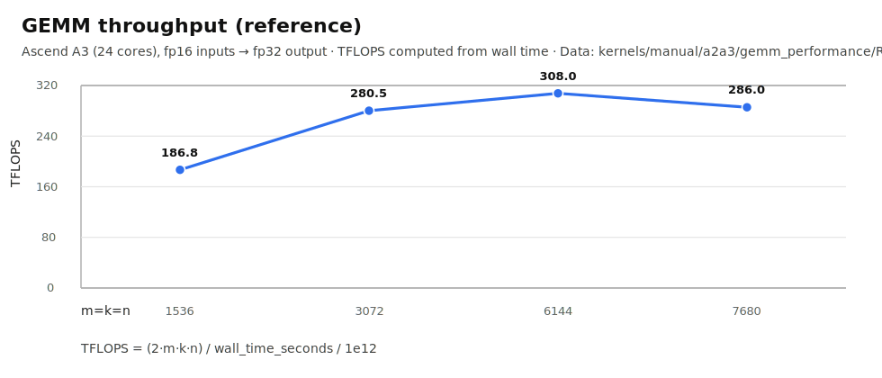
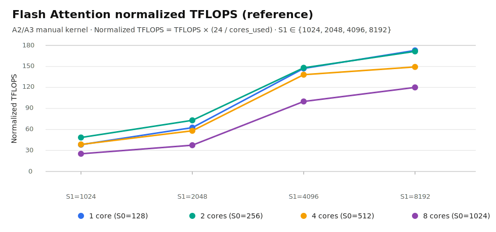

<p align="center">
  
</p>

# PTO Tile Library

Parallel Tile Operation (PTO) is a virtual ISA for tile-oriented programming defined by Ascend CANN. This repository provides PTO Tile instruction implementations, examples, tests, and documentation to help developers migrate and optimize operators more smoothly across different Ascend generations.

[](LICENSE)
[](#-platform-support)
[](docs/README.md)

## 📰 News

- 🎉 **2025-12-27**: PTO Tile Library is officially open-sourced.
- ✨ **2026-01-30**: Added reduction instructions and MX instructions.
- 🚀 **2026-02-28**: Added convolution instructions, quantization instructions, and inter-kernel communication instructions.
- 🔥 **2026-03-30**: Added support for Ascend A5, asynchronous communication instructions, and CostModel performance simulation.
- 🛠️ **2026-04-02**: Local engineering workflow improved with pre-commit checks, documentation build verification, and CPU-SIM validation updates.

## 🎯 Project Positioning

The PTO ISA is built on Ascend's underlying hardware and software abstractions and defines more than 90 standard tile instructions. It uses a higher-level tile programming model to bridge implementation differences across generations. Its goal is not to hide low-level capabilities, but to raise the abstraction level while preserving room for performance tuning.

- **Unified cross-generation tile abstraction**: reduces migration cost across different Ascend generations.
- **Balances portability and performance**: guarantees correct behavior under fixed tile shapes while preserving tuning dimensions such as tile size, tile shape, and instruction ordering.
- **Designed for frameworks, operators, and toolchains**: serves as a common interface for upper-layer frameworks, operator implementations, and compiler toolchains.
- **Continuously extensible**: defines 90+ standard operations today, with ongoing implementation and ecosystem integration.

In addition to compute and data-movement instructions, PTO ISA also provides a **communication extension instruction set** for inter-NPU data transfer and synchronization, covering point-to-point communication, signal synchronization, and collective communication.

These communication primitives follow the same tile-level abstraction and cross-platform design as the compute instructions, and can drive multiple data-movement hardware engines on Ascend to help users build deeply fused compute-communication kernels. For the communication ISA entry, see [docs/isa/comm/README.md](docs/isa/comm/README.md).

At present, PTO instructions have been integrated into the following frameworks:

- [PyPTO](https://gitcode.com/cann/pypto/)
- [TileLang Ascend](https://github.com/tile-ai/tilelang-ascend/)
- More language and frontend support is continuously being improved

## ✨ Core Features

- **Unified Tile ISA abstraction**: uses standard PTO instructions to describe tile-level computation and dataflow.
- **Balances cross-generation migration and performance tuning**: improves portability while retaining sufficient low-level control.
- **Auto / Manual dual-mode workflow**: validate logic quickly first, then refine the implementation step by step. Auto Mode is currently available in CPU simulation.
- **CPU Simulator support**: enables functional verification and development debugging on CPU.
- **Covers key programming elements**: supports tile shape, tile mask, event synchronization, fixed-function units, and pipeline modeling.
- **Complete docs, tests, and examples**: includes ISA docs, developer docs, test scripts, and performance case studies.

## 👥 Intended Audience

PTO Tile Lib is mainly intended for the following developers:

- Framework or compiler backend developers who interface directly with Ascend hardware
- High-performance operator developers who need to migrate and reuse implementations across platforms
- Performance engineers who need explicit control over tiles, buffers, and pipelines

## 🚀 Quick Start

### Environment Setup

- **CPU path**: requires Python, CMake, and a C++20-capable compiler; suitable for quick cross-platform validation.
- **NPU path**: requires Linux and the Ascend CANN toolkit; suitable for running on Ascend hardware or simulator.
- For detailed environment setup instructions, see the [Getting Started Guide](docs/getting-started.md)

### Build and Run

```bash
# CPU Simulator (recommended first step)
python3 tests/run_cpu.py --clean --verbose

# Run GEMM demo
python3 tests/run_cpu.py --demo gemm --verbose

# Run Flash Attention demo
python3 tests/run_cpu.py --demo flash_attn --verbose

# Run a single ST testcase
python3 tests/script/run_st.py -r sim -v a3 -t tadd -g TADDTest.case_float_64x64_64x64

# One-click build and run recommended tests
./build.sh --run_all --a3 --sim
```

For more complete build, test, and scripting details, see the [Getting Started Guide](docs/getting-started.md) and [Test Guide](tests/README.md).

### Recommended Examples

- [Auto Mode Add example](demos/auto_mode/baseline/add/README.md): a good first example for understanding how PTO instructions are organized
- [GEMM performance example](kernels/manual/a2a3/gemm_performance/README.md): useful for understanding tile-level operator optimization
- [Flash Attention example](kernels/manual/common/flash_atten/README.md): useful for understanding complex operators and performance tuning

### Recommended Learning Path

1. Start from simple examples to understand how PTO instructions organize tile-level computation and data movement.
2. Verify functionality and correctness in CPU simulation to build intuition about instruction semantics and results.
3. Port the code to Ascend hardware to validate correctness and collect performance data. See the [msprof tool](https://www.hiascend.com/document/detail/zh/canncommercial/850/devaids/Profiling/atlasprofiling_16_0010.html)
4. Identify performance bottlenecks (CUBE Bound / MTE Bound / Vector Bound) and start optimization and tuning. See [Performance Optimization](docs/coding/opt.md)

This repository also demonstrates how standard tile operations can be mapped to different pipeline implementations through template parameters:

- [Tile Programming Model](docs/coding/Tile.md): understand static tile shapes, dynamic tile masks, and data organization
- [Events and Synchronization](docs/coding/Event.md): understand set/wait flag and pipeline synchronization
- [General Conventions](docs/isa/conventions.md): understand general PTO programming rules and constraints
- [PTO Instruction List](docs/isa/README.md): browse the standard operations defined by the PTO ISA

## 🗂️ Documentation Navigation

### ISA and Programming Model

- [ISA Overview](docs/README.md): entry point and navigation for PTO ISA documentation
- [PTO Instruction List](docs/isa/README.md): browse PTO standard operations by category
- [Tile Programming Model](docs/coding/Tile.md): understand tile shapes, masks, and the programming model
- [Events and Synchronization](docs/coding/Event.md): understand event recording, waiting, and synchronization
- [General Conventions](docs/isa/conventions.md): review naming, constraints, and common rules

### Development and Optimization

- [Developer Documentation Index](docs/coding/README.md): browse documentation for extending PTO Tile Lib
- [Performance Optimization](docs/coding/opt.md): review performance analysis and tuning guidance
- [Documentation Build Guide](docs/mkdocs/README.md): learn how to build the MkDocs site locally

## 📊 Examples and Performance References

### GEMM

- Reference implementation: `kernels/manual/a2a3/gemm_performance/`
- Detailed analysis and tuning notes: [High-Performance GEMM Operator Example](kernels/manual/a2a3/gemm_performance/README.md)



### Flash Attention

- Reference implementation: `kernels/manual/common/flash_atten/`
- Detailed analysis and tuning notes: [Flash Attention Operator Implementation](kernels/manual/common/flash_atten/README.md)
- S0: query sequence length (number of rows in Q/O)
- S1: key/value sequence length (number of rows in K/V)



### Communication Instruction Bandwidth

- Reference implementation: `kernels/manual/a2a3/tget_bandwidth/`
- Detailed analysis and build/run guide: [TGET / TGET_ASYNC Bandwidth Comparison Example](kernels/manual/a2a3/tget_bandwidth/README.md)

This example measures point-to-point remote-read bandwidth on Ascend A2/A3 and compares `TGET` (synchronous, via UB staging) with `TGET_ASYNC` (asynchronous, direct transfer through the DMA engine).

### GEMM AllReduce Fused Compute-Communication

- Reference implementation: `kernels/manual/a2a3/gemm_ar/`
- Detailed analysis and tuning notes: [High-Performance GEMM AllReduce Fused Operator Example](kernels/manual/a2a3/gemm_ar/README_zh.md)

This example shows how PTO communication primitives can be fused with compute kernels to overlap GEMM and AllReduce within one operator pipeline.

## 🖥️ Platform Support

- Ascend A2 (Ascend 910B)
- Ascend A3 (Ascend 910C)
- Ascend A5 (Ascend 950)
- CPU (x86_64 / AArch64)

For more details, see [include/README.md](include/README.md).

## 🛣️ Roadmap

Planned future features:

| Feature | Description | Scope |
| --- | --- | --- |
| PTO Auto Mode | BiSheng compiler support for automatic tile buffer allocation and synchronization insertion. | Compiler / toolchain |
| PTO Tile Fusion | BiSheng compiler support for automatic tile operation fusion. | Compiler / toolchain |
| PTO-AS | Bytecode support for PTO ISA. | Compiler / toolchain |
| **Convolution extension** | PTO ISA support for convolution kernels. | ISA extension |
| **Collective communication extension** | PTO ISA support for collective communication kernels. | ISA extension |
| **System scheduling extension** | PTO ISA support for SPMD/MPMD programming schedules. | ISA extension |

## 🗃️ Directory Structure

Key directories are listed below:

```text
├── include/                     # Public PTO headers and interfaces
│   └── pto/                     # Common types, ISA interfaces, and CPU/NPU implementations
├── kernels/                     # Kernels and operator implementations
│   ├── manual/                  # Hand-optimized implementations and performance examples
│   └── custom/                  # Custom operator examples
├── docs/                        # ISA, programming model, getting started, and doc site sources
│   ├── isa/                     # Instruction references and category indexes
│   ├── coding/                  # Developer and performance optimization docs
│   ├── assembly/                # PTO-AS assembly syntax and specification
│   └── mkdocs/                  # MkDocs config and source files
├── demos/                       # Auto Mode, baseline, and torch_jit examples
├── tests/                       # CPU / NPU tests, scripts, and test entry points
│   ├── cpu/                     # CPU simulation tests
│   ├── npu/                     # SoC-specific NPU tests
│   └── script/                  # Test build and execution scripts
├── scripts/                     # Build, install, and release scripts
├── cmake/                       # Shared CMake configuration and packaging logic
├── build.sh                     # One-click build and run entry script
└── CMakeLists.txt               # Top-level CMake configuration
```

## ℹ️ Related Information

- [Contributing Guide](CONTRIBUTING.md): contribution workflow and development guidelines
- [Security and Vulnerability Disclosure](SECURITY.md): process for reporting security issues
- [Release Notes](ReleaseNote.md): version updates and release history
- [License](LICENSE): CANN Open Software License Agreement Version 2.0
- [PyPTO](https://gitcode.com/cann/pypto/): an upper-layer programming framework in the PTO ecosystem
- [PTOAS](https://gitcode.com/cann/PTOAS/): PTO assembler and compiler backend for PTO workflows
- [pto-dsl](https://gitcode.com/cann/pto-dsl/): Pythonic frontend and JIT workflow exploration for PTO

## 📬 Contact Us

- **Issue reporting**: submit problems through repository Issues
- **Feature requests**: share suggestions through Issues or discussion channels
- **Code contributions**: contribute through Pull Requests
