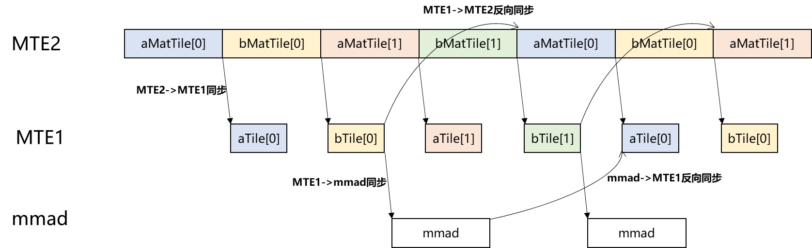

# 基础 GEMM 算子示例

## 概览

本示例展示如何使用 PTO 实现一个基础 GEMM 算子，并通过 `torch_npu` 将其暴露为 PyTorch 算子。

## 支持的 AI 处理器

- A2/A3

## 目录结构

```
demos/baseline/gemm_basic/
├── op_extension/              # Python 包入口（模块加载）
├── csrc/
│   ├── kernel/                # PTO kernel 实现
│   └── host/                  # Host 侧 PyTorch 算子注册
├── test/                      # 最小化 Python 测试
├── CMakeLists.txt             # 构建配置
├── setup.py                   # Wheel 构建脚本
└── README.md                  # 本文档
```

## 算子说明

### 计算功能

本示例实现固定维度 `[m, k, n] = [512, 2048, 1536]` 的 GEMM：

$$
C = A \times B
$$

其中：

- `A` 形状：`[512, 2048]`（`m × k`）
- `B` 形状：`[2048, 1536]`（`k × n`）
- `C` 形状：`[512, 1536]`（`m × n`）

### 规格

| 项目        | 值 |
| ----------- | ----- |
| OpType      | `gemm` |
| 输入        | `a`: `m×k`, `float16`, `ND`; `b`: `k×n`, `float16`, `DN` |
| 输出        | `c`: `m×n`, `float`, `ND` |
| Kernel 名称 | `gemm_basic_custom` |

### Tiling 参数

验证平台有 24 个核。本示例采用 `4 × 6` 分组方式将工作量切分到核上（优先切 `m` 与 `n`）：将 `m` 分为 4 份，`n` 分为 6 份，以充分利用 24 核。

每核形状：

- `singleCoreM = 128`、`singleCoreK = 2048`、`singleCoreN = 256`

由于每核 tile 仍然超过 L0 容量，进一步将 `k` 按 64 的 base block 切分。base block 为：

- `baseM = 128`、`baseK = 64`、`baseN = 256`

| 参数          | 值     |
| ------------- | ----- |
| `m`           | 512   |
| `k`           | 2048  |
| `n`           | 1536  |
| `singleCoreM` | 128   |
| `singleCoreK` | 2048  |
| `singleCoreN` | 256   |
| `baseM`       | 128   |
| `baseK`       | 64    |
| `baseN`       | 256   |

## 实现说明

### 类型定义

实现中定义了 GM、L1、L0 的矩阵表示，并为 tiles 绑定底层存储。示例（简化）：

```cpp
using NDValidShapeA = TileShape2D<U, baseM, baseK>;
using NDsingleCoreShapeA = BaseShape2D<U, M, K>;
using GlobalDataSrcA = GlobalTensor<U, NDValidShapeA, NDsingleCoreShapeA>; // A in GM (ND)

using NDValidShapeB = TileShape2D<U, baseK, baseN, Layout::DN>;
using NDsingleCoreShapeB = BaseShape2D<U, K, N, Layout::DN>;
using GlobalDataSrcB = GlobalTensor<U, NDValidShapeB, NDsingleCoreShapeB, Layout::DN>; // B in GM (DN)

using NDValidShapeC = TileShape2D<T, baseM, baseN>;
using NDWholeShapeC = BaseShape2D<T, M, N>;
using GlobalDataOut = GlobalTensor<T, NDValidShapeC, NDWholeShapeC>; // C in GM
```

### 流水线调度

本示例通过在 L1 与 L0 使用双缓冲来重叠数据搬运与计算，以提高利用率。同步点用于确保依赖关系正确，包括：

- 正向同步：`MTE2 -> MTE1`、`MTE1 -> MMAD`、`MMAD -> FIXPIPE`
- 反向同步：`MTE1 -> MTE2`、`MMAD -> MTE1`

流水线示意图：


## 构建与运行

### 1. 准备Python环境

创建python虚拟环境并安装需要的python包：

```bash
python -m venv virEnv
source virEnv/bin/activate
python3 -m pip install -r requirements.txt
```

### 2. 构建 wheel

配置 Ascend CANN 环境、 PTO Tile Lib 路径并构建 wheel：

```bash
export ASCEND_HOME_PATH=/usr/local/Ascend/
source ${ASCEND_INSTALL_PATH}/bin/setenv.bash
export PTO_LIB_PATH=[YOUR_PATH]/pto-isa
rm -rf build op_extension.egg-info
python3 setup.py bdist_wheel
```

### 3. 安装 wheel

```bash
pip install dist/*.whl
```

### 4. 运行测试

```bash
cd test
python3 test.py
```
