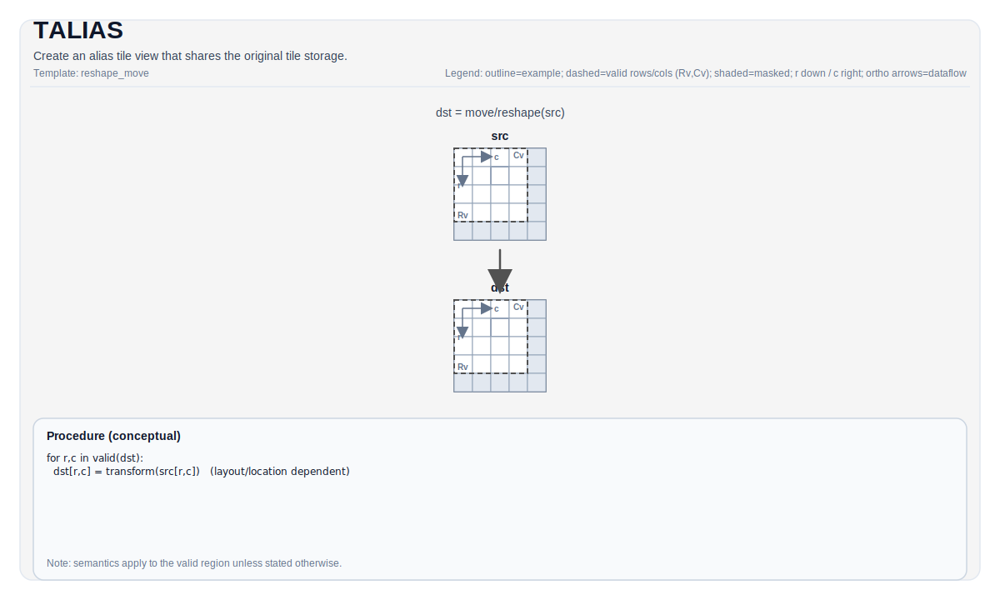

# TALIAS

## 指令示意图



## 简介

`TALIAS` 创建一个与源 Tile 共享底层存储的别名视图。它不复制数据，只改变后续代码观察这块存储的逻辑方式。

这类操作通常用于：

- 在同一块 tile buffer 上建立新的 shape 或切片视图
- 把同一份数据交给不同的后续操作，以不同逻辑边界读取
- 避免为了得到子视图或重解释视图而额外搬运数据

## 语义

`TALIAS` 的结果与源 Tile 指向同一块底层存储。通过任一别名写入的数据，都会对共享该存储的其他别名立即可见。

它本身不定义新的数值变换；后续行为仍由消费该别名的具体指令决定，并且默认只在目标 valid region 内具有架构意义。

## 汇编语法

PTO-AS 形式见 [PTO-AS 规范](../assembly/PTO-AS_zh.md)。

### AS Level 1（SSA）

```text
%dst = pto.talias ...
```

### AS Level 2（DPS）

```text
pto.talias ins(...) outs(%dst : !pto.tile_buf<...>)
```

## C++ 内建接口

声明于 `include/pto/common/pto_instr.hpp`。

## 约束

- `TALIAS` 不会修复原始 Tile 的非法 shape、layout 或 location intent。
- alias 后得到的 Tile 仍需满足后续消费者指令的合法性要求。
- 若多个别名在没有额外同步的情况下并发读写，共享存储的可见顺序由后续使用这些别名的指令负责建立。

## 示例

`TALIAS` 常与子视图、局部重排和“同存储多视图”模式配合使用。更具体的用法见相关的 tile 搬运与布局页。

## 相关页面

- [布局与重排指令集](./tile/layout-and-rearrangement_zh.md)
- [Tile 与有效区域](./programming-model/tiles-and-valid-regions_zh.md)
