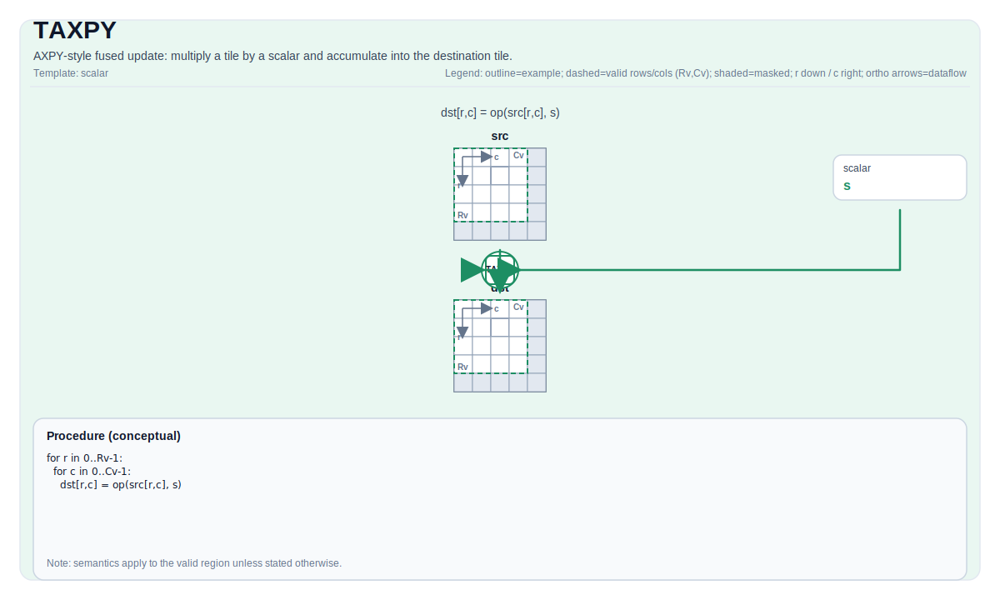

# TAXPY

## 指令示意图



## 简介

AXPY 风格融合更新：将 Tile 乘以标量并累加到目标 Tile。

## 数学语义

语义随指令而变化。 除非另有说明，行为都按目标 valid region 定义。

## 汇编语法

PTO-AS 形式：参见 [PTO-AS 规范](../assembly/PTO-AS_zh.md)。

### AS Level 1（SSA）

```text
%dst = pto.taxpy ...
```

### AS Level 2（DPS）

```text
pto.taxpy ins(...) outs(%dst : !pto.tile_buf<...>)
```

## C++ 内建接口

声明于 `include/pto/common/pto_instr.hpp`.

## 约束

数据类型、layout、location 和 shape 的进一步限制以对应 backend 的合法性检查为准。

## 示例

具体的 Auto / Manual 使用方式见 `docs/isa/` 下的相关指令页。
