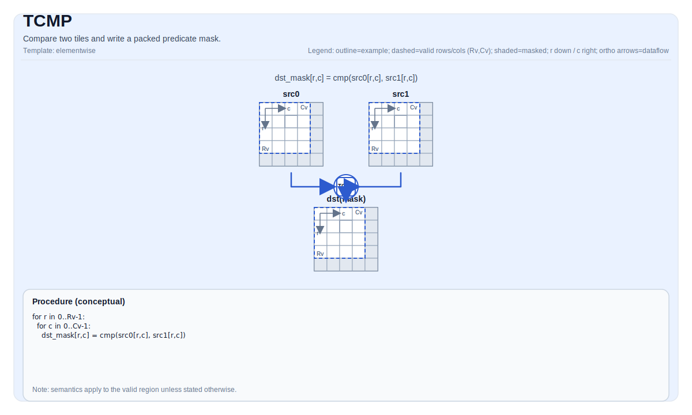

# TCMP

## 指令示意图



## 简介

比较两个 Tile 并写入一个打包的谓词掩码。

## 数学语义

概念上，对于有效区域中的每个元素 `(i, j)`，定义一个谓词：

$$ p_{i,j} = \left(\mathrm{src0}_{i,j}\ \mathrm{cmpMode}\ \mathrm{src1}_{i,j}\right) $$

谓词掩码使用实现定义的打包布局存储在 `dst` 中。

## 汇编语法

PTO-AS 形式：参见 [PTO-AS 规范](../assembly/PTO-AS_zh.md)。

同步形式：

```text
%dst = tcmp %src0, %src1 {cmpMode = #pto.cmp<EQ>} : !pto.tile<...> -> !pto.tile<...>
```

### AS Level 1（SSA）

```text
%dst = pto.tcmp %src0, %src1{cmpMode = #pto<cmp xx>}: (!pto.tile<...>, !pto.tile<...>) -> !pto.tile<...>
```

### AS Level 2（DPS）

```text
pto.tcmp ins(%src0, %src1{cmpMode = #pto<cmp xx>}: !pto.tile_buf<...>, !pto.tile_buf<...>) outs(%dst : !pto.tile_buf<...>)
```

## C++ 内建接口

声明于 `include/pto/common/pto_instr.hpp` 和 `include/pto/common/type.hpp`：

```cpp
template <typename TileDataDst, typename TileDataSrc, typename... WaitEvents>
PTO_INST RecordEvent TCMP(TileDataDst &dst, TileDataSrc &src0, TileDataSrc &src1, CmpMode cmpMode, WaitEvents &... events);
```

## 约束

- **实现检查 (A2A3)**:
    - 输入类型必须是以下之一：`int32_t`、`half`、`float`。
    - 输出类型必须是 `uint8_t`。
    - `src0/src1/dst` tile 位置必须是 `TileType::Vec`。
    - 静态有效边界：`TileDataSrc::ValidRow <= TileDataSrc::Rows` 且 `TileDataSrc::ValidCol <= TileDataSrc::Cols`。
    - 运行时：`src0.GetValidRow() == dst.GetValidRow()` 且 `src0.GetValidCol() == dst.GetValidCol()`。
    - 注意：`src1` 的形状/有效性在此实现中不通过显式运行时断言进行验证。
    - 对于 `TileDataSrc::DType == int32_t`，实现使用 `EQ` 比较路径，无论 `cmpMode` 如何。
- **实现检查 (A5)**:
    - 输入类型必须是以下之一：`uint32_t`、`int32_t`、`uint16_t`、`int16_t`、`uint8_t`、`int8_t`、`float`、`half`。
    - 输出类型必须是 `uint32_t`。
    - 已实现（参见 `include/pto/npu/a5/TCmp.hpp`）。
    - A5 实现使用 `dst.GetValidRow()` / `dst.GetValidCol()` 作为迭代域，并将打包的谓词掩码写入 `dst`（目标定义的打包方式）。
- **掩码编码**:
    - 掩码 tile 被解释为目标定义布局中的打包谓词位。

## 示例

### 自动（Auto）

```cpp
#include <pto/pto-inst.hpp>

using namespace pto;

void example_auto() {
  using SrcT = Tile<TileType::Vec, float, 16, 16>;
  using MaskT = Tile<TileType::Vec, uint8_t, 16, 32, BLayout::RowMajor, -1, -1>;
  SrcT src0, src1;
  MaskT mask(16, 2);
  TCMP(mask, src0, src1, CmpMode::GT);
}
```

### 手动（Manual）

```cpp
#include <pto/pto-inst.hpp>

using namespace pto;

void example_manual() {
  using SrcT = Tile<TileType::Vec, float, 16, 16>;
  using MaskT = Tile<TileType::Vec, uint8_t, 16, 32, BLayout::RowMajor, -1, -1>;
  SrcT src0, src1;
  MaskT mask(16, 2);
  TASSIGN(src0, 0x1000);
  TASSIGN(src1, 0x2000);
  TASSIGN(mask, 0x3000);
  TCMP(mask, src0, src1, CmpMode::GT);
}
```

## 汇编示例（ASM）

### 自动模式

```text
# 自动模式：由编译器/运行时负责资源放置与调度。
%dst = pto.tcmp %src0, %src1{cmpMode = #pto<cmp xx>}: (!pto.tile<...>, !pto.tile<...>) -> !pto.tile<...>
```

### 手动模式

```text
# 手动模式：先显式绑定资源，再发射指令。
# 可选（当该指令包含 tile 操作数时）：
# pto.tassign %arg0, @tile(0x1000)
# pto.tassign %arg1, @tile(0x2000)
%dst = pto.tcmp %src0, %src1{cmpMode = #pto<cmp xx>}: (!pto.tile<...>, !pto.tile<...>) -> !pto.tile<...>
```

### PTO 汇编形式

```text
%dst = tcmp %src0, %src1 {cmpMode = #pto.cmp<EQ>} : !pto.tile<...> -> !pto.tile<...>
# AS Level 2 (DPS)
pto.tcmp ins(%src0, %src1{cmpMode = #pto<cmp xx>}: !pto.tile_buf<...>, !pto.tile_buf<...>) outs(%dst : !pto.tile_buf<...>)
```
