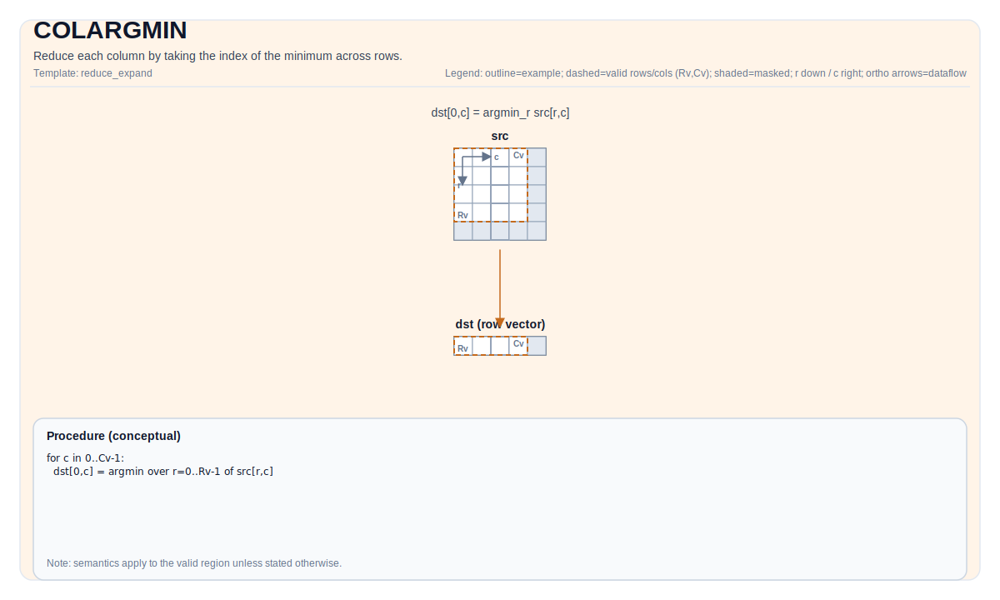

# TCOLARGMIN

## 指令示意图



## 简介

获取每列最小值对应行索引。

## 数学语义

Let `R = src.GetValidRow()` and `C = src.GetValidCol()`. For `0 <= j < C`:

$$ \mathrm{dst}_{0,j} = \underset{0 \le i < R}{\operatorname{argmin}} \; \mathrm{src}_{i,j} $$

## 汇编语法

PTO-AS 形式：参见 [PTO-AS 规范](../assembly/PTO-AS_zh.md)。

同步形式：

```text
%dst = tcolargmin %src : !pto.tile<...> -> !pto.tile<...>
```
Lowering may introduce internal scratch tiles; the C++ intrinsic requires an explicit `tmp` operand.

### IR Level 1（SSA）

```text
%dst = pto.tcolargmin %src, %tmp : (!pto.tile<...>, !pto.tile<...>) -> !pto.tile<...>
```

### IR Level 2（DPS）

```text
pto.tcolargmin ins(%src, %tmp : !pto.tile_buf<...>, !pto.tile_buf<...>) outs(%dst : !pto.tile_buf<...>)
```

## C++ 内建接口

声明于 `include/pto/common/pto_instr.hpp`:

```cpp
template <typename TileDataOut, typename TileDataIn, typename TileDataTmp, typename... WaitEvents>
PTO_INST RecordEvent TCOLARGMIN(TileDataOut& dst, TileDataIn& src, TileDataTmp& tmp, WaitEvents&... events);
```

## 约束

### 通用约束或检查

- `dst` 和 `src` 必须为 `TileType::Vec`。
- 由于已检查到的辅助检查仅要求 `SLayout::NoneBox`，因此 `src` 可使用 ND 或 DN 的非分形布局。
- `dst` 必须使用标准 ND 布局：行主且非分形（`BLayout::RowMajor`、`SLayout::NoneBox`）。
- 支持的目标元素类型：`uint32_t`、`int32_t`。
- 编译时检查：`TileDataIn::ValidCol == 1 || TileDataIn::ValidCol == -1`。
- 运行时检查：
    - `src.GetValidRow() != 0`
    - `src.GetValidCol() != 0`
    - `dst.GetValidRow() == 1`
    - `src.GetValidCol() == dst.GetValidCol()`

### A2A3 实现检查

- 支持的源元素类型：`half`、`float`、`uint16_t`、`uint32_t`。
- `tmp` 的元素类型必须与 `src` 一致。
- 在已检查到的 A2A3 实现路径中，`tmp` 用作索引跟踪和当前比较值的临时存储。

### A5 实现检查

- 支持的源元素宽度为 8 位、16 位或 32 位，因此已检查到的实现覆盖 `int8_t`、`uint8_t`、`int16_t`、`uint16_t`、`int32_t`、`uint32_t`、`half`、`float`。
- 在已检查到的 A5 实现路径中，接口仍接收 `tmp`，但 `TCOLARGMIN_IMPL` 实际并不使用它。

### A2A3 `tmp` 临时 Tile 相关说明

* A2A3 实现中 `tmp` **始终被使用**，作为中间结果的临时存储空间（当前行索引、argmin 索引、当前最小值元素）。
* `tmp` Tile 的数据类型必须与 `src` 的数据类型一致。
* `tmp` Tile 在单行内被划分为三个区域：
  - 区域 0（`[0, tmpGapEles)`）：当前行索引计数器（每行递增）。
  - 区域 1（`[tmpGapEles, 2 * tmpGapEles)`）：当前最小值元素，用于比较。
  - 区域 2（`[2 * tmpGapEles, 3 * tmpGapEles)`）：argmin 索引结果（最终转换后写入 `dst`）。
* `tmpGapEles` 的确定方式：
  - 当 `srcValidCol >= elemPerRpt` 时：`tmpGapEles = elemPerRpt`。
  - 当 `srcValidCol < elemPerRpt` 时：`tmpGapEles = ceil(srcValidCol / elemPerBlock) * elemPerBlock`。
* 当 `src` 较小时，可直接将 `tmp` Tile 大小设为与 `src` 相同；也可按以下公式根据 `src` 的 `validCol` 算出 `tmp` Tile 所需 stride：

```text
repeats = ceil(validCol / elementPerRepeat)
stride = ceil(repeats * 2 / elementPerBlock) * elementPerBlock + ceil(repeats / elementPerBlock) * elementPerBlock
```

### A5 `tmp` 临时 Tile 相关说明

* A5 实现中 `tmp` 临时 Tile **不使用**。A5 使用基于向量寄存器的计算方式（`__VEC_SCOPE__`），不需要临时 Tile 存储。
* `tmp` 在 C++ 内建接口签名中保留，仅为了与 A2A3 的 API 兼容。

## 示例

### 自动（Auto）

```cpp
#include <pto/pto-inst.hpp>

using namespace pto;

void example_auto() {
  using SrcT = Tile<TileType::Vec, float, 16, 256, BLayout::RowMajor, -1, -1>;
  using DstT = Tile<TileType::Vec, uint32_t, 1, 256, BLayout::RowMajor, -1, -1>;
  using TmpT = Tile<TileType::Vec, float, 1, 32, BLayout::RowMajor, -1, -1>;
  SrcT src(16, 255);
  DstT dst(1, 255);
  TmpT tmp(1, 32);
  TCOLARGMIN(dst, src, tmp);
}
```

### 手动（Manual）

```cpp
#include <pto/pto-inst.hpp>

using namespace pto;

void example_manual() {
  using SrcT = Tile<TileType::Vec, float, 16, 256, BLayout::RowMajor, -1, -1>;
  using DstT = Tile<TileType::Vec, uint32_t, 1, 256, BLayout::RowMajor, -1, -1>;
  using TmpT = Tile<TileType::Vec, float, 1, 32, BLayout::RowMajor, -1, -1>;
  SrcT src(16, 255);
  DstT dst(1, 255);
  TmpT tmp(1, 32);
  TASSIGN(src, 0x0);
  TASSIGN(dst, 0x1000);
  TASSIGN(tmp, 0x2000);
  TCOLARGMIN(dst, src, tmp);
}
```

## 汇编示例（ASM）

### 自动模式

```text
# 自动模式：由编译器/运行时负责资源放置与调度。
%dst = pto.tcolargmin %src, %tmp : (!pto.tile<...>, !pto.tile<...>) -> !pto.tile<...>
```

### 手动模式

```text
# 手动模式：先显式绑定资源，再发射指令。
# 可选（当该指令包含 tile 操作数时）：
# pto.tassign %arg0, @tile(0x1000)
# pto.tassign %arg1, @tile(0x2000)
%dst = pto.tcolargmin %src, %tmp : (!pto.tile<...>, !pto.tile<...>) -> !pto.tile<...>
```

### PTO 汇编形式

```text
%dst = tcolargmin %src : !pto.tile<...> -> !pto.tile<...>
# IR Level 2 (DPS)
pto.tcolargmin ins(%src, %tmp : !pto.tile_buf<...>, !pto.tile_buf<...>) outs(%dst : !pto.tile_buf<...>)
```
</task_progress>
- [x] Write tcolargmin English documentation (docs/isa/TCOLARGMIN.md)
- [x] Write tcolargmin Chinese documentation (docs/isa/TCOLARGMIN_zh.md)
</task_progress>
</write_to_file>
