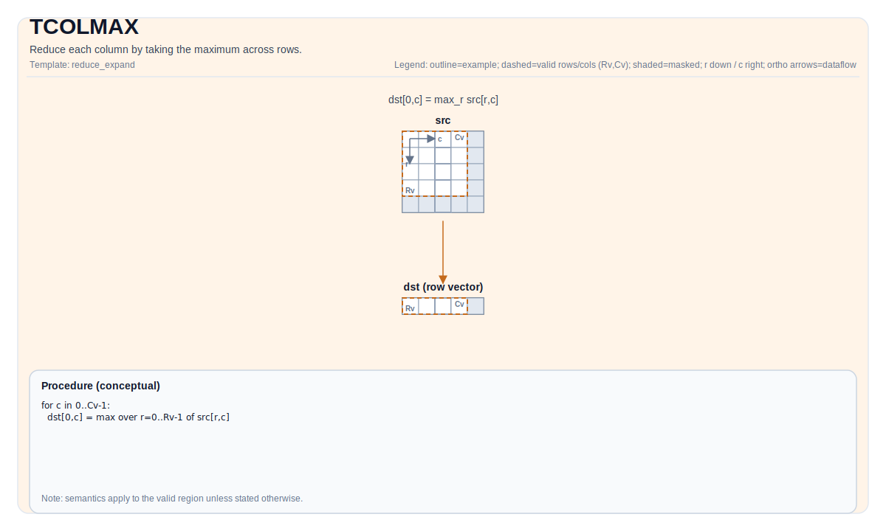

# TCOLMAX

## 指令示意图



## 简介

通过取行间最大值来归约每一列。

## 数学语义

设 `R = src.GetValidRow()`，`C = src.GetValidCol()`。对 `0 <= j < C`：

$$ \mathrm{dst}_{0,j} = \max_{0 \le i < R} \mathrm{src}_{i,j} $$

## 汇编语法

PTO-AS 形式：参见 [PTO-AS 规范](../assembly/PTO-AS_zh.md)。

同步形式：

```text
%dst = tcolmax %src : !pto.tile<...> -> !pto.tile<...>
```

### AS Level 1（SSA）

```text
%dst = pto.tcolmax %src : !pto.tile<...> -> !pto.tile<...>
```

### AS Level 2（DPS）

```text
pto.tcolmax ins(%src : !pto.tile_buf<...>) outs(%dst : !pto.tile_buf<...>)
```

## C++ 内建接口

声明于 `include/pto/common/pto_instr.hpp`：

```cpp
template <typename TileDataOut, typename TileDataIn, typename... WaitEvents>
PTO_INST RecordEvent TCOLMAX(TileDataOut &dst, TileDataIn &src, WaitEvents &... events);
```

## 约束

### 通用约束或检查

- `dst` 和 `src` 必须为 `TileType::Vec`。
- `dst` 和 `src` 必须使用标准 ND 布局：行主且非分形（`BLayout::RowMajor`、`SLayout::NoneBox`）。
- `dst` 和 `src` 的元素类型必须一致。
- 运行时检查：
    - `src.GetValidCol() == dst.GetValidCol()`
- 若 `src.GetValidRow() == 0` 或 `src.GetValidCol() == 0`，实现会直接返回。

### A2A3 实现检查

- 支持的元素类型：`half`、`float`、`int16_t`、`int32_t`。

### A5 实现检查

- 支持的元素类型：`half`、`float`、`int8_t`、`uint8_t`、`int16_t`、`uint16_t`、`int32_t`、`uint32_t`、`bfloat16_t`。

## 示例

### 自动（Auto）

```cpp
#include <pto/pto-inst.hpp>

using namespace pto;

void example_auto() {
  using SrcT = Tile<TileType::Vec, float, 16, 16>;
  using DstT = Tile<TileType::Vec, float, 1, 16>;
  SrcT src;
  DstT dst;
  TCOLMAX(dst, src);
}
```

### 手动（Manual）

```cpp
#include <pto/pto-inst.hpp>

using namespace pto;

void example_manual() {
  using SrcT = Tile<TileType::Vec, float, 16, 16>;
  using DstT = Tile<TileType::Vec, float, 1, 16>;
  SrcT src;
  DstT dst;
  TASSIGN(src, 0x1000);
  TASSIGN(dst, 0x2000);
  TCOLMAX(dst, src);
}
```

## 汇编示例（ASM）

### 自动模式

```text
# 自动模式：由编译器/运行时负责资源放置与调度。
%dst = pto.tcolmax %src : !pto.tile<...> -> !pto.tile<...>
```

### 手动模式

```text
# 手动模式：先显式绑定资源，再发射指令。
# 可选（当该指令包含 tile 操作数时）：
# pto.tassign %arg0, @tile(0x1000)
# pto.tassign %arg1, @tile(0x2000)
%dst = pto.tcolmax %src : !pto.tile<...> -> !pto.tile<...>
```

### PTO 汇编形式

```text
%dst = tcolmax %src : !pto.tile<...> -> !pto.tile<...>
# AS Level 2 (DPS)
pto.tcolmax ins(%src : !pto.tile_buf<...>) outs(%dst : !pto.tile_buf<...>)
```
