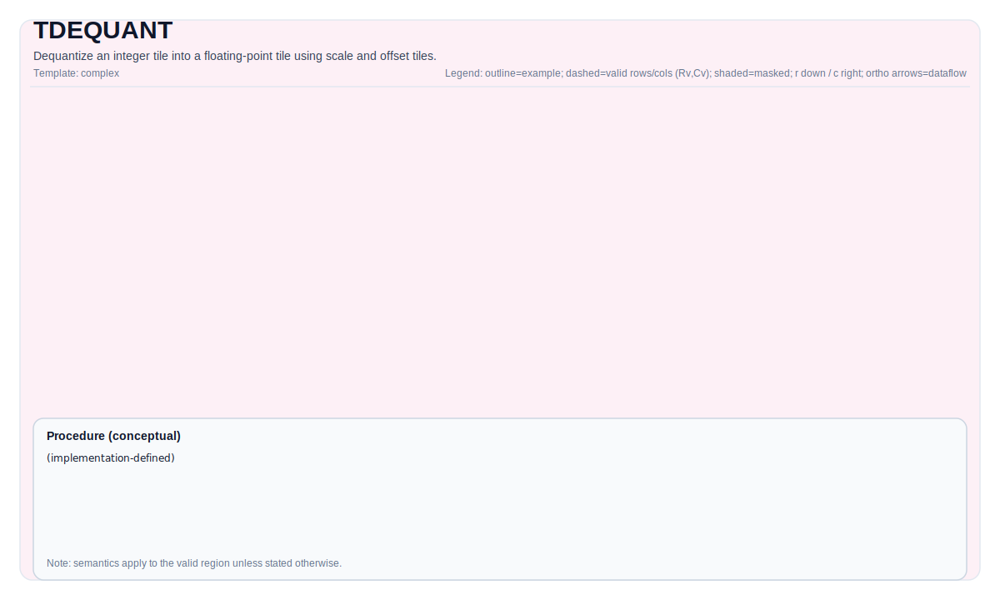

# TDEQUANT

## Tile Operation Diagram



## Introduction

Dequantize an integer tile into a floating-point tile using scale and offset tiles.

## Math Interpretation

Semantics are instruction-specific. Unless stated otherwise, behavior is defined over the destination valid region.

## Assembly Syntax

Textual spelling is defined by the PTO ISA syntax-and-operands pages.

### IR Level 1 (SSA)

```text
%dst = pto.tdequant ...
```

### IR Level 2 (DPS)

```text
pto.tdequant ins(...) outs(%dst : !pto.tile_buf<...>)
```
## C++ Intrinsic

Declared in `include/pto/common/pto_instr.hpp`.

## Constraints

Refer to backend-specific legality checks for data type/layout/location/shape constraints.

## Examples

See related instruction pages in `docs/isa/` for concrete Auto/Manual usage patterns.
