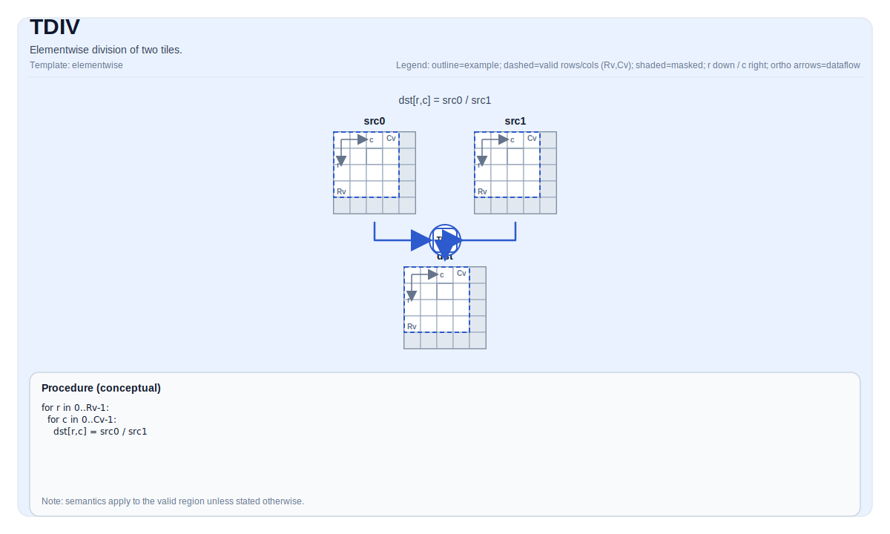

# TDIV


## Tile Operation Diagram



## Introduction

Elementwise division of two tiles.

## Math Interpretation

For each element `(i, j)` in the valid region:

$$ \mathrm{dst}_{i,j} = \frac{\mathrm{src0}_{i,j}}{\mathrm{src1}_{i,j}} $$

## Assembly Syntax

PTO-AS form: see [PTO-AS Specification](../assembly/PTO-AS.md).

Synchronous form:

```text
%dst = tdiv %src0, %src1 : !pto.tile<...>
```

### AS Level 1 (SSA)

```text
%dst = pto.tdiv %src0, %src1 : (!pto.tile<...>, !pto.tile<...>) -> !pto.tile<...>
```

### AS Level 2 (DPS)

```text
pto.tdiv ins(%src0, %src1 : !pto.tile_buf<...>, !pto.tile_buf<...>) outs(%dst : !pto.tile_buf<...>)
```
## C++ Intrinsic

Declared in `include/pto/common/pto_instr.hpp`:

```cpp
template <auto PrecisionType = DivAlgorithm::DEFAULT, typename TileDataDst, typename TileDataSrc0,
          typename TileDataSrc1, typename... WaitEvents>
PTO_INST RecordEvent TDIV(TileDataDst &dst, TileDataSrc0 &src0, TileDataSrc1 &src1, WaitEvents &... events);
```

`PrecisionType` has the following values available:

* `DivAlgorithm::DEFAULT`: Normal algorithm, faster but with lower precision.
* `DivAlgorithm::HIGH_PRECISION`: High precision algorithm, but slower.

## Constraints

- **Implementation checks (A2A3)**:
    - `TileData::DType` must be one of: `half`, `float`.
    - Tile layout must be row-major (`TileData::isRowMajor`).
    - Tile location must be vector (`TileData::Loc == TileType::Vec`).
    - Static valid bounds: `TileData::ValidRow <= TileData::Rows` and `TileData::ValidCol <= TileData::Cols`.
    - Runtime: `src0`, `src1` and `dst` tiles should have the same `validRow/validCol`.
- **Implementation checks (A5)**:
    - `TileData::DType` must be one of: `int32_t`, `uint32_t`, `float`, `int16_t`, `uint16_t`, `half`.
    - Tile layout must be row-major (`TileData::isRowMajor`).
    - Tile location must be vector (`TileData::Loc == TileType::Vec`).
    - Static valid bounds: `TileData::ValidRow <= TileData::Rows` and `TileData::ValidCol <= TileData::Cols`.
    - Runtime: `src0`, `src1` and `dst` tiles should have the same `validRow/validCol`.
- **Valid region**:
    - The op uses `dst.GetValidRow()` / `dst.GetValidCol()` as the iteration domain;.
- **Division-by-zero**:
    - Behavior is target-defined.
- **High Precision Algorithm**
    - Only available on A5, `PrecisionType` option is ignored on A3.

## Examples

### Auto

```cpp
#include <pto/pto-inst.hpp>

using namespace pto;

void example_auto() {
  using TileT = Tile<TileType::Vec, float, 16, 16>;
  TileT src0, src1, dst;
  TDIV(dst, src0, src1);
}
```

### Manual

```cpp
#include <pto/pto-inst.hpp>

using namespace pto;

void example_manual() {
  using TileT = Tile<TileType::Vec, float, 16, 16>;
  TileT src0, src1, dst;
  TASSIGN(src0, 0x1000);
  TASSIGN(src1, 0x2000);
  TASSIGN(dst,  0x3000);
  TDIV(dst, src0, src1);
}
```

## ASM Form Examples

### Auto Mode

```text
# Auto mode: compiler/runtime-managed placement and scheduling.
%dst = pto.tdiv %src0, %src1 : (!pto.tile<...>, !pto.tile<...>) -> !pto.tile<...>
```

### Manual Mode

```text
# Manual mode: bind resources explicitly before issuing the instruction.
# Optional for tile operands:
# pto.tassign %arg0, @tile(0x1000)
# pto.tassign %arg1, @tile(0x2000)
%dst = pto.tdiv %src0, %src1 : (!pto.tile<...>, !pto.tile<...>) -> !pto.tile<...>
```

### PTO Assembly Form

```text
%dst = tdiv %src0, %src1 : !pto.tile<...>
# AS Level 2 (DPS)
pto.tdiv ins(%src0, %src1 : !pto.tile_buf<...>, !pto.tile_buf<...>) outs(%dst : !pto.tile_buf<...>)
```
