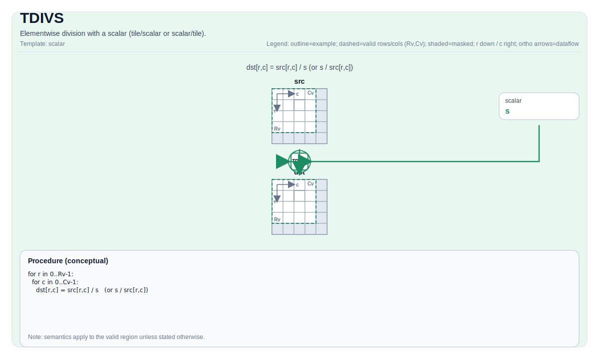

# TDIVS

## 指令示意图



## 简介

与标量的逐元素除法（Tile/标量 或 标量/Tile）。

## 数学语义

对有效区域内的每个元素 `(i, j)`：

- Tile/标量形式：

  $$ \mathrm{dst}_{i,j} = \frac{\mathrm{src}_{i,j}}{\mathrm{scalar}} $$

- 标量/Tile 形式：

  $$ \mathrm{dst}_{i,j} = \frac{\mathrm{scalar}}{\mathrm{src}_{i,j}} $$

## 汇编语法

PTO-AS 形式：参见 [PTO-AS 规范](../assembly/PTO-AS_zh.md)。

Tile/标量形式：

```text
%dst = tdivs %src, %scalar : !pto.tile<...>, f32
```

标量/Tile 形式：

```text
%dst = tdivs %scalar, %src : f32, !pto.tile<...>
```

### AS Level 1（SSA）

```text
%dst = pto.tdivs %src, %scalar : (!pto.tile<...>, dtype) -> !pto.tile<...>
%dst = pto.tdivs %scalar, %src : (dtype, !pto.tile<...>) -> !pto.tile<...>
```

### AS Level 2（DPS）

```text
pto.tdivs ins(%src, %scalar : !pto.tile_buf<...>, dtype) outs(%dst : !pto.tile_buf<...>)
pto.tdivs ins(%scalar, %src : dtype, !pto.tile_buf<...>) outs(%dst : !pto.tile_buf<...>)
```

## C++ 内建接口

声明于 `include/pto/common/pto_instr.hpp`：

```cpp
template <auto PrecisionType = DivAlgorithm::DEFAULT, typename TileDataDst, typename TileDataSrc,
          typename... WaitEvents>
PTO_INST RecordEvent TDIVS(TileDataDst &dst, TileDataSrc &src0, typename TileDataSrc::DType scalar,
                           WaitEvents &... events);

template <auto PrecisionType = DivAlgorithm::DEFAULT, typename TileDataDst, typename TileDataSrc,
          typename... WaitEvents>
PTO_INST RecordEvent TDIVS(TileDataDst &dst, typename TileDataDst::DType scalar, TileDataSrc &src0,
                           WaitEvents &... events)
```

`PrecisionType`可指定以下值：

* `DivAlgorithm::DEFAULT`：普通算法，速度快但精度较低。
* `DivAlgorithm::HIGH_PRECISION`：高精度算法，速度较慢。

## 约束

- **实现检查 (A2A3)**（两个重载）:
    - `TileData::DType` 必须是以下之一：`int32_t`、`int`、`int16_t`、`half`、`float16_t`、`float`、`float32_t`。
    - Tile 位置必须是向量（`TileData::Loc == TileType::Vec`）。
    - 静态有效边界：`TileData::ValidRow <= TileData::Rows` 且 `TileData::ValidCol <= TileData::Cols`。
    - 运行时：`src0.GetValidRow() == dst.GetValidRow()` 且 `src0.GetValidCol() == dst.GetValidCol()`。
    - Tile 布局必须是行主序（`TileData::isRowMajor`）。
- **实现检查 (A5)**（两个重载）:
    - `TileData::DType` 必须是以下之一：`uint8_t`、`int8_t`、`uint16_t`、`int16_t`、`uint32_t`、`int32_t`、`half`、`float`。
    - Tile 位置必须是向量（`TileData::Loc == TileType::Vec`）。
    - 静态有效边界：`TileData::ValidRow <= TileData::Rows` 且 `TileData::ValidCol <= TileData::Cols`。
    - 运行时：`src0.GetValidRow() == dst.GetValidRow()` 且 `src0.GetValidCol() == dst.GetValidCol()`。
    - Tile 布局必须是行主序（`TileData::isRowMajor`）。
- **有效区域**:
    - 该操作使用 `dst.GetValidRow()` / `dst.GetValidCol()` 作为迭代域。
- **除零**:
    - 行为由目标定义；在 A5 上，Tile/标量形式映射到乘以倒数，并对 `scalar == 0` 使用 `1/0 -> +inf`。dst.GetValidRow()`且`src0.GetValidCol() == dst.GetValidCol()`.
    - Tile 布局必须是行主序（`TileData::isRowMajor`）。
- **有效区域**:
    - 该操作使用 `dst.GetValidRow()` / `dst.GetValidCol()` 作为迭代域.
- **除零**:
    - 行为由目标定义；在 A5 上，tile/标量形式映射到乘以倒数，并对 `scalar == 0` 使用 `1/0 -> +inf`。
- **高精度算法**
    - 仅在A5上有效，`PrecisionType`选项A3上将被忽略。

## 示例

### 自动（Auto）

```cpp
#include <pto/pto-inst.hpp>

using namespace pto;

void example_auto() {
  using TileT = Tile<TileType::Vec, float, 16, 16>;
  TileT src, dst;
  TDIVS(dst, src, 2.0f);
  TDIVS<DivAlgorithm::HIGH_PRECISION>(dst, src, 2.0f);
}
```

### 手动（Manual）

```cpp
#include <pto/pto-inst.hpp>

using namespace pto;

void example_manual() {
  using TileT = Tile<TileType::Vec, float, 16, 16>;
  TileT src, dst;
  TASSIGN(src, 0x1000);
  TASSIGN(dst, 0x2000);
  TDIVS(dst, 2.0f, src);
  TDIVS<DivAlgorithm::HIGH_PRECISION>(dst, 2.0f, src);
}
```

## 汇编示例（ASM）

### 自动模式

```text
# 自动模式：由编译器/运行时负责资源放置与调度。
%dst = pto.tdivs %src, %scalar : (!pto.tile<...>, dtype) -> !pto.tile<...>
```

### 手动模式

```text
# 手动模式：先显式绑定资源，再发射指令。
# 可选（当该指令包含 tile 操作数时）：
# pto.tassign %arg0, @tile(0x1000)
# pto.tassign %arg1, @tile(0x2000)
%dst = pto.tdivs %src, %scalar : (!pto.tile<...>, dtype) -> !pto.tile<...>
```

### PTO 汇编形式

```text
%dst = pto.tdivs %src, %scalar : (!pto.tile<...>, dtype) -> !pto.tile<...>
# AS Level 2 (DPS)
pto.tdivs ins(%src, %scalar : !pto.tile_buf<...>, dtype) outs(%dst : !pto.tile_buf<...>)
```
