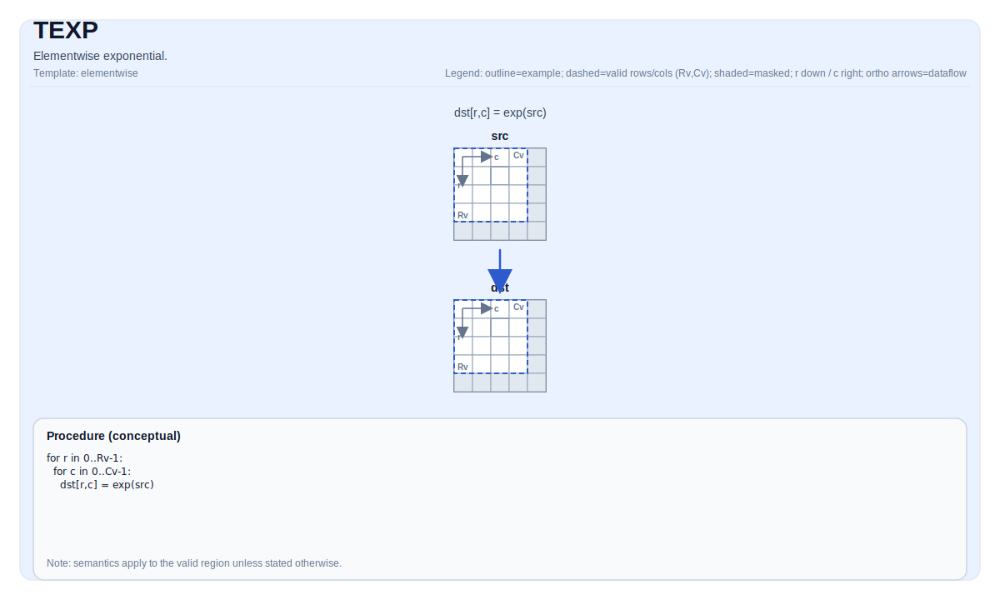

# TEXP


## Tile Operation Diagram



## Introduction

Elementwise exponential.

## Math Interpretation

For each element `(i, j)` in the valid region:

$$ \mathrm{dst}_{i,j} = \exp(\mathrm{src}_{i,j}) $$

## Assembly Syntax

PTO-AS form: see [PTO-AS Specification](../assembly/PTO-AS.md).

Synchronous form:

```text
%dst = texp %src : !pto.tile<...>
```

### AS Level 1 (SSA)

```text
%dst = pto.texp %src : !pto.tile<...> -> !pto.tile<...>
```

### AS Level 2 (DPS)

```text
pto.texp ins(%src : !pto.tile_buf<...>) outs(%dst : !pto.tile_buf<...>)
```
## C++ Intrinsic

Declared in `include/pto/common/pto_instr.hpp`:

```cpp
template <auto PrecisionType = ExpAlgorithm::DEFAULT, typename TileDataDst, typename TileDataSrc,
          typename... WaitEvents>
PTO_INST RecordEvent TEXP(TileDataDst &dst, TileDataSrc &src, WaitEvents &... events);
```

`PrecisionType` has the following values available:

* `ExpAlgorithm::DEFAULT`: Normal algorithm, faster but with lower precision.
* `ExpAlgorithm::HIGH_PRECISION`: High precision algorithm, but slower.


## Constraints

- **Implementation checks (NPU)**:
    - `TileData::DType` must be one of: `float` or `half`;
    - Tile location must be vector (`TileData::Loc == TileType::Vec`);
    - Static valid bounds: `TileData::ValidRow <= TileData::Rows` and `TileData::ValidCol <= TileData::Cols`;
    - Runtime: `src.GetValidRow() == dst.GetValidRow()` and `src.GetValidCol() == dst.GetValidCol()`;
    - Tile layout must be row-major (`TileData::isRowMajor`).
- **Valid region**:
    - The op uses `dst.GetValidRow()` / `dst.GetValidCol()` as the iteration domain.
- **High Precision Algorithm**
    - Only available on A5, `PrecisionType` option is ignored on A3.


## Examples

### Auto

```cpp
#include <pto/pto-inst.hpp>

using namespace pto;

void example_auto() {
  using TileT = Tile<TileType::Vec, float, 16, 16>;
  TileT src, dst;
  TEXP(dst, src);
  TEXP<ExpAlgorithm::HIGH_PRECISION>(dst, src);  // A5 Only
}
```

### Manual

```cpp
#include <pto/pto-inst.hpp>

using namespace pto;

void example_manual() {
  using TileT = Tile<TileType::Vec, float, 16, 16>;
  TileT src, dst;
  TASSIGN(src, 0x1000);
  TASSIGN(dst, 0x2000);
  TEXP(dst, src);
}
```

## ASM Form Examples

### Auto Mode

```text
# Auto mode: compiler/runtime-managed placement and scheduling.
%dst = pto.texp %src : !pto.tile<...> -> !pto.tile<...>
```

### Manual Mode

```text
# Manual mode: bind resources explicitly before issuing the instruction.
# Optional for tile operands:
# pto.tassign %arg0, @tile(0x1000)
# pto.tassign %arg1, @tile(0x2000)
%dst = pto.texp %src : !pto.tile<...> -> !pto.tile<...>
```

### PTO Assembly Form

```text
%dst = texp %src : !pto.tile<...>
# AS Level 2 (DPS)
pto.texp ins(%src : !pto.tile_buf<...>) outs(%dst : !pto.tile_buf<...>)
```
