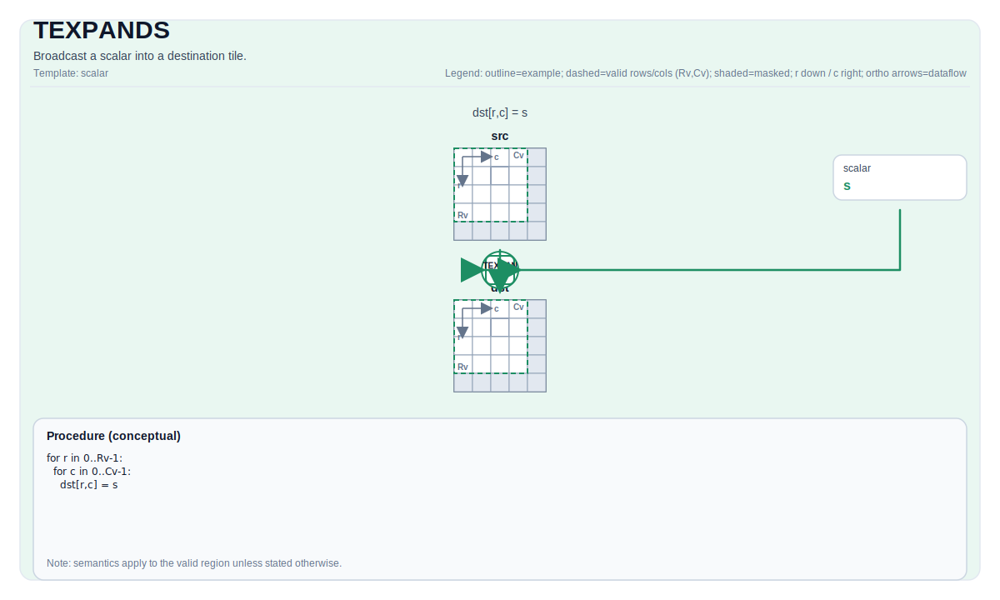

# TEXPANDS

## 指令示意图



## 简介

将标量广播到目标 Tile 中。

## 数学语义

对每个元素 `(i, j)` 在有效区域内：

$$ \mathrm{dst}_{i,j} = \mathrm{scalar} $$

## 汇编语法

PTO-AS 形式：参见 [PTO-AS 规范](../assembly/PTO-AS_zh.md)。

同步形式：

```text
%dst = texpands %scalar : f32, !pto.tile<...>
```

### AS Level 1（SSA）

```text
%dst = pto.texpands %scalar : dtype -> !pto.tile<...>
```

### AS Level 2（DPS）

```text
pto.texpands ins(%scalar : dtype) outs(%dst : !pto.tile_buf<...>)
```

## C++ 内建接口

声明于 `include/pto/common/pto_instr.hpp`：

```cpp
template <typename TileData, typename... WaitEvents>
PTO_INST RecordEvent TEXPANDS(TileData &dst, typename TileData::DType scalar, WaitEvents &... events);
```

## 约束

- **实现检查 (A2A3)**:
    - 对于Tile位置是向量（`TileData::Loc == TileType::Vec`）:
    - `TileData::DType` 必须是以下之一：`int8_t`、`uint8_t`、`int16_t`、`uint16_t`、`int32_t`、`uint32_t`、`half`、`bfloat16_t`、`float`。
    - 静态有效边界： `TileData::ValidRow <= TileData::Rows`且`TileData::ValidCol <= TileData::Cols`.
    - 对于Tile位置是Mat（`TileData::Loc == TileType::Mat`）:
    - `TileData::DType` 必须是以下之一：`int8_t`、`uint8_t`、`int16_t`、`uint16_t`、`int32_t`、`uint32_t`、`half`、`bfloat16_t`、`float`。
    - 有效边界：`TileData::Rows * TileData::Cols * sizeof(T) / 32` 必须在`[1, 32767]`范围内。
- **实现检查 (A5)**:
    - 对于Tile位置是向量（`TileData::Loc == TileType::Vec`）:
    - 静态有效边界： `TileData::ValidRow <= TileData::Rows`且`TileData::ValidCol <= TileData::Cols`.
    - `TileData::DType` 必须是以下之一： `uint8_t`, `int8_t`, `uint16_t`, `int16_t`, `uint32_t`, `int32_t`, `half`, `float`.
    - 对于Tile位置是Mat（`TileData::Loc == TileType::Mat`）:
    - `TileData::DType` 必须是以下之一： `uint8_t`, `int8_t`, `uint16_t`, `int16_t`, `uint32_t`, `int32_t`, `half`, `float`.
    - 对于`TileDataDst::layout == pto::Layout::NC1HWC0 || TileDataDst::layout == pto::Layout::FRACTAL_Z`:
      - `TileData::shape0 * TileData::shape1 * TileData::shape2 * TileData::shape3` 必须在`[1, 32767]`范围内。
    - 对于`TileDataDst::layout == pto::Layout::NDC1HWC0 || TileDataDst::layout == pto::Layout::FRACTAL_Z_3D`:
      - `TileData::shape0 * TileData::shape1 * TileData::shape2 * TileData::shape3 * TileData::shape4` 必须在`[1, 32767]`范围内。
- **有效区域**:
    - 对于Tile位置是向量（`TileData::Loc == TileType::Vec`）:
    - 该操作在 `dst.GetValidRow()` / `dst.GetValidCol()` 上填充 `dst`。
    - 对于Tile位置是Mat（`TileData::Loc == TileType::Mat`）:
    - 对于Tile，该操作在 `TileData::Rows` / `TileData::Cols` 上填充 `dst`。
    - 对于convTile，该操作在`ConvTileData`的`shape`内填充`dst`。

## 示例

### 自动（Auto）

```cpp
#include <pto/pto-inst.hpp>

using namespace pto;

void example_auto() {
  using TileT = Tile<TileType::Vec, float, 16, 16>;
  TileT dst;
  TEXPANDS(dst, 0.0f);
}
```

### 手动（Manual）

```cpp
#include <pto/pto-inst.hpp>

using namespace pto;

void example_manual() {
  using TileT = Tile<TileType::Vec, float, 16, 16>;
  TileT dst;
  TASSIGN(dst, 0x1000);
  TEXPANDS(dst, 0.0f);
}
```

## 汇编示例（ASM）

### 自动模式

```text
# 自动模式：由编译器/运行时负责资源放置与调度。
%dst = pto.texpands %scalar : dtype -> !pto.tile<...>
```

### 手动模式

```text
# 手动模式：先显式绑定资源，再发射指令。
# 可选（当该指令包含 tile 操作数时）：
# pto.tassign %arg0, @tile(0x1000)
# pto.tassign %arg1, @tile(0x2000)
%dst = pto.texpands %scalar : dtype -> !pto.tile<...>
```

### PTO 汇编形式

```text
%dst = texpands %scalar : f32, !pto.tile<...>
# AS Level 2 (DPS)
pto.texpands ins(%scalar : dtype) outs(%dst : !pto.tile_buf<...>)
```
