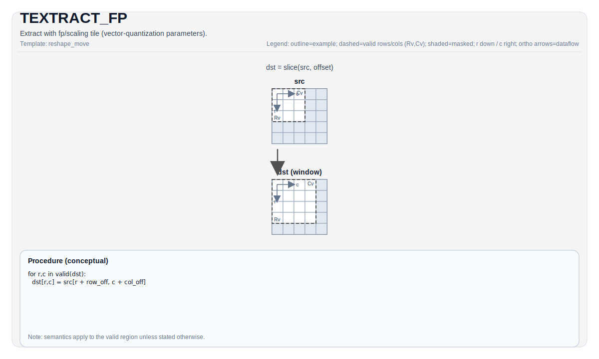

# TEXTRACT_FP

## 指令示意图



## 简介

带 fp/缩放 Tile 的提取（向量量化参数）。

## 数学语义

除非另有说明，语义在有效区域上定义，目标相关的行为标记为实现定义。

## 汇编语法

PTO-AS 形式：参见 [PTO-AS 规范](../assembly/PTO-AS_zh.md)。

### AS Level 1（SSA）

```text
%dst = pto.textract_fp %src, %idxrow, %idxcol : (!pto.tile<...>, dtype, dtype) -> !pto.tile<...>
```

### AS Level 2（DPS）

```text
pto.textract_fp ins(%src, %idxrow, %idxcol : !pto.tile_buf<...>, dtype, dtype) outs(%dst : !pto.tile_buf<...>)
```

## C++ 内建接口

声明于 `include/pto/common/pto_instr.hpp`：

```cpp
template <typename DstTileData, typename SrcTileData, typename FpTileData, ReluPreMode reluMode = ReluPreMode::NoRelu,
          typename... WaitEvents>
PTO_INST RecordEvent TEXTRACT_FP(DstTileData &dst, SrcTileData &src, FpTileData &fp, uint16_t indexRow, uint16_t indexCol, WaitEvents &... events);
```

## 约束

类型/布局/位置/形状的合法性取决于后端；将实现特定的说明视为该后端的规范。

## 示例

参见 `docs/isa/` 和 `docs/coding/tutorials/` 中的相关示例。

## 汇编示例（ASM）

### 自动模式

```text
# 自动模式：由编译器/运行时负责资源放置与调度。
%dst = pto.textract_fp %src, %idxrow, %idxcol : (!pto.tile<...>, dtype, dtype) -> !pto.tile<...>
```

### 手动模式

```text
# 手动模式：先显式绑定资源，再发射指令。
# 可选（当该指令包含 tile 操作数时）：
# pto.tassign %arg0, @tile(0x1000)
# pto.tassign %arg1, @tile(0x2000)
%dst = pto.textract_fp %src, %idxrow, %idxcol : (!pto.tile<...>, dtype, dtype) -> !pto.tile<...>
```

### PTO 汇编形式

```text
%dst = pto.textract_fp %src, %idxrow, %idxcol : (!pto.tile<...>, dtype, dtype) -> !pto.tile<...>
# AS Level 2 (DPS)
pto.textract_fp ins(%src, %idxrow, %idxcol : !pto.tile_buf<...>, dtype, dtype) outs(%dst : !pto.tile_buf<...>)
```
