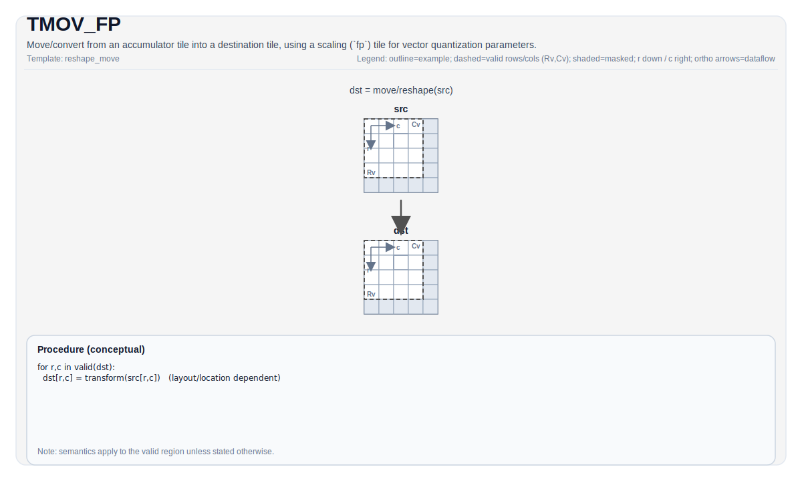

# TMOV_FP

## 指令示意图



## 简介

使用缩放 (`fp`) Tile 作为向量量化参数，将累加器 Tile 移动/转换到目标 Tile。

## 数学语义

概念上使用从 `fp` 派生的实现定义的量化/反量化配置转换每个元素：

$$ \mathrm{dst}_{i,j} = \mathrm{Convert}\!\left(\mathrm{src}_{i,j};\ \mathrm{fp}\right) $$

## 汇编语法

PTO-AS 形式：参见 [PTO-AS 规范](../assembly/PTO-AS_zh.md)。

同步形式：

```text
%dst = tmov.fp %src, %fp : !pto.tile<...>, !pto.tile<...> -> !pto.tile<...>
```

### AS Level 1（SSA）

```text
%dst = pto.tmov.fp %src, %fp : !pto.tile<...>, !pto.tile<...> -> !pto.tile<...>
```

### AS Level 2（DPS）

```text
pto.tmov.fp ins(%src, %fp : !pto.tile_buf<...>, !pto.tile_buf<...>) outs(%dst : !pto.tile_buf<...>)
```

## C++ 内建接口

声明于 `include/pto/common/pto_instr.hpp` 和 `include/pto/common/constants.hpp`：

```cpp
template <typename DstTileData, typename SrcTileData, typename FpTileData, ReluPreMode reluMode = ReluPreMode::NoRelu,
          typename... WaitEvents>
PTO_INST RecordEvent TMOV_FP(DstTileData &dst, SrcTileData &src, FpTileData &fp, WaitEvents &... events);
```

## 约束

- **实现检查 (A2A3)**:
    - fp 路径仅支持累加器转换，并通过 `TMOV_IMPL(dst, src, fp)` 中的内部编译时检查进行验证。
    - `FpTileData::Loc` 必须是 `TileType::Scaling`（`static_assert`）。
- **实现检查 (A5)**:
    - 通过 `CheckTMovAccValid(...)` 和 `TMOV_IMPL(dst, src, fp)` 中的相关编译时检查进行验证。
    - `FpTileData::Loc` 必须是 `TileType::Scaling`（`static_assert`）。
    - 目标位置取决于目标（fp 路径支持 `Vec` 或 `Mat`）。

## 示例

### 自动（Auto）

```cpp
#include <pto/pto-inst.hpp>

using namespace pto;

void example_auto() {
  using AccT = TileAcc<float, 16, 16>;
  using DstT = Tile<TileType::Vec, int8_t, 16, 16>;
  using FpT = Tile<TileType::Scaling, uint64_t, 1, 16, BLayout::RowMajor, 1, 16, SLayout::NoneBox>;

  AccT acc;
  DstT dst;
  FpT fp;
  TMOV_FP(dst, acc, fp);
}
```

### 手动（Manual）

```cpp
#include <pto/pto-inst.hpp>

using namespace pto;

void example_manual() {
  using AccT = TileAcc<float, 16, 16>;
  using DstT = Tile<TileType::Vec, int8_t, 16, 16>;
  using FpT = Tile<TileType::Scaling, uint64_t, 1, 16, BLayout::RowMajor, 1, 16, SLayout::NoneBox>;

  AccT acc;
  DstT dst;
  FpT fp;
  TASSIGN(acc, 0x1000);
  TASSIGN(dst, 0x2000);
  TASSIGN(fp,  0x3000);
  TMOV_FP(dst, acc, fp);
}
```

## 汇编示例（ASM）

### 自动模式

```text
# 自动模式：由编译器/运行时负责资源放置与调度。
%dst = pto.tmov.fp %src, %fp : !pto.tile<...>, !pto.tile<...> -> !pto.tile<...>
```

### 手动模式

```text
# 手动模式：先显式绑定资源，再发射指令。
# 可选（当该指令包含 tile 操作数时）：
# pto.tassign %arg0, @tile(0x1000)
# pto.tassign %arg1, @tile(0x2000)
%dst = pto.tmov.fp %src, %fp : !pto.tile<...>, !pto.tile<...> -> !pto.tile<...>
```

### PTO 汇编形式

```text
%dst = tmov.fp %src, %fp : !pto.tile<...>, !pto.tile<...> -> !pto.tile<...>
# AS Level 2 (DPS)
pto.tmov.fp ins(%src, %fp : !pto.tile_buf<...>, !pto.tile_buf<...>) outs(%dst : !pto.tile_buf<...>)
```
