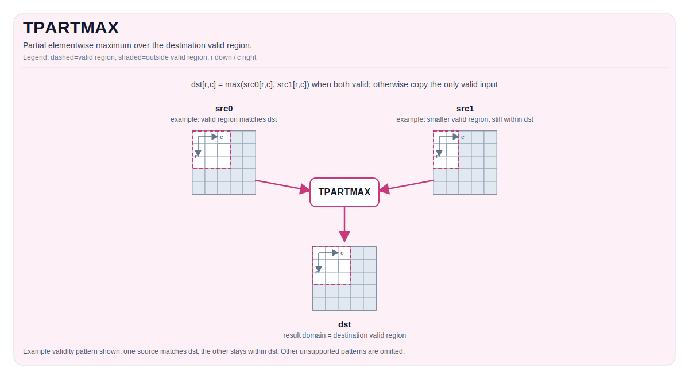

# TPARTMAX

## 指令示意图



## 简介

在目标有效区域内执行逐元素最大值选择。若某个位置上 `src0` 和 `src1` 都有效，则结果为 `max(src0, src1)`；若只有一个输入在该位置有效，则结果直接取该输入的值。其余有效区域不匹配的情况由具体实现定义。

## 数学语义

对目标有效区域内的每个元素 `(i, j)`：

$$
\mathrm{dst}_{i,j} =
\begin{cases}
\max(\mathrm{src0}_{i,j}, \mathrm{src1}_{i,j}) & \text{若两个输入在 } (i,j) \text{ 处均有定义} \\\\
\mathrm{src0}_{i,j} & \text{若仅 src0 在 } (i,j) \text{ 处有定义} \\\\
\mathrm{src1}_{i,j} & \text{若仅 src1 在 } (i,j) \text{ 处有定义}
\end{cases}
$$

## 汇编语法

PTO-AS 形式：参见 [PTO-AS 规范](../assembly/PTO-AS_zh.md)。

同步形式：

```text
%dst = tpartmax %src0, %src1 : !pto.tile<...> -> !pto.tile<...>
```

### AS Level 1（SSA）

```text
%dst = pto.tpartmax %src0, %src1 : (!pto.tile<...>, !pto.tile<...>) -> !pto.tile<...>
```

### AS Level 2（DPS）

```text
pto.tpartmax ins(%src0, %src1 : !pto.tile_buf<...>, !pto.tile_buf<...>) outs(%dst : !pto.tile_buf<...>)
```

## C++ 内建接口

声明于 `include/pto/common/pto_instr.hpp`：

```cpp
template <typename TileDataDst, typename TileDataSrc0, typename TileDataSrc1, typename... WaitEvents>
PTO_INST RecordEvent TPARTMAX(TileDataDst &dst, TileDataSrc0 &src0, TileDataSrc1 &src1, WaitEvents &... events);
```

## 约束

### 通用约束或检查

- `dst`、`src0` 和 `src1` 的元素类型必须一致。
- 目标有效区域定义结果的计算范围。
- 对目标有效区域内的每个元素：
    - 若两个输入都有效，则执行逐元素最大值运算；
    - 若只有一个输入有效，则结果直接取该输入的值。
- 若 `dst` 的有效区域为零，指令直接返回。
- 支持的部分有效区域模式要求至少有一个源 Tile 的有效区域与 `dst` 完全一致，另一个源 Tile 的有效区域在两个维度上都不能超过 `dst`。
- 上述范围之外的有效区域组合，其行为均由具体实现定义。

### A2A3 实现检查

- 支持的元素类型：`int32_t`、`int16_t`、`half`、`float`。
- `dst`、`src0` 和 `src1` 必须全部为行主序（`isRowMajor`）。

### A5 实现检查

- 支持的元素类型：`int8_t`、`uint8_t`、`int16_t`、`uint16_t`、`int32_t`、`uint32_t`、`half`、`bfloat16_t`、`float`。

## 示例

### 自动（Auto）

```cpp
#include <pto/pto-inst.hpp>

using namespace pto;

void example_auto() {
  using TileT = Tile<TileType::Vec, float, 16, 16>;
  TileT src0, src1, dst;
  TPARTMAX(dst, src0, src1);
}
```

### 手动（Manual）

```cpp
#include <pto/pto-inst.hpp>

using namespace pto;

void example_manual() {
  using TileT = Tile<TileType::Vec, float, 16, 16>;
  TileT src0, src1, dst;
  TASSIGN(src0, 0x1000);
  TASSIGN(src1, 0x2000);
  TASSIGN(dst,  0x3000);
  TPARTMAX(dst, src0, src1);
}
```

## 汇编示例（ASM）

### 自动模式

```text
# 自动模式：由编译器/运行时负责资源放置与调度。
%dst = pto.tpartmax %src0, %src1 : (!pto.tile<...>, !pto.tile<...>) -> !pto.tile<...>
```

### 手动模式

```text
# 手动模式：先显式绑定资源，再发射指令。
# 可选（当该指令包含 tile 操作数时）：
# pto.tassign %arg0, @tile(0x1000)
# pto.tassign %arg1, @tile(0x2000)
%dst = pto.tpartmax %src0, %src1 : (!pto.tile<...>, !pto.tile<...>) -> !pto.tile<...>
```

### PTO 汇编形式

```text
%dst = tpartmax %src0, %src1 : !pto.tile<...> -> !pto.tile<...>
# AS Level 2 (DPS)
pto.tpartmax ins(%src0, %src1 : !pto.tile_buf<...>, !pto.tile_buf<...>) outs(%dst : !pto.tile_buf<...>)
```
