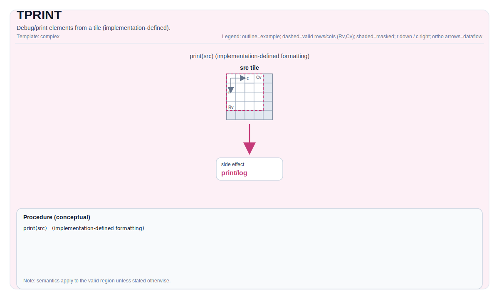

# TPRINT


## Tile Operation Diagram



## Introduction

Print the contents of a Tile or GlobalTensor for debugging purposes directly from device code.

The `TPRINT` instruction outputs the logical view of data stored in a Tile or GlobalTensor. It supports common data types (e.g., `float`, `half`, `int8`, `uint32`) and multiple memory layouts (`ND`, `DN`, `NZ` for GlobalTensor; vector tiles for on-chip buffers).

> **Important**:
> - This instruction is **for development and debugging ONLY**.
> - It incurs **significant runtime overhead** and **must not be used in production kernels**.
> - Output may be **truncated** if it exceeds the internal print buffer. The print buffer can be modified by adding `-DCCEBlockMaxSize=16384` in compile options; default is 16KB.
> - **Requires CCE compilation option `-D_DEBUG --cce-enable-print`** (see [Behavior](#behavior)).

## Assembly Syntax

PTO-AS form: see [PTO-AS Specification](../assembly/PTO-AS.md).

```text
tprint %src : !pto.tile<...> | !pto.global<...>
```

### AS Level 1 (SSA)

```text
pto.tprint %src : !pto.tile<...> | !pto.partition_tensor_view<MxNxdtype> -> ()
```

### AS Level 2 (DPS)

```text
pto.tprint ins(%src : !pto.tile_buf<...> | !pto.partition_tensor_view<MxNxdtype>)
```
## C++ Intrinsic
Declared in `include/pto/common/pto_instr.hpp`:
```cpp
// For printing GlobalTensor or Vec-type Tile
template <PrintFormat Format = PrintFormat::Width8_Precision4, typename TileData>
PTO_INST void TPRINT(TileData &src);

// For printing Acc-type Tile and Mat-type Tile (Mat printing only supported for A3, not yet for A5)
template <PrintFormat Format = PrintFormat::Width8_Precision4, typename TileData, typename GlobalData>
PTO_INTERNAL void TPRINT(TileData &src, GlobalData &tmp);
```

### PrintFormat Enumeration
Declared in `include/pto/common/type.hpp`:
```cpp
enum class PrintFormat : uint8_t
{
    Width8_Precision4 = 0,  // Print width 8, precision 4
    Width8_Precision2 = 1,  // Print width 8, precision 2
    Width10_Precision6 = 2, // Print width 10, precision 6
};
```

### Supported Types for T
- **Tile**: TileType must be `Vec`, `Acc`, `Mat (A3 only)`, and have a supported element type.
- **GlobalTensor**: Must use layout `ND`, `DN`, or `NZ`, and have a supported element type.

## Constraints

- **Supported element type**:
    - Floating-point: `float`, `half`
    - Signed integers: `int8_t`, `int16_t`, `int32_t`
    - Unsigned integers: `uint8_t`, `uint16_t`, `uint32_t`
- **For GlobalTensor**: Layout must be one of `Layout::ND`, `Layout::DN`, or `Layout::NZ`.
- **For temporary space**: Printing a Tile with `TileType` of `Mat` or `Acc` requires temporary space on GM. The temporary space must not be less than `TileData::Numel * sizeof(T)`.
- A5 does not yet support printing Tiles with `TileType` of `Mat`.
- **Echo information**: When `TileType` is `Mat`, the layout will be printed according to `Layout::ND`; other layouts may result in misaligned information.

## Behavior
- **Mandatory Compilation Flag**:

  On A2/A3/A5 devices, `TPRINT` uses `cce::printf` to emit output via the device-to-host debug channel. **You must enable the CCE option `-D_DEBUG --cce-enable-print`**.

- **Buffer Limitation:**

  The internal print buffer of `cce::printf` is limited in size. If the output exceeds this buffer, a warning message such as `"Warning: out of bound! try best to print"` may appear, and **only partial data will be printed**.

- **Synchronization**:

  Automatically inserts a `pipe_barrier(PIPE_ALL)` before printing to ensure all prior operations complete and data is consistent.

- **Formatting**:

    - Floating-point values: printed format depends on `PrintFormat` template parameter:
      - `PrintFormat::Width8_Precision4`: `%8.4f` (default)
      - `PrintFormat::Width8_Precision2`: `%8.2f`
      - `PrintFormat::Width10_Precision6`: `%10.6f`
    - Integer values: printed format depends on `PrintFormat` template parameter:
      - `PrintFormat::Width8_Precision4` or `PrintFormat::Width8_Precision2`: `%8d`
      - `PrintFormat::Width10_Precision6`: `%10d`
    - For `GlobalTensor`, due to data size and buffer limitations, only elements within its logical shape (defined by `Shape`) are printed.
    - For `Tile`, invalid regions (beyond `validRows`/`validCols`) are still printed but marked with a `|` separator when partial validity is specified.

## Examples

### Print a Tile

```cpp
#include <pto/pto-inst.hpp>

PTO_INTERNAL void DebugTile(__gm__ float *src) {
  using ValidSrcShape = TileShape2D<float, 16, 16>;
  using NDSrcShape = BaseShape2D<float, 32, 32>;
  using GlobalDataSrc = GlobalTensor<float, ValidSrcShape, NDSrcShape>;
  GlobalDataSrc srcGlobal(src);

  using srcTileData = Tile<TileType::Vec, float, 16, 16>;
  srcTileData srcTile;
  TASSIGN(srcTile, 0x0);

  TLOAD(srcTile, srcGlobal);
  TPRINT(srcTile);
}
```

### Print a GlobalTensor

```cpp
#include <pto/pto-inst.hpp>

PTO_INTERNAL void DebugGlobalTensor(__gm__ float *src) {
  using ValidSrcShape = TileShape2D<float, 16, 16>;
  using NDSrcShape = BaseShape2D<float, 32, 32>;
  using GlobalDataSrc = GlobalTensor<float, ValidSrcShape, NDSrcShape>;
  GlobalDataSrc srcGlobal(src);

  TPRINT(srcGlobal);
}
```

## Math Interpretation

Unless otherwise specified, semantics are defined over the valid region and target-dependent behavior is marked as implementation-defined.

## ASM Form Examples

### Auto Mode

```text
# Auto mode: compiler/runtime-managed placement and scheduling.
pto.tprint %src : !pto.tile<...> | !pto.partition_tensor_view<MxNxdtype> -> ()
```

### Manual Mode

```text
# Manual mode: bind resources explicitly before issuing the instruction.
# Optional for tile operands:
# pto.tassign %arg0, @tile(0x1000)
# pto.tassign %arg1, @tile(0x2000)
pto.tprint %src : !pto.tile<...> | !pto.partition_tensor_view<MxNxdtype> -> ()
```

### PTO Assembly Form

```text
pto.tprint %src : !pto.tile<...> | !pto.partition_tensor_view<MxNxdtype> -> ()
# AS Level 2 (DPS)
pto.tprint ins(%src : !pto.tile_buf<...> | !pto.partition_tensor_view<MxNxdtype>)
```
