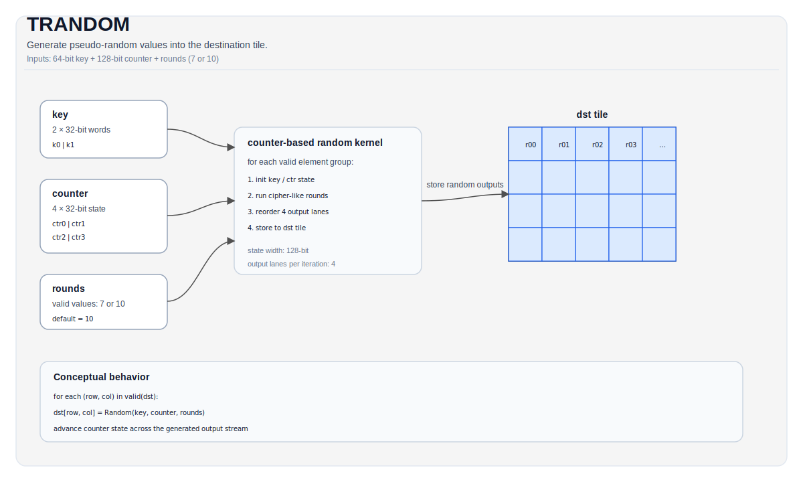

# TRANDOM


## Tile Operation Diagram



## Introduction

Generates random numbers in the destination tile using a counter-based cipher algorithm.

## Math Interpretation

This instruction implements a counter-based random number generator. For each element in the valid region, it generates pseudo-random values based on a key and counter state using a cipher-like transformation with configurable rounds.

The algorithm uses:
- 128-bit state (4 × 32-bit counters)
- 64-bit key (2 × 32-bit words)
- ChaCha-like quarter-round operations with vector instructions

## Assembly Syntax

PTO-AS form: see [PTO-AS Specification](../assembly/PTO-AS.md).

Synchronous form:

```text
trandom %dst, %key, %counter : !pto.tile<...>
```

### AS Level 1 (SSA)

```text
%dst = pto.trandom %key, %counter : (!pto.tile<...>, !pto.tile<...>) -> !pto.tile<...>
```

### AS Level 2 (DPS)

```text
pto.trandom ins(%key, %counter : !pto.tile_buf<...>, !pto.tile_buf<...>) outs(%dst : !pto.tile_buf<...>)
```

## C++ Intrinsic

Declared in `include/pto/npu/a5/TRandom.hpp`:

```cpp
template <uint16_t Rounds = 10, typename DstTile>
PTO_INST void TRANDOM_IMPL(DstTile &dst, TRandomKey &key, TRandomCounter &counter);
```

## Constraints

- **Implementation checks (A5)**:
    - `DstTile::DType` must be one of: `int32_t`, `uint32_t`.
    - Tile layout must be row-major (`DstTile::isRowMajor`).
    - `Rounds` must be either 7 or 10 (default: 10).
    - `key` and `counter` must not be null.
- **Valid region**:
    - The op uses `dst.GetValidRow()` / `dst.GetValidCol()` as the iteration domain.

## Examples

### Auto

```cpp
#include <pto/pto-inst.hpp>

using namespace pto;

void example_auto() {
  using TileT = Tile<TileType::Vec, uint32_t, 16, 16>;
  TileT dst;
  TRandomKey key = {0x01234, 0x56789};
  TRandomCounter counter = {0, 0, 0, 0};
  TRANDOM_IMPL(dst, key, counter);
}
```

### Manual

```cpp
#include <pto/pto-inst.hpp>

using namespace pto;

void example_manual() {
  using TileT = Tile<TileType::Vec, uint32_t, 16, 16>;
  TileT dst;
  TRandomKey key = {0x01234, 0x56789};
  TRandomCounter counter = {0, 0, 0, 0};
  TASSIGN(dst, 0x0);
  TRANDOM_IMPL<10>(dst, key, counter);
}
```

## ASM Form Examples

### Auto Mode

```text
# Auto mode: compiler/runtime-managed placement and scheduling.
%dst = pto.trandom %key, %counter : (!pto.tile<...>, !pto.tile<...>) -> !pto.tile<...>
```

### Manual Mode

```text
# Manual mode: bind resources explicitly before issuing the instruction.
# Optional for tile operands:
# pto.tassign %arg0, @tile(0x3000)
%dst = pto.trandom %key, %counter : (!pto.tile<...>, !pto.tile<...>) -> !pto.tile<...>
```

### PTO Assembly Form

```text
trandom %dst, %key, %counter : !pto.tile<...>
# AS Level 2 (DPS)
pto.trandom ins(%key, %counter : !pto.tile_buf<...>, !pto.tile_buf<...>) outs(%dst : !pto.tile_buf<...>)
```
