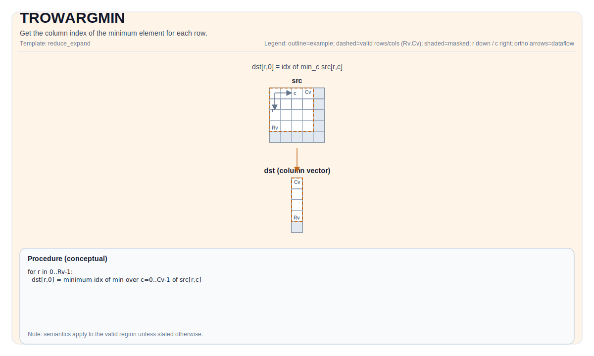

# pto.trowargmin

旧路径兼容入口。规范页见 [pto.trowargmin](./tile/ops/reduce-and-expand/trowargmin_zh.md)。



## 简介

获取每行最小值对应列索引，或同时获取每行最小值及其对应列索引。

## 数学语义

设 `R = src.GetValidRow()`，`C = src.GetValidCol()`。对 `0 <= i < R`：

$$ \mathrm{dst}_{i,0} = \underset{0 \le j < C}{\operatorname{argmin}} \; \mathrm{src}_{i,j} $$

$$ \mathrm{dstval}_{i,0} = \min_{0 \le j < C} \mathrm{src}_{i,j} $$

## 汇编语法

PTO-AS 形式：参见 [PTO-AS 规范](../assembly/PTO-AS_zh.md)。

同步形式：

```text
%dst = trowargmin %src : !pto.tile<...> -> !pto.tile<...>
```
Lowering may introduce internal scratch tiles; the C++ intrinsic requires an explicit `tmp` operand.

### IR Level 1（SSA）

```text
%dst = pto.trowargmin %src, %tmp : (!pto.tile<...>, !pto.tile<...>) -> !pto.tile<...>
```

### IR Level 2（DPS）

```text
pto.trowargmin ins(%src, %tmp : !pto.tile_buf<...>, !pto.tile_buf<...>) outs(%dst : !pto.tile_buf<...>)
```

## C++ 内建接口

声明于 `include/pto/common/pto_instr.hpp`:

仅输出索引：

```cpp
template <typename TileDataOut, typename TileDataIn, typename TileDataTmp, typename... WaitEvents>
PTO_INST RecordEvent TROWARGMIN(TileDataOut& dst, TileDataIn& src, TileDataTmp& tmp, WaitEvents&... events);
```

同时输出值和索引：

```cpp
template <typename TileDataOutVal, typename TileDataOutIdx, typename TileDataIn, typename TileDataTmp,
          typename... WaitEvents>
PTO_INST RecordEvent TROWARGMIN(TileDataOutVal &dstVal, TileDataOutIdx &dstIdx, TileDataIn &src, TileDataTmp &tmp,
                                WaitEvents &... events)
```

## 约束

### 通用约束或检查

- 支持的源元素类型：`half`、`float`。
- `src` 必须使用标准 ND 布局：行主且非分形（`BLayout::RowMajor`、`SLayout::NoneBox`）。
- 仅输出索引时：
    -`dst` 和 `src` 必须为 `TileType::Vec`。
    - 支持的目标元素类型：`uint32_t`、`int32_t`。
    - 运行时检查遵循共享的行归约检查路径：
        - `src.GetValidRow() != 0`
        - `src.GetValidCol() != 0`
        - `src.GetValidRow() == dst.GetValidRow()`
    - `dst` 通过共享的行归约索引检查路径约束，可使用以下任一非分形布局：
        - 单列 DN 布局（`BLayout::ColMajor`、`Cols == 1`），或
        - 有效列数为 1 的 ND 布局。
- 同时输出值和索引时：
    - `dstVal`、`dstIdx`、`src` 必须为 `TileType::Vec`。
    - `dstVal`的元素类型必须与`src`的元素类型一致。
    - 支持的目标元素类型：
        - 源元素类型为`float`时，支持`uint32_t`、`int32_t`。
        - 源元素类型为`half`时，支持`uint16_t`、`int16_t`。
    - 运行时检查遵循共享的行归约检查路径：
        - `src.GetValidRow() != 0`
        - `src.GetValidCol() != 0`
        - `src.GetValidRow() == dstIdx.GetValidRow()`
        - `src.GetValidRow() == dstVal.GetValidRow()`
    - `dstVal`、`dstIdx`通过共享的行归约索引检查路径约束，可使用以下任一非分形布局：
        - 单列 DN 布局（`BLayout::ColMajor`、`Cols == 1`），或
        - 有效列数为 1 的 ND 布局。

### `tmp`临时Tile相关说明

- 仅A3使用`tmp`临时Tile，A5接收`tmp`但实际并不使用。
- 仅输出索引时，`tmp`临时Tile在`srcValidCol <= ElementPerRepeat`时不使用。
- 同时输出值和索引且`srcValidCol <= ElementPerRepeat`时，`tmp`临时Tile可使用以下任一非分形布局：
    - 单列 DN 布局（`BLayout::ColMajor`、`Cols == 1`），有效行数为`srcValidRow * 2`。
    - 有效行数为`srcValidRow`且有效列数为 2 的 ND 布局。
- `srcValidCol > ElementPerRepeat`时：
    - `tmp` tile的行数和`src` tile的行数相同。
    - 按以下公式根据`src` tile的`validCol`算出`tmp` tile所需stride：

```text
repeats = ceil(validCol / elementPerRepeat)
stride = (ceil(repeats * 2 / elementPerBlock) + ceil(repeats / elementPerBlock)) * elementPerBlock
```


## 示例

### 自动（Auto）

```cpp
#include <pto/pto-inst.hpp>

using namespace pto;

void example_auto() {
  using SrcT = Tile<TileType::Vec, float, 16, 16>;
  using DstT = Tile<TileType::Vec, float, 16, 1, BLayout::ColMajor>;
  using DstValT = Tile<TileType::Vec, float, 16, 1, BLayout::ColMajor>;
  using TmpT = Tile<TileType::Vec, float, 16, 16>;
  SrcT src;
  DstT dst;
  DstValT dst;
  TmpT tmp;
  TROWARGMIN(dst, src, tmp);
  TROWARGMIN(dstVal, dst, src, tmp);
}
```

### 手动（Manual）

```cpp
#include <pto/pto-inst.hpp>

using namespace pto;

void example_manual() {
  using SrcT = Tile<TileType::Vec, float, 16, 16>;
  using DstT = Tile<TileType::Vec, float, 16, 1, BLayout::ColMajor>;
  using DstValT = Tile<TileType::Vec, float, 16, 1, BLayout::ColMajor>;
  using TmpT = Tile<TileType::Vec, float, 16, 16>;
  SrcT src;
  DstT dst;
  DstValT dst;
  TmpT tmp;
  TASSIGN(src, 0x1000);
  TASSIGN(dst, 0x2000);
  TASSIGN(dstVal, 0x3000);
  TASSIGN(tmp, 0x4000);
  TROWARGMIN(dst, src, tmp);
  TROWARGMIN(dstVal, dst, src, tmp);
}
```

## 汇编示例（ASM）

### 自动模式

```text
# 自动模式：由编译器/运行时负责资源放置与调度。
%dst = pto.trowargmin %src, %tmp : (!pto.tile<...>, !pto.tile<...>) -> !pto.tile<...>
```

### 手动模式

```text
# 手动模式：先显式绑定资源，再发射指令。
# 可选（当该指令包含 tile 操作数时）：
# pto.tassign %arg0, @tile(0x1000)
# pto.tassign %arg1, @tile(0x2000)
%dst = pto.trowargmin %src, %tmp : (!pto.tile<...>, !pto.tile<...>) -> !pto.tile<...>
```

### PTO 汇编形式

```text
%dst = trowargmin %src : !pto.tile<...> -> !pto.tile<...>
# IR Level 2 (DPS)
pto.trowargmin ins(%src, %tmp : !pto.tile_buf<...>, !pto.tile_buf<...>) outs(%dst : !pto.tile_buf<...>)
```

新的 PTO ISA 文档应直接链接到分组后的指令集路径。
