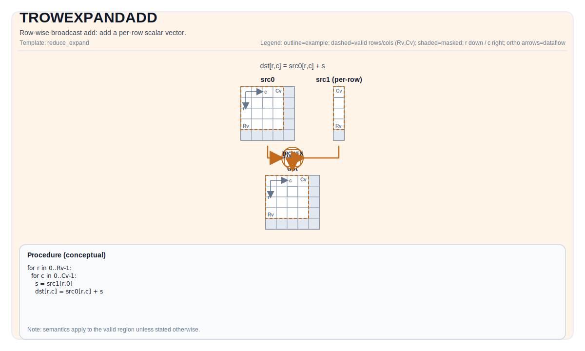

# TROWEXPANDADD

## 指令示意图



## 简介

行广播加法：加上一个每行标量向量。

## 数学语义

设 `R = dst.GetValidRow()` 和 `C = dst.GetValidCol()`。设 `s_i` 为从 `src1` 中获取的每行标量（每行一个值）。

对于 `0 <= i < R` 和 `0 <= j < C`：

$$
\mathrm{dst}_{i,j} = \mathrm{src0}_{i,j} + s_i
$$

## 汇编语法

PTO-AS 形式：参见 [PTO-AS 规范](../assembly/PTO-AS_zh.md)。

同步形式：

```text
%dst = trowexpandadd %src0, %src1 : !pto.tile<...>, !pto.tile<...> -> !pto.tile<...>
```

### AS Level 1（SSA）

```text
%dst = pto.trowexpandadd %src0, %src1 : !pto.tile<...>, !pto.tile<...> -> !pto.tile<...>
```

### AS Level 2（DPS）

```text
pto.trowexpandadd ins(%src0, %src1 : !pto.tile_buf<...>, !pto.tile_buf<...>) outs(%dst : !pto.tile_buf<...>)
```

## C++ 内建接口

声明于 `include/pto/common/pto_instr.hpp`：

```cpp
template <typename TileDataDst, typename TileDataSrc0, typename TileDataSrc1, typename... WaitEvents>
PTO_INST RecordEvent TROWEXPANDADD(TileDataDst &dst, TileDataSrc0 &src0, TileDataSrc1 &src1, WaitEvents &... events);

template <typename TileDataDst, typename TileDataSrc0, typename TileDataSrc1, typename TileDataTmp,
          typename... WaitEvents>
PTO_INST RecordEvent TROWEXPANDADD(TileDataDst &dst, TileDataSrc0 &src0, TileDataSrc1 &src1, TileDataTmp &tmp, WaitEvents &... events);
```

## 约束

- `TileDataDst::DType == TileDataSrc0::DType == TileDataSrc1::DType`
- `TileDataDst::DType`、`TileDataSrc0::DType`、`TileDataSrc1::DType` 必须是以下之一：`half`、`float`。
- Tile 形状/布局约束（编译时）：`TileDataDst::isRowMajor`。
- 模式 1：`src1` 预期提供**每行一个标量**（即，其有效形状必须覆盖 `R` 个值）。
- 模式 2：`src1` 预期提供**每行 32 字节数据**。
- 确切的布局/分形约束是目标特定的；参见 `include/pto/npu/*/TRowExpand*.hpp` 下的后端头文件。

## 示例

参见 `docs/isa/` 和 `docs/coding/tutorials/` 中的相关示例。

## 汇编示例（ASM）

### 自动模式

```text
# 自动模式：由编译器/运行时负责资源放置与调度。
%dst = pto.trowexpandadd %src0, %src1 : !pto.tile<...>, !pto.tile<...> -> !pto.tile<...>
```

### 手动模式

```text
# 手动模式：先显式绑定资源，再发射指令。
# 可选（当该指令包含 tile 操作数时）：
# pto.tassign %arg0, @tile(0x1000)
# pto.tassign %arg1, @tile(0x2000)
%dst = pto.trowexpandadd %src0, %src1 : !pto.tile<...>, !pto.tile<...> -> !pto.tile<...>
```

### PTO 汇编形式

```text
%dst = trowexpandadd %src0, %src1 : !pto.tile<...>, !pto.tile<...> -> !pto.tile<...>
# AS Level 2 (DPS)
pto.trowexpandadd ins(%src0, %src1 : !pto.tile_buf<...>, !pto.tile_buf<...>) outs(%dst : !pto.tile_buf<...>)
```
