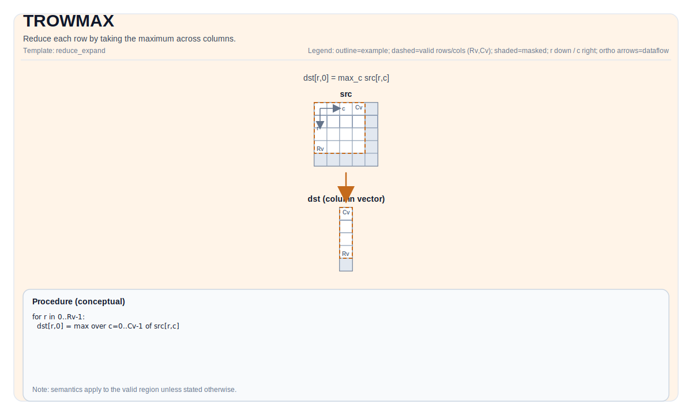

# TROWMAX

## 指令示意图



## 简介

通过取列间最大值来归约每一行。

## 数学语义

设 `R = src.GetValidRow()`，`C = src.GetValidCol()`。对 `0 <= i < R`：

$$ \mathrm{dst}_{i,0} = \max_{0 \le j < C} \mathrm{src}_{i,j} $$

## 汇编语法

PTO-AS 形式：参见 [PTO-AS 规范](../assembly/PTO-AS_zh.md)。

同步形式：

```text
%dst = trowmax %src : !pto.tile<...> -> !pto.tile<...>
```
降低时可能引入内部临时 Tile；C++ 内建接口需要显式传入 `tmp` 操作数。

### AS Level 1（SSA）

```text
%dst = pto.trowmax %src, %tmp : (!pto.tile<...>, !pto.tile<...>) -> !pto.tile<...>
```

### AS Level 2（DPS）

```text
pto.trowmax ins(%src, %tmp : !pto.tile_buf<...>, !pto.tile_buf<...>) outs(%dst : !pto.tile_buf<...>)
```

## C++ 内建接口

声明于 `include/pto/common/pto_instr.hpp`：

```cpp
template <typename TileDataOut, typename TileDataIn, typename TileDataTmp, typename... WaitEvents>
PTO_INST RecordEvent TROWMAX(TileDataOut &dst, TileDataIn &src, TileDataTmp &tmp, WaitEvents &... events);
```

## 约束

### 通用约束或检查

- `dst` 和 `src` 必须均为 `TileType::Vec`。
- `src` 必须使用标准 ND 布局：行主且非分形（`BLayout::RowMajor`、`SLayout::NoneBox`）。
- `dst` 必须使用以下两种非分形布局之一：
    - ND 布局（`BLayout::RowMajor`、`SLayout::NoneBox`），或
    - 列数严格为 1 的 DN 布局（`BLayout::ColMajor`、`SLayout::NoneBox`、`Cols == 1`）。
- `dst` 和 `src` 的元素类型必须一致。
- 运行时有效区域检查：
    - `src.GetValidRow() != 0`
    - `src.GetValidCol() != 0`
    - `src.GetValidRow() == dst.GetValidRow()`
- 内建接口签名要求显式传入 `tmp` 操作数。

### A2A3 实现检查

- 支持的元素类型：`half`、`float`、`int32_t`、`int16_t`。
- 实现同时接受 ND 输出和 `Cols == 1` 的 DN 输出。
- 运行时检查遵循共享的行归约检查路径：
    - `src.GetValidRow() != 0`
    - `src.GetValidCol() != 0`
    - `src.GetValidRow() == dst.GetValidRow()`
- 当前实现路径会将 `tmp` 传入后端调用，但本文档不额外补充 checked implementation 未显式约束的 `tmp` shape/layout 要求。


## 示例

### 自动（Auto）

```cpp
#include <pto/pto-inst.hpp>

using namespace pto;

void example_auto() {
  using SrcT = Tile<TileType::Vec, float, 16, 16>;
  using DstT = Tile<TileType::Vec, float, 16, 1, BLayout::ColMajor>;
  using TmpT = Tile<TileType::Vec, float, 16, 16>;
  SrcT src;
  DstT dst;
  TmpT tmp;
  TROWMAX(dst, src, tmp);
}
```

### 手动（Manual）

```cpp
#include <pto/pto-inst.hpp>

using namespace pto;

void example_manual() {
  using SrcT = Tile<TileType::Vec, float, 16, 16>;
  using DstT = Tile<TileType::Vec, float, 16, 1, BLayout::ColMajor>;
  using TmpT = Tile<TileType::Vec, float, 16, 16>;
  SrcT src;
  DstT dst;
  TmpT tmp;
  TASSIGN(src, 0x1000);
  TASSIGN(dst, 0x2000);
  TASSIGN(tmp, 0x3000);
  TROWMAX(dst, src, tmp);
}
```

## 汇编示例（ASM）

### 自动模式

```text
# 自动模式：由编译器/运行时负责资源放置与调度。
%dst = pto.trowmax %src, %tmp : (!pto.tile<...>, !pto.tile<...>) -> !pto.tile<...>
```

### 手动模式

```text
# 手动模式：先显式绑定资源，再发射指令。
# 可选（当该指令包含 tile 操作数时）：
# pto.tassign %arg0, @tile(0x1000)
# pto.tassign %arg1, @tile(0x2000)
%dst = pto.trowmax %src, %tmp : (!pto.tile<...>, !pto.tile<...>) -> !pto.tile<...>
```

### PTO 汇编形式

```text
%dst = trowmax %src : !pto.tile<...> -> !pto.tile<...>
# AS Level 2 (DPS)
pto.trowmax ins(%src, %tmp : !pto.tile_buf<...>, !pto.tile_buf<...>) outs(%dst : !pto.tile_buf<...>)
```
