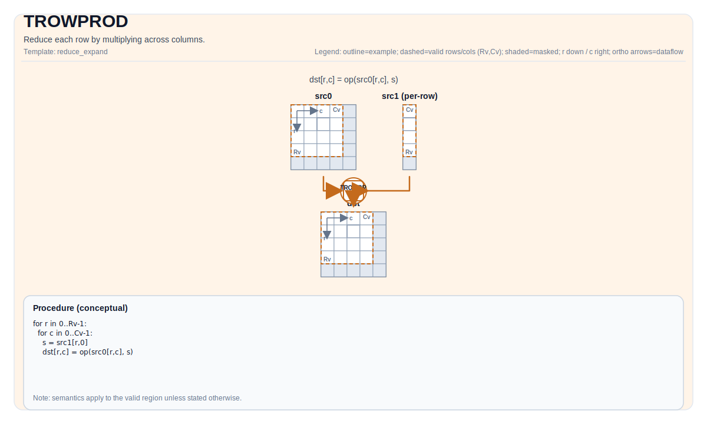

# TROWPROD


## Tile Operation Diagram



## Introduction

Reduce each row by multiplying across columns.

## Math Interpretation

Let `R = src.GetValidRow()` and `C = src.GetValidCol()`. For `0 <= i < R`:

$$ \mathrm{dst}_{i,0} = \prod_{j=0}^{C-1} \mathrm{src}_{i,j} $$

## Assembly Syntax

PTO-AS form: see [PTO-AS Specification](../assembly/PTO-AS.md).

Synchronous form:

```text
%dst = trowprod %src : !pto.tile<...> -> !pto.tile<...>
```
Lowering may introduce internal scratch tiles; the C++ intrinsic requires an explicit `tmp` operand.

### AS Level 1 (SSA)

```text
%dst = pto.trowprod %src, %tmp : (!pto.tile<...>, !pto.tile<...>) -> !pto.tile<...>
```

### AS Level 2 (DPS)

```text
pto.trowprod ins(%src, %tmp : !pto.tile_buf<...>, !pto.tile_buf<...>) outs(%dst : !pto.tile_buf<...>)
```

## C++ Intrinsic

Declared in `include/pto/common/pto_instr.hpp`:

```cpp
template <typename TileDataOut, typename TileDataIn, typename TileDataTmp, typename... WaitEvents>
PTO_INST RecordEvent TROWPROD(TileDataOut &dst, TileDataIn &src, TileDataTmp &tmp, WaitEvents &... events);
```

## Constraints

### General constraints / checks

- `dst` and `src` must both be `TileType::Vec`.
- `src` must use standard ND layout: row-major and non-fractal (`BLayout::RowMajor`, `SLayout::NoneBox`).
- `dst` must use one of the following non-fractal layouts:
    - ND layout (`BLayout::RowMajor`, `SLayout::NoneBox`), or
    - DN layout with exactly one column (`BLayout::ColMajor`, `SLayout::NoneBox`, `Cols == 1`).
- `dst` and `src` must use the same element type.
- Runtime valid-region checks:
    - `src.GetValidRow() != 0`
    - `src.GetValidCol() != 0`
    - `src.GetValidRow() == dst.GetValidRow()`
- The intrinsic signature requires an explicit `tmp` operand.

### A5 implementation checks

- Supported element types: `half`, `float`, `int32_t`, `int16_t`.
- In the currently inspected implementation path, the enforced constraints are on `src` and `dst`.
- No extra shape/layout assertions on `tmp` are enforced in the current implementation path.

## Implementation Notes

`TROWPROD` follows the currently implemented A5 backend path in this codebase. It performs row-wise multiplication reduction directly from `src` to `dst` after validating `src`/`dst` constraints.

The C++ intrinsic still takes a `tmp` operand for interface consistency:

1. `tmp` remains part of the intrinsic signature and AS lowering form.
2. The currently inspected implementation-enforced constraints are on `src` and `dst`.
3. If another backend introduces additional `tmp` requirements later, the documentation should be updated to match that backend implementation exactly.

## Examples

### Auto

```cpp
#include <pto/pto-inst.hpp>

using namespace pto;

void example_auto() {
  using SrcT = Tile<TileType::Vec, float, 16, 16>;
  using DstT = Tile<TileType::Vec, float, 16, 1, BLayout::ColMajor>;
  using TmpT = Tile<TileType::Vec, float, 16, 16>;
  SrcT src;
  DstT dst;
  TmpT tmp;
  TROWPROD(dst, src, tmp);
}
```

### Manual

```cpp
#include <pto/pto-inst.hpp>

using namespace pto;

void example_manual() {
  using SrcT = Tile<TileType::Vec, float, 16, 16>;
  using DstT = Tile<TileType::Vec, float, 16, 1, BLayout::ColMajor>;
  using TmpT = Tile<TileType::Vec, float, 16, 16>;
  SrcT src;
  DstT dst;
  TmpT tmp;
  TASSIGN(src, 0x1000);
  TASSIGN(dst, 0x2000);
  TASSIGN(tmp, 0x3000);
  TROWPROD(dst, src, tmp);
}
```

## ASM Form Examples

### Auto Mode

```text
# Auto mode: compiler/runtime-managed placement and scheduling.
%dst = pto.trowprod %src, %tmp : (!pto.tile<...>, !pto.tile<...>) -> !pto.tile<...>
```

### Manual Mode

```text
# Manual mode: bind resources explicitly before issuing the instruction.
# Optional for tile operands:
# pto.tassign %arg0, @tile(0x1000)
# pto.tassign %arg1, @tile(0x2000)
%dst = pto.trowprod %src, %tmp : (!pto.tile<...>, !pto.tile<...>) -> !pto.tile<...>
```

### PTO Assembly Form

```text
%dst = trowprod %src : !pto.tile<...> -> !pto.tile<...>
# AS Level 2 (DPS)
pto.trowprod ins(%src, %tmp : !pto.tile_buf<...>, !pto.tile_buf<...>) outs(%dst : !pto.tile_buf<...>)
```
