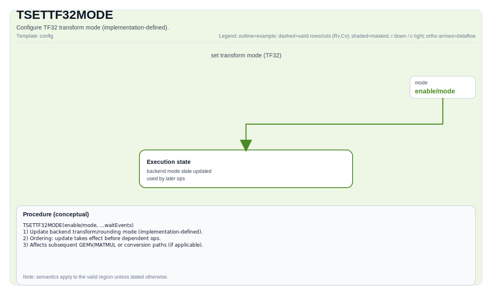

# TSETTF32MODE

## 指令示意图



## 简介

`TSETTF32MODE` 设置 TF32 相关的变换模式。它本身不做张量算术，而是更新后续相关计算会读取的模式状态。

## 语义

该指令属于同步与配置路径，更接近“模式寄存器写入”，而不是普通 tile 运算。它的效果取决于目标实现如何解释 TF32 模式配置。

## 汇编语法

PTO-AS 形式见 [PTO-AS 规范](../assembly/PTO-AS_zh.md)。

示意形式：

```text
tsettf32mode {enable = true, mode = ...}
```

### AS Level 1（SSA）

```text
pto.tsettf32mode {enable = true, mode = ...}
```

### AS Level 2（DPS）

```text
pto.tsettf32mode ins({enable = true, mode = ...}) outs()
```

## C++ 内建接口

声明于 `include/pto/common/pto_instr.hpp`：

```cpp
template <bool isEnable, RoundMode tf32TransMode = RoundMode::CAST_ROUND, typename... WaitEvents>
PTO_INST RecordEvent TSETTF32MODE(WaitEvents &... events);
```

## 约束

- 仅在对应 backend capability macro 启用时可用。
- 精确模式取值和硬件行为由目标实现定义。
- 该指令具有控制状态副作用，应与依赖它的计算指令建立正确顺序。

## 示例

```cpp
#include <pto/pto-inst.hpp>
using namespace pto;

void example_enable_tf32() {
  TSETTF32MODE<true, RoundMode::CAST_ROUND>();
}
```

## 相关页面

- [同步与配置指令集](./tile/sync-and-config_zh.md)
- [TSETHF32MODE](./TSETHF32MODE_zh.md)
