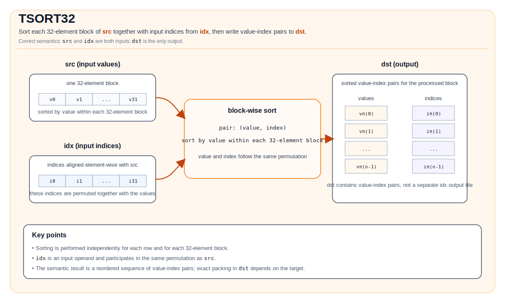

# TSORT32

## 指令示意图



## 简介

对 `src` 的每个 32 元素块，与 `idx` 中对应的索引一起进行排序，并将排序后的值-索引对写入 `dst`。

## 数学语义

对每一行，`TSORT32` 会按独立的 32 元素块处理 `src`。设第 `b` 个块覆盖列 `32b ... 32b+31`，该块的有效元素数为 `n_b = min(32, C - 32b)`。

对于块中的每个有效元素，先构造一个二元组：

$$
(v_k, i_k) = (\mathrm{src}_{r,32b+k}, \mathrm{idx}_{r,32b+k}), \quad 0 \le k < n_b
$$

然后按值对这些二元组排序，并将排序后的值-索引对写入 `dst`。`dst` 中的具体打包布局由目标实现定义，但从语义上看，每个块的输出可表示为：

$$
[(v_{\pi(0)}, i_{\pi(0)}), (v_{\pi(1)}, i_{\pi(1)}), \ldots, (v_{\pi(n_b-1)}, i_{\pi(n_b-1)})]
$$

其中 `π` 是该 32 元素块对应的排序置换。

说明：

- `idx` 是输入 Tile，不是输出 Tile。
- `dst` 保存的是排序后的值-索引对，而不只是排序后的值。
- 在 CPU 仿真实现中，按值降序排序；当值相同时，索引较小者优先。

## 汇编语法

PTO-AS 形式：参见 [PTO-AS 规范](../assembly/PTO-AS_zh.md)。

同步形式：

```text
%dst = tsort32 %src, %idx : !pto.tile<...>, !pto.tile<...> -> !pto.tile<...>
```

### AS Level 1（SSA）

```text
%dst = pto.tsort32 %src, %idx : !pto.tile<...>, !pto.tile<...> -> !pto.tile<...>
```

### AS Level 2（DPS）

```text
pto.tsort32 ins(%src, %idx : !pto.tile_buf<...>, !pto.tile_buf<...>) outs(%dst : !pto.tile_buf<...>)
```

## C++ 内建接口

声明于 `include/pto/common/pto_instr.hpp`：

```cpp
template <typename DstTileData, typename SrcTileData, typename IdxTileData>
PTO_INST RecordEvent TSORT32(DstTileData &dst, SrcTileData &src, IdxTileData &idx);

template <typename DstTileData, typename SrcTileData, typename IdxTileData, typename TmpTileData>
PTO_INST RecordEvent TSORT32(DstTileData &dst, SrcTileData &src, IdxTileData &idx, TmpTileData &tmp);
```

## 约束

- `TSORT32` 不接受 `WaitEvents&...` 参数，也不在内部调用 `TSYNC(...)`；如有需要请显式同步。
- `idx` 在两个重载中都是必需的输入操作数；它提供与 `src` 一起参与重排的索引。
- **实现检查 (A2A3/A5)**:
    - `DstTileData::DType` 必须是 `half` 或 `float`。
    - `SrcTileData::DType` 必须与 `DstTileData::DType` 匹配。
    - `IdxTileData::DType` 必须是 `uint32_t`。
    - `dst`/`src`/`idx` Tile 位置必须是 `TileType::Vec`，且都必须是行主序（`isRowMajor`）。
- **有效区域**:
    - 实现使用 `dst.GetValidRow()` 作为行数。
    - 实现使用 `src.GetValidCol()` 确定每行参与排序的元素数量。
    - 排序按独立的 32 元素块进行；4 参数重载额外通过 `tmp` 支持非 32 对齐尾块。

## 示例

### 自动（Auto）

```cpp
#include <pto/pto-inst.hpp>

using namespace pto;

void example_auto() {
  using SrcT = Tile<TileType::Vec, float, 1, 32>;
  using IdxT = Tile<TileType::Vec, uint32_t, 1, 32>;
  using DstT = Tile<TileType::Vec, float, 1, 64>;
  SrcT src;
  IdxT idx;
  DstT dst;
  TSORT32(dst, src, idx);
}
```

### 手动（Manual）

```cpp
#include <pto/pto-inst.hpp>

using namespace pto;

void example_manual() {
  using SrcT = Tile<TileType::Vec, float, 1, 32>;
  using IdxT = Tile<TileType::Vec, uint32_t, 1, 32>;
  using DstT = Tile<TileType::Vec, float, 1, 64>;
  SrcT src;
  IdxT idx;
  DstT dst;
  TASSIGN(src, 0x1000);
  TASSIGN(idx, 0x2000);
  TASSIGN(dst, 0x3000);
  TSORT32(dst, src, idx);
}
```

## 汇编示例（ASM）

### 自动模式

```text
# 自动模式：由编译器/运行时负责资源放置与调度。
%dst = pto.tsort32 %src, %idx : !pto.tile<...>, !pto.tile<...> -> !pto.tile<...>
```

### 手动模式

```text
# 手动模式：先显式绑定资源，再发射指令。
# 可选（当该指令包含 tile 操作数时）：
# pto.tassign %arg0, @tile(0x1000)
# pto.tassign %arg1, @tile(0x2000)
# pto.tassign %arg2, @tile(0x3000)
%dst = pto.tsort32 %src, %idx : !pto.tile<...>, !pto.tile<...> -> !pto.tile<...>
```

### PTO 汇编形式

```text
%dst = tsort32 %src, %idx : !pto.tile<...>, !pto.tile<...> -> !pto.tile<...>
# AS Level 2 (DPS)
pto.tsort32 ins(%src, %idx : !pto.tile_buf<...>, !pto.tile_buf<...>) outs(%dst : !pto.tile_buf<...>)
```
