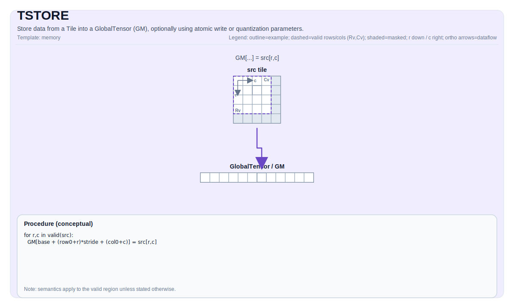

# TSTORE

## 指令示意图



## 简介

将 Tile 中的数据存储到 GlobalTensor (GM)，可选使用原子写入或量化参数。

## 数学语义

符号表示取决于 `GlobalTensor` 的形状/步长和 `Tile` 的布局。概念上（二维视图，带基础偏移量）：

$$ \mathrm{dst}_{r_0 + i,\; c_0 + j} = \mathrm{src}_{i,j} $$

## 汇编语法

PTO-AS 形式：参见 [PTO-AS 规范](../assembly/PTO-AS_zh.md)。

同步形式：

```text
tstore %t1, %sv_out[%c0, %c0]
```

### AS Level 1（SSA）

```text
pto.tstore %src, %mem : (!pto.tile<...>, !pto.partition_tensor_view<MxNxdtype>) -> ()
```

### AS Level 2（DPS）

```text
pto.tstore ins(%src : !pto.tile_buf<...>) outs(%mem : !pto.partition_tensor_view<MxNxdtype>)
```

## C++ 内建接口

声明于 `include/pto/common/pto_instr.hpp` 和 `include/pto/common/constants.hpp`：

```cpp
template <typename TileData, typename GlobalData, AtomicType atomicType = AtomicType::AtomicNone,
          typename... WaitEvents>
PTO_INST RecordEvent TSTORE(GlobalData& dst, TileData& src, WaitEvents&... events);

template <typename TileData, typename GlobalData, AtomicType atomicType = AtomicType::AtomicNone,
          typename... WaitEvents>
PTO_INST RecordEvent TSTORE(GlobalData& dst, TileData& src, uint64_t preQuantScalar, WaitEvents&... events);

template <typename TileData, typename GlobalData, typename FpTileData, AtomicType atomicType = AtomicType::AtomicNone,
          typename... WaitEvents>
PTO_INST RecordEvent TSTORE_FP(GlobalData& dst, TileData& src, FpTileData& fp, WaitEvents&... events);
```

## 约束

- **实现检查 (A2A3)**:
    - 源 tile 位置必须是以下之一：`TileType::Vec`、`TileType::Mat`、`TileType::Acc`。
    - 运行时：所有 `dst.GetShape(dim)` 值和 `src.GetValidRow()/GetValidCol()` 必须 `> 0`。
    - 对于 `TileType::Vec` / `TileType::Mat`：
    - `TileData::DType` 必须是以下之一：`int8_t`、`uint8_t`、`int16_t`、`uint16_t`、`int32_t`、`uint32_t`、`int64_t`、`uint64_t`、`half`、`bfloat16_t`、`float`。
    - `sizeof(TileData::DType) == sizeof(GlobalData::DType)`。
    - 布局必须匹配 ND/DN/NZ（或特殊情况：`TileData::Rows == 1` 或 `TileData::Cols == 1`）。
    - 对于 `int64_t/uint64_t`，仅支持 ND->ND 或 DN->DN。
    - 对于 `TileType::Acc`（包括量化/原子变体）：
    - 目标布局必须是 ND 或 NZ。
    - 源数据类型必须是 `int32_t` 或 `float`。
    - 不使用量化时，目标数据类型必须是 `__gm__ int32_t/float/half/bfloat16_t`。
    - 静态形状约束：`1 <= TileData::Cols <= 4095`；如果是 ND 则 `1 <= TileData::Rows <= 8192`；如果是 NZ 则 `1 <= TileData::Rows <= 65535` 且 `TileData::Cols % 16 == 0`。
    - 运行时：`1 <= src.GetValidCol() <= 4095`。
- **实现检查 (A5)**:
    - 源 tile 位置必须是 `TileType::Vec` 或 `TileType::Acc`（此目标不支持 `Mat` 存储）。
    - 对于 `TileType::Vec`：
    - `sizeof(TileData::DType) == sizeof(GlobalData::DType)`。
    - `TileData::DType` 必须是以下之一：`int8_t`、`uint8_t`、`int16_t`、`uint16_t`、`int32_t`、`uint32_t`、`int64_t`、`uint64_t`、`half`、`bfloat16_t`、`float`、`float8_e4m3_t`、`float8_e5m2_t`、`hifloat8_t`、`float4_e1m2x2_t`、`float4_e2m1x2_t`。
    - 布局必须匹配 ND/DN/NZ（或特殊情况：`TileData::Rows == 1` 或 `TileData::Cols == 1`）。
    - 强制执行额外的对齐约束（例如，对于 ND，行主序宽度（以字节为单位）必须是 32 的倍数；对于 DN，列主序高度（以字节为单位）必须是 32 的倍数，但有特殊情况例外）。
    - 对于 `TileType::Acc`：
    - 目标布局必须是 ND 或 NZ；源数据类型必须是 `int32_t` 或 `float`。
    - 不使用量化时，目标数据类型必须是 `__gm__ int32_t/float/half/bfloat16_t`。
    - 静态形状约束与 A2A3 对于行/列的约束相同；`AtomicAdd` 额外限制目标数据类型为支持的原子类型。
- **有效区域**:
    - 实现使用 `src.GetValidRow()` / `src.GetValidCol()` 作为传输大小.

## 示例

### 自动（Auto）

```cpp
#include <pto/pto-inst.hpp>

using namespace pto;

template <typename T>
void example_auto(__gm__ T* out) {
  using TileT = Tile<TileType::Vec, T, 16, 16>;
  using GShape = Shape<1, 1, 1, 16, 16>;
  using GStride = BaseShape2D<T, 16, 16, Layout::ND>;
  using GTensor = GlobalTensor<T, GShape, GStride, Layout::ND>;

  GTensor gout(out);
  TileT t;
  TSTORE(gout, t);
}
```

### 手动（Manual）

```cpp
#include <pto/pto-inst.hpp>

using namespace pto;

template <typename T>
void example_manual(__gm__ T* out) {
  using TileT = Tile<TileType::Vec, T, 16, 16>;
  using GShape = Shape<1, 1, 1, 16, 16>;
  using GStride = BaseShape2D<T, 16, 16, Layout::ND>;
  using GTensor = GlobalTensor<T, GShape, GStride, Layout::ND>;

  GTensor gout(out);
  TileT t;
  TASSIGN(t, 0x1000);
  TSTORE<TileT, GTensor, AtomicType::AtomicAdd>(gout, t);
}
```

## 汇编示例（ASM）

### 自动模式

```text
# 自动模式：由编译器/运行时负责资源放置与调度。
pto.tstore %src, %mem : (!pto.tile<...>, !pto.partition_tensor_view<MxNxdtype>) -> ()
```

### 手动模式

```text
# 手动模式：先显式绑定资源，再发射指令。
# 可选（当该指令包含 tile 操作数时）：
# pto.tassign %arg0, @tile(0x1000)
# pto.tassign %arg1, @tile(0x2000)
pto.tstore %src, %mem : (!pto.tile<...>, !pto.partition_tensor_view<MxNxdtype>) -> ()
```

### PTO 汇编形式

```text
tstore %t1, %sv_out[%c0, %c0]
# AS Level 2 (DPS)
pto.tstore ins(%src : !pto.tile_buf<...>) outs(%mem : !pto.partition_tensor_view<MxNxdtype>)
```
