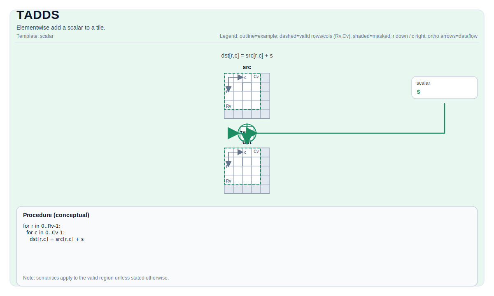

# TADDS

## 指令示意图



## 简介

Tile 与标量的逐元素加法。

## 数学语义

对每个元素 `(i, j)` 在有效区域内：

$$ \mathrm{dst}_{i,j} = \mathrm{src}_{i,j} + \mathrm{scalar} $$

## 汇编语法

PTO-AS 形式：参见 [PTO-AS Specification](../../../../assembly/PTO-AS_zh.md).

同步形式：

```text
%dst = tadds %src, %scalar : !pto.tile<...>, f32
```

### AS Level 1（SSA）

```text
%dst = pto.tadds %src, %scalar : (!pto.tile<...>,dtype) -> !pto.tile<...>
```

### AS Level 2（DPS）

```text
pto.tadds ins(%src, %scalar : !pto.tile_buf<...>, dtype) outs(%dst : !pto.tile_buf<...>)
```

## C++ 内建接口

声明于 `include/pto/common/pto_instr.hpp`：

```cpp
template <typename TileDataDst, typename TileDataSrc, typename... WaitEvents>
PTO_INST RecordEvent TADDS(TileDataDst &dst, TileDataSrc &src0, typename TileDataSrc::DType scalar, WaitEvents &... events);
```

## 约束

- **实现检查 (A2A3)**:
    - `TileData::DType` must be one of: `int32_t`, `int`, `int16_t`, `half`, `float16_t`, `float`, `float32_t`.
    - Tile location must be vector (`TileData::Loc == TileType::Vec`).
    - Static valid bounds: `TileData::ValidRow <= TileData::Rows` and `TileData::ValidCol <= TileData::Cols`.
    - Runtime: `src0.GetValidRow() == dst.GetValidRow()` and `src0.GetValidCol() == dst.GetValidCol()`.
    - Tile 布局 must be row-major (`TileData::isRowMajor`).
- **实现检查 (A5)**:
    - `TileData::DType` must be one of: `uint8_t`, `int8_t`, `uint16_t`, `int16_t`, `uint32_t`, `int32_t`, `half`, `float`, `bfloat16_t`.
    - Tile location must be vector (`TileData::Loc == TileType::Vec`).
    - Static valid bounds: `TileData::ValidRow <= TileData::Rows` and `TileData::ValidCol <= TileData::Cols`.
    - Runtime: `src0.GetValidCol() == dst.GetValidCol()`.
    - Tile 布局 must be row-major (`TileData::isRowMajor`).
- **有效区域**:
    - The op uses `dst.GetValidRow()` / `dst.GetValidCol()` as the iteration domain.

## 示例

### 自动（Auto）

```cpp
#include <pto/pto-inst.hpp>

using namespace pto;

void example_auto() {
  using TileT = Tile<TileType::Vec, float, 16, 16>;
  TileT src, dst;
  TADDS(dst, src, 1.0f);
}
```

### 手动（Manual）

```cpp
#include <pto/pto-inst.hpp>

using namespace pto;

void example_manual() {
  using TileT = Tile<TileType::Vec, float, 16, 16>;
  TileT src, dst;
  TASSIGN(src, 0x1000);
  TASSIGN(dst, 0x2000);
  TADDS(dst, src, 1.0f);
}
```
