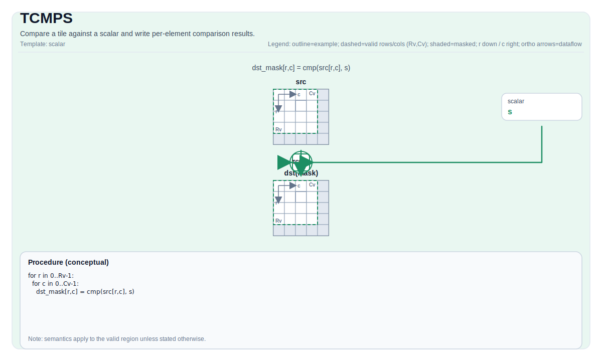

# TCMPS

## 指令示意图



## 简介

将 Tile 与标量比较并写入逐元素比较结果。

## 数学语义

对每个元素 `(i, j)` 在有效区域内：

$$ \mathrm{dst}_{i,j} = \left(\mathrm{src}_{i,j}\ \mathrm{cmpMode}\ \mathrm{scalar}\right) $$

The encoding/type of `dst` is implementation-defined (often a mask-like tile).

## 汇编语法

PTO-AS 形式：参见 [PTO-AS Specification](../../../../assembly/PTO-AS_zh.md).

同步形式：

```text
%dst = tcmps %src, %scalar {cmpMode = #pto.cmp<EQ>} : !pto.tile<...> -> !pto.tile<...>
```

### AS Level 1（SSA）

```text
%dst = pto.tcmps %src, %scalar {cmpMode = #pto<cmp xx>} : (!pto.tile<...>, dtype) -> !pto.tile<...>
```

### AS Level 2（DPS）

```text
pto.tcmps ins(%src, %scalar{cmpMode = #pto<cmp xx>}: !pto.tile_buf<...>, dtype) outs(%dst : !pto.tile_buf<...>)
```

## C++ 内建接口

声明于 `include/pto/common/pto_instr.hpp` and `include/pto/common/type.hpp`:

```cpp
template <typename TileDataDst, typename TileDataSrc0, typename T, typename... WaitEvents>
PTO_INST RecordEvent TCMPS(TileDataDst& dst, TileDataSrc0& src0, T src1, CmpMode cmpMode, WaitEvents&... events);
```

## 约束

- **实现检查 (A2A3)**:
    - `TileData::DType` must be one of: `int32_t`, `float`, `half`, `uint16_t`, `int16_t`.
    - Tile 布局 must be row-major (`TileData::isRowMajor`).
- **实现检查 (A5)**:
    - `TileData::DType` must be one of: `int32_t`, `float`, `half`, `uint16_t`, `int16_t`.
    - Tile 布局 must be row-major (`TileData::isRowMajor`).
- **Common constraints**:
    - Tile location must be vector (`TileData::Loc == TileType::Vec`).
    - Static valid bounds: `TileData::ValidRow <= TileData::Rows` and `TileData::ValidCol <= TileData::Cols`.
    - Runtime: `src0` and `dst` must have the same valid row/col.
- **有效区域**:
    - The op uses `dst.GetValidRow()` / `dst.GetValidCol()` as the iteration domain.
- **Comparison modes**:
    - Supports `CmpMode::EQ`, `CmpMode::NE`, `CmpMode::LT`, `CmpMode::GT`, `CmpMode::LE`, `CmpMode::GE`.

## 示例

### 自动（Auto）

```cpp
#include <pto/pto-inst.hpp>

using namespace pto;

void example_auto() {
  using SrcT = Tile<TileType::Vec, float, 16, 16>;
  using DstT = Tile<TileType::Vec, uint8_t, 16, 32, BLayout::RowMajor, -1, -1>;
  SrcT src;
  DstT dst(16, 2);
  TCMPS(dst, src, 0.0f, CmpMode::GT);
}
```

### 手动（Manual）

```cpp
#include <pto/pto-inst.hpp>

using namespace pto;

void example_manual() {
  using SrcT = Tile<TileType::Vec, float, 16, 16>;
  using DstT = Tile<TileType::Vec, uint8_t, 16, 32, BLayout::RowMajor, -1, -1>;
  SrcT src;
  DstT dst(16, 2);
  TASSIGN(src, 0x1000);
  TASSIGN(dst, 0x2000);
  TCMPS(dst, src, 0.0f, CmpMode::GT);
}
```
