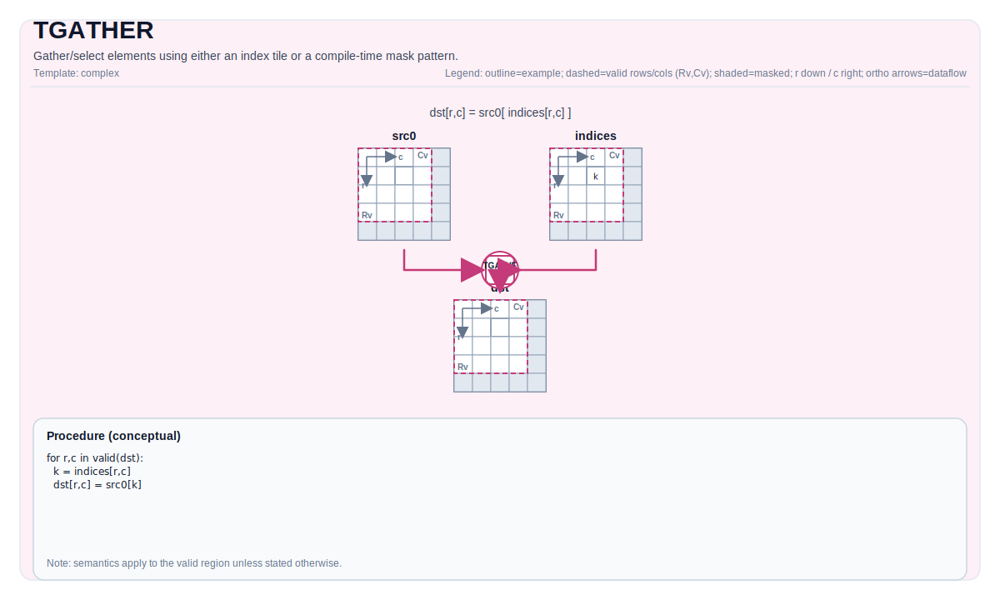

# TGATHER

## 指令示意图



## 简介

使用索引 Tile 或编译时掩码模式来收集/选择元素。

## 数学语义

基于索引的 gather（概念性定义）：

设 `R = dst.GetValidRow()`，`C = dst.GetValidCol()`。对于 `0 <= i < R` 且 `0 <= j < C`：

$$ \mathrm{dst}_{i,j} = \mathrm{src0}\!\left[\mathrm{indices}_{i,j}\right] $$

确切的索引解释和边界行为由实现定义。

基于掩码模式的 gather 是由 `pto::MaskPattern` 控制的实现定义的选择/归约操作。

## 汇编语法

PTO-AS 形式：参见 [PTO-AS 规范](../../../../assembly/PTO-AS_zh.md)。

基于索引的 gather：

```text
%dst = tgather %src0, %indices : !pto.tile<...> -> !pto.tile<...>
```

基于掩码模式的 gather：

```text
%dst = tgather %src {maskPattern = #pto.mask_pattern<P0101>} : !pto.tile<...> -> !pto.tile<...>
```

### AS Level 1（SSA）

```text
%dst = pto.tgather %src, %indices : (!pto.tile<...>, !pto.tile<...>) -> !pto.tile<...>
%dst = pto.tgather %src {maskPattern = #pto.mask_pattern<P0101>}: !pto.tile<...> -> !pto.tile<...>
```

### AS Level 2（DPS）

```text
pto.tgather ins(%src, %indices : !pto.tile_buf<...>, !pto.tile_buf<...>) outs(%dst : !pto.tile_buf<...>)
pto.tgather ins(%src, {maskPattern = #pto.mask_pattern<P0101>} : !pto.tile_buf<...>) outs(%dst : !pto.tile_buf<...>)
```

## C++ 内建接口

声明于 `include/pto/common/pto_instr.hpp`：

```cpp
template <typename TileDataD, typename TileDataS0, typename TileDataS1, typename TileDataTmp, typename... WaitEvents>
PTO_INST RecordEvent TGATHER(TileDataD &dst, TileDataS0 &src0, TileDataS1 &src1, TileDataTmp &tmp, WaitEvents &... events);

template <typename DstTileData, typename SrcTileData, MaskPattern maskPattern, typename... WaitEvents>
PTO_INST RecordEvent TGATHER(DstTileData &dst, SrcTileData &src, WaitEvents &... events);
```

## 约束

- **基于索引的 gather：实现检查 (A2A3)**:
    - `sizeof(DstTileData::DType)` 对应类型必须是 `int16_t`、`uint16_t`、`int32_t`、`uint32_t`、`half`、`float` 之一。
    - `sizeof(Src1TileData::DType)` 对应类型必须是 `int32_t`、`uint32_t` 之一。
    - `DstTileData::DType` 必须与 `Src0TileData::DType` 类型相同。
    - `src1.GetValidCol() == Src1TileData::Cols` 且 `dst.GetValidCol() == DstTileData::Cols`。
- **基于索引的 gather：实现检查 (A5)**:
    - `sizeof(DstTileData::DType)` 对应类型必须是 `int16_t`、`uint16_t`、`int32_t`、`uint32_t`、`half`、`float` 之一。
    - `sizeof(Src1TileData::DType)` 对应类型必须是 `int16_t`、`uint16_t`、`int32_t`、`uint32_t` 之一。
    - `DstTileData::DType` 必须与 `Src0TileData::DType` 类型相同。
    - `src1.GetValidCol() == Src1TileData::Cols` 且 `dst.GetValidCol() == DstTileData::Cols`。
- **基于掩码模式的 gather：实现检查 (A2A3)**:
    - 源元素大小必须是 `2` 或 `4` 字节。
    - `SrcTileData::DType`/`DstTileData::DType` 必须是 `int16_t`、`uint16_t`、`int32_t`、`uint32_t`、`half`、`bfloat16_t` 或 `float` 之一。
    - `dst` 和 `src` 必须都是 `TileType::Vec` 且行主序。
    - `sizeof(dst element) == sizeof(src element)` 且 `dst.GetValidCol() == DstTileData::Cols`（连续的目标存储）。
- **基于掩码模式的 gather：实现检查 (A5)**:
    - 源元素大小必须是 `1`、`2` 或 `4` 字节。
    - `dst` 和 `src` 必须都是 `TileType::Vec` 且行主序。
    - `SrcTileData::DType`/`DstTileData::DType` 必须是 `int8_t`、`uint8_t`、`int16_t`、`uint16_t`、`int32_t`、`uint32_t`、`half`、`bfloat16_t`、`float`、`float8_e4m3_t`、`float8_e5m2_t` 或 `hifloat8_t` 之一。
    - 支持的数据类型限制为目标定义的集合（通过实现中的 `static_assert` 强制执行），且 `sizeof(dst element) == sizeof(src element)`，`dst.GetValidCol() == DstTileData::Cols`（连续的目标存储）。
- **边界 / 有效性**:
    - 索引边界不通过显式运行时断言进行验证；超出范围的索引行为由目标定义。

## 示例

### 自动（Auto）

```cpp
#include <pto/pto-inst.hpp>

using namespace pto;

void example_auto() {
  using SrcT = Tile<TileType::Vec, float, 16, 16>;
  using IdxT = Tile<TileType::Vec, int32_t, 16, 16>;
  using DstT = Tile<TileType::Vec, float, 16, 16>;
  SrcT src0;
  IdxT idx;
  DstT dst;
  TGATHER(dst, src0, idx);
}
```

### 手动（Manual）

```cpp
#include <pto/pto-inst.hpp>

using namespace pto;

void example_manual() {
  using SrcT = Tile<TileType::Vec, float, 16, 16>;
  using DstT = Tile<TileType::Vec, float, 1, 16>;
  SrcT src;
  DstT dst;
  TASSIGN(src, 0x1000);
  TASSIGN(dst, 0x2000);
  TGATHER<DstT, SrcT, MaskPattern::P0101>(dst, src);
}
```

## 汇编示例（ASM）

### 自动模式

```text
# 自动模式：由编译器/运行时负责资源放置与调度。
%dst = pto.tgather %src, %indices : (!pto.tile<...>, !pto.tile<...>) -> !pto.tile<...>
```

### 手动模式

```text
# 手动模式：先显式绑定资源，再发射指令。
# 可选（当该指令包含 tile 操作数时）：
# pto.tassign %arg0, @tile(0x1000)
# pto.tassign %arg1, @tile(0x2000)
%dst = pto.tgather %src, %indices : (!pto.tile<...>, !pto.tile<...>) -> !pto.tile<...>
```

### PTO 汇编形式

```text
%dst = pto.tgather %src, %indices : (!pto.tile<...>, !pto.tile<...>) -> !pto.tile<...>
# AS Level 2 (DPS)
pto.tgather ins(%src, %indices : !pto.tile_buf<...>, !pto.tile_buf<...>) outs(%dst : !pto.tile_buf<...>)
```
