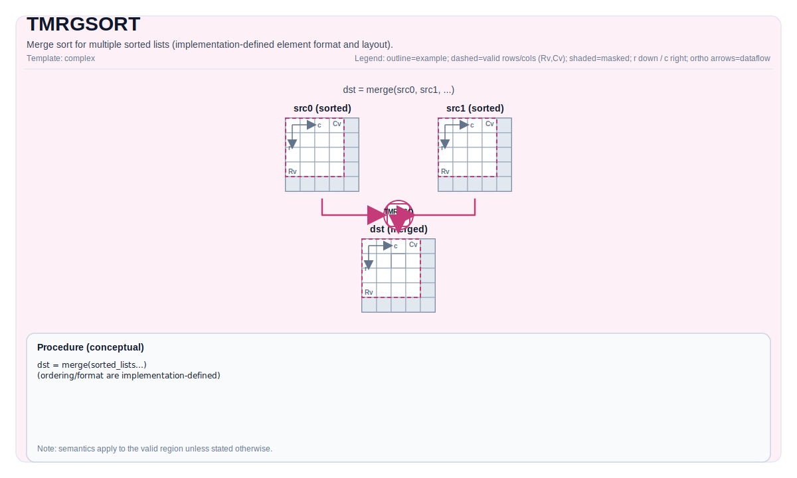

# TMRGSORT

## 指令示意图



## 简介

`TMRGSORT` 用于把多个已经排好序的列表按目标定义的键顺序做归并。它不是“对一个无序 Tile 排序”，而是“归并多个有序输入”。

这条指令在仓库里有两类接口：

- 多列表归并：2 路 / 3 路 / 4 路输入
- 单列表块归并：把一个源 Tile 中连续放置的 4 个已排序块再归并成一个更大的有序结果

## 机制

`TMRGSORT` 的输入并不是“任意数组”，而是按固定结构组织的记录流。当前实现里，一个记录按 8 字节结构处理：

- `float` 类型时，每条记录通常占 2 个元素
- `half` 类型时，每条记录通常占 4 个元素

CPU 模拟器会按每条结构的第一个元素作为排序键，并优先选更大的键值；NPU backend 则通过 `vmrgsort4` 完成硬件归并。也就是说，记录格式和精确比较规则仍然和目标实现强相关。

## 汇编语法

PTO-AS 形式：参见 [PTO-AS 规范](../../../../assembly/PTO-AS_zh.md)。

示意形式：

```text
%dst, %executed = tmrgsort %src0, %src1 {exhausted = false}
    : !pto.tile<...>, !pto.tile<...> -> (!pto.tile<...>, vector<4xi16>)
```

### AS Level 1（SSA）

```text
%dst = pto.tmrgsort %src, %blockLen : (!pto.tile<...>, dtype) -> !pto.tile<...>
%dst, %executed = pto.tmrgsort %src0, %src1, %src2, %src3 {exhausted = false}
 : (!pto.tile<...>, !pto.tile<...>, !pto.tile<...>, !pto.tile<...>) -> (!pto.tile<...>, vector<4xi16>)
```

### AS Level 2（DPS）

```text
pto.tmrgsort ins(%src, %blockLen : !pto.tile_buf<...>, dtype) outs(%dst : !pto.tile_buf<...>)
pto.tmrgsort ins(%src0, %src1, %src2, %src3 {exhausted = false} : !pto.tile_buf<...>, !pto.tile_buf<...>, !pto.tile_buf<...>, !pto.tile_buf<...>)
outs(%dst, %executed : !pto.tile_buf<...>, vector<4xi16>)
```

## C++ 内建接口

声明于 `include/pto/common/pto_instr.hpp`：

```cpp
template <typename DstTileData, typename TmpTileData, typename Src0TileData, typename Src1TileData,
          typename Src2TileData, typename Src3TileData, bool exhausted, typename... WaitEvents>
PTO_INST RecordEvent TMRGSORT(DstTileData &dst, MrgSortExecutedNumList &executedNumList, TmpTileData &tmp,
                              Src0TileData &src0, Src1TileData &src1, Src2TileData &src2, Src3TileData &src3,
                              WaitEvents &... events);

template <typename DstTileData, typename SrcTileData, typename... WaitEvents>
PTO_INST RecordEvent TMRGSORT(DstTileData &dst, SrcTileData &src, uint32_t blockLen, WaitEvents &... events);
```

## 约束

### 通用约束

- 所有参与 Tile 都必须是：
  - `TileType::Vec`
  - `Rows == 1`
  - `BLayout::RowMajor`
- 支持的数据类型是 `half` 或 `float`，并且 `dst/tmp/src*` 的元素类型必须一致。

### 多列表归并

- 2 路 / 3 路 / 4 路版本都要求显式传入 `tmp`。
- `executedNumList` 会返回每个输入列表实际消费了多少条记录。
- 模板参数 `exhausted` 决定当某一路输入先耗尽时，是否提前挂起/停止归并：
  - CPU 会按这个布尔值决定是否在任一路耗尽时提前退出
  - NPU 会把它映射到底层 `vmrgsort4` 的 exhausted 配置位
- UB 使用量必须满足各 backend 的限制；源码中对 `src* + tmp (+ dst)` 总体积都有检查。

### 单列表块归并

- 这条接口假设 `src` 中顺序摆放了 4 个已排序块。
- `blockLen` 表示每个块的长度，并且它本身包含记录值和索引/负载。
- A2/A3 源码明确要求：
  - `blockLen` 必须是 `64` 的倍数
  - `src.GetValidCol()` 必须是 `blockLen * 4` 的整数倍
  - `repeatTimes = src.GetValidCol() / (blockLen * 4)` 必须在 `[1, 255]`
- A5 / Kirin9030 走的是同一类硬件归并路径，但这些约束在文档层仍然可以视为安全使用域。

### 目标说明

- CPU 使用显式归并逻辑。
- A2/A3 与 A5 使用 `vmrgsort4`。
- Kirin9030 复用 A5 的 `TMRGSORT` 路径，只在末尾 UB->UB 搬运上用了一层适配。

## 示例

### 单列表块归并

```cpp
#include <pto/pto-inst.hpp>

using namespace pto;

void example_auto() {
  using SrcT = Tile<TileType::Vec, float, 1, 256>;
  using DstT = Tile<TileType::Vec, float, 1, 256>;
  SrcT src;
  DstT dst;
  TMRGSORT(dst, src, /*blockLen=*/64);
}
```

### 双列表归并

```cpp
#include <pto/pto-inst.hpp>

using namespace pto;

void example_merge2() {
  using TileT = Tile<TileType::Vec, float, 1, 256>;
  TileT src0, src1, tmp, dst;
  MrgSortExecutedNumList executed{};
  TMRGSORT<TileT, TileT, TileT, TileT, false>(dst, executed, tmp, src0, src1);
}
```

## 相关页面

- [TSORT32](./tsort32_zh.md)
- [不规则与复杂指令集](../../irregular-and-complex_zh.md)
