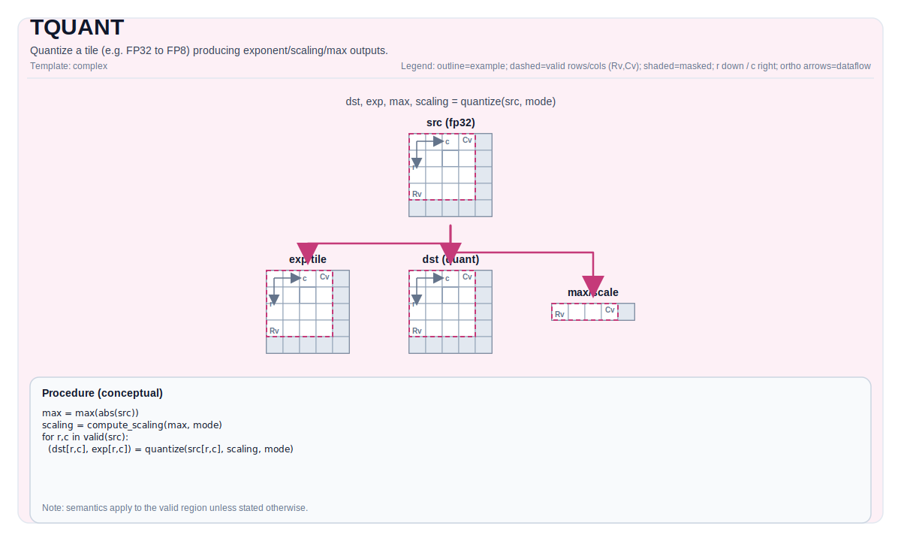

# TQUANT

## 指令示意图



## 简介

`TQUANT` 把高精度 Tile 量化成较低精度表示，并在需要时同时产出量化元数据。它不是一条单一模式的指令，而是一组按模板参数分化出来的量化接口。

当前仓库里最重要的两类路径是：

- `INT8_SYM / INT8_ASYM`
- `MXFP8`

## 模式

### INT8_SYM

对输入 `float32` Tile 做对称 INT8 量化：

$$ q = \mathrm{round}(x \cdot scale) $$

结果写入 `int8_t` 目标 Tile。

### INT8_ASYM

对输入 `float32` Tile 做非对称 UINT8 量化：

$$ q = \mathrm{round}(x \cdot scale + offset) $$

结果写入 `uint8_t` 目标 Tile。

### MXFP8

按组计算共享指数与缩放信息，再生成低精度输出，同时产出辅助元数据：

- `exp`
- `max`
- `scaling`

在 CPU 模拟器里，`MXFP8` 还额外支持一条 NZ 辅助重排接口，用于生成 `exp_zz`。

## 汇编语法

PTO-AS 形式：参见 [PTO-AS 规范](../../../../assembly/PTO-AS_zh.md)。

### AS Level 1（SSA）

```text
%dst = pto.tquant %src, %qp : (!pto.tile<...>, !pto.tile<...>) -> !pto.tile<...>
```

### AS Level 2（DPS）

```text
pto.tquant ins(%src, %qp : !pto.tile_buf<...>, !pto.tile_buf<...>) outs(%dst : !pto.tile_buf<...>)
```

## C++ 内建接口

声明于 `include/pto/common/pto_instr.hpp`：

```cpp
template <auto quant_type, typename TileDataOut, typename TileDataSrc, typename TileDataExp, typename TileDataMax,
          typename... WaitEvents>
PTO_INST RecordEvent TQUANT(TileDataOut &dst, TileDataSrc &src, TileDataExp *exp, TileDataMax *max,
                            TileDataSrc *scaling, WaitEvents &... events);

template <auto quant_type, auto store_mode, typename TileDataOut, typename TileDataSrc, typename TileDataExp,
          typename TileDataMax, typename TileDataIdx, typename... WaitEvents>
PTO_INST RecordEvent TQUANT(TileDataOut &dst, TileDataSrc &src, TileDataExp *exp, TileDataMax *max,
                            TileDataSrc *scaling, TileDataExp *exp_zz, TileDataIdx *vgather_idx,
                            WaitEvents &... events);

template <auto quant_type, typename TileDataOut, typename TileDataSrc, typename TileDataPara, typename... WaitEvents>
PTO_INST RecordEvent TQUANT(TileDataOut &dst, TileDataSrc &src, TileDataPara &scale,
                            TileDataPara *offset = nullptr, WaitEvents &... events);
```

## 约束

### A2/A3 实现

- A2/A3 当前只实现：
  - `INT8_SYM`
  - `INT8_ASYM`
- 输入类型必须是 `float32_t`。
- `INT8_SYM` 输出必须是 `int8_t`。
- `INT8_ASYM` 输出必须是 `uint8_t`。
- A2/A3 的实现会先对输入做按行扩展乘法/加法，再通过中间 `TRESHAPE/TCVT` 路径完成量化。

### A5 实现

- A5 实现：
  - `INT8_SYM`
  - `INT8_ASYM`
  - `MXFP8`
- `INT8_*` 路径输入同样要求 `float32_t`。
- `MXFP8` 路径会输出：
  - 量化后的低精度结果 `dst`
  - 共享指数 `exp`
  - 每组绝对值最大值 `max`
  - 每元素缩放值 `scaling`
- A5 源码里还明确写了：
  - `E8M0` 指数默认按 ND 形式输出
  - 如果需要 ZZ 形式指数，应再借助 `TMOV` 等路径做后续转换

### CPU 模拟器

- CPU 模拟器支持的模拟面比 NPU backend 更宽：
  - `INT8_SYM`
  - `INT8_ASYM`
  - `MXFP8`
  - 以及 `MXFP8 + NZ` 辅助重排接口
- 但 CPU 上能跑通，并不等于所有 NPU backend 都支持同一模式。

### 使用建议

- 如果目标是 A2/A3，可把 `TQUANT` 理解为“INT8 量化指令族”。
- 如果目标是 A5，才应把 `MXFP8` 当成主路径之一。
- 如果你依赖 `exp_zz` 或 `vgather_idx` 这类接口，先确认目标 backend 是否真的实现了它，而不要只看通用 C++ 声明。

## 示例

### 对称 INT8

```cpp
#include <pto/pto-inst.hpp>

using namespace pto;

void example_int8_sym() {
  using SrcT = Tile<TileType::Vec, float, 16, 16>;
  using DstT = Tile<TileType::Vec, int8_t, 16, 16>;
  using ParaT = Tile<TileType::Vec, float, 16, 1>;

  SrcT src;
  DstT dst;
  ParaT scale;
  TQUANT<QuantType::INT8_SYM>(dst, src, scale);
}
```

### MXFP8

```cpp
#include <pto/pto-inst.hpp>

using namespace pto;

void example_mxfp8() {
  using SrcT = Tile<TileType::Vec, float, 16, 32>;
  using DstT = Tile<TileType::Vec, int8_t, 16, 32>;
  using ExpT = Tile<TileType::Vec, uint8_t, 1, 16>;
  using MaxT = Tile<TileType::Vec, float, 1, 16>;

  SrcT src, scaling;
  DstT dst;
  ExpT exp;
  MaxT max;
  TQUANT<QuantType::MXFP8>(dst, src, &exp, &max, &scaling);
}
```

## 相关页面

- [TMOV](../layout-and-rearrangement/tmov_zh.md)
- [TMOV_FP](../layout-and-rearrangement/tmov-fp_zh.md)
- [不规则与复杂指令集](../../irregular-and-complex_zh.md)
