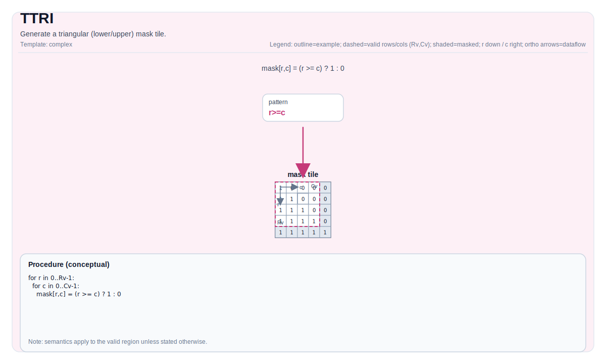

# TTRI

## 指令示意图



## 简介

`TTRI` 生成一个三角掩码 Tile。它不读取源 Tile，而是根据目标 Tile 的有效形状和 `diagonal` 参数直接在 `dst` 里写出上三角或下三角的 0/1 模式。

这条指令常用于注意力 mask、三角区域约束或后续按位/乘法掩码场景。

## 数学语义

设 `R = dst.GetValidRow()`、`C = dst.GetValidCol()`，`d = diagonal`。

### 下三角形式 `isUpperOrLower = 0`

$$
\mathrm{dst}_{i,j} =
\begin{cases}
1 & j \le i + d \\
0 & \text{否则}
\end{cases}
$$

### 上三角形式 `isUpperOrLower = 1`

$$
\mathrm{dst}_{i,j} =
\begin{cases}
0 & j < i + d \\
1 & \text{否则}
\end{cases}
$$

`diagonal = 0` 表示主对角线；正值会把保留区域向右扩展，负值则会收缩。

## 汇编语法

PTO-AS 形式：参见 [PTO-AS 规范](../../../../assembly/PTO-AS_zh.md)。

### AS Level 1（SSA）

```text
%dst = pto.ttri %src0, %src1 : (!pto.tile<...>, !pto.tile<...>) -> !pto.tile<...>
```

### AS Level 2（DPS）

```text
pto.ttri ins(%src0, %src1 : !pto.tile_buf<...>, !pto.tile_buf<...>) outs(%dst : !pto.tile_buf<...>)
```

## C++ 内建接口

声明于 `include/pto/common/pto_instr.hpp`：

```cpp
template <typename TileData, int isUpperOrLower, typename... WaitEvents>
PTO_INST RecordEvent TTRI(TileData &dst, int diagonal, WaitEvents &... events);
```

## 约束

- `isUpperOrLower` 只能是：
  - `0`：下三角
  - `1`：上三角
- `dst` 必须是 row-major Tile。
- 支持的数据类型随目标略有差异：
  - CPU / A2A3：`int32_t`、`int16_t`、`uint32_t`、`uint16_t`、`half`、`float` 等
  - A5：额外覆盖 `int8_t`、`uint8_t`、`bfloat16_t`

## 示例

```cpp
#include <pto/pto-inst.hpp>

using namespace pto;

void example() {
  using MaskT = Tile<TileType::Vec, float, 16, 16>;
  MaskT mask;
  TTRI<MaskT, 0>(mask, 0);  // lower triangular
}
```

## 相关页面

- [TCMP](../../../TCMP_zh.md)
- [不规则与复杂指令集](../../irregular-and-complex_zh.md)
