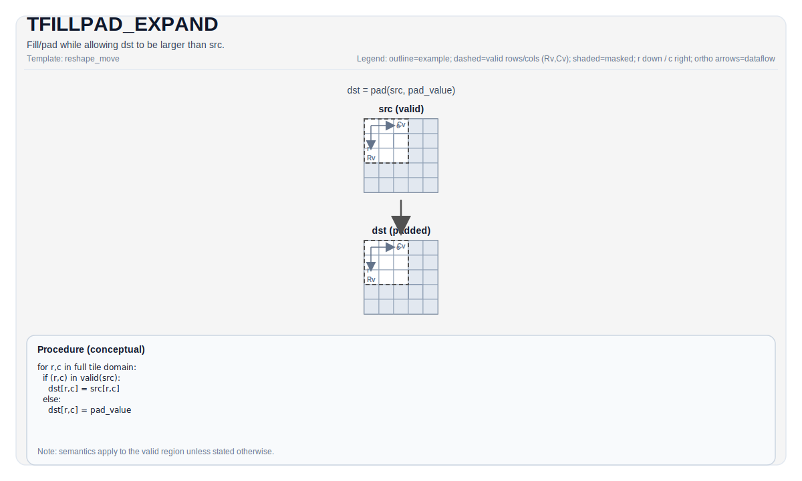

# TFILLPAD_EXPAND

## 指令示意图



## 简介

`TFILLPAD_EXPAND` 是 `TFILLPAD` 的扩展尺寸版本。它和 `TFILLPAD` 做的是同一件事：复制源 Tile 的有效区域，并把剩余位置填成确定 pad 值；不同之处在于，这里允许 `dst` 的静态尺寸大于 `src`。

当你需要把一个较小 Tile 嵌进更大的工作 Tile，再把外围补成统一边界值时，用的就是这条指令。

## 数学语义

设：

- `VR = src.GetValidRow()`
- `VC = src.GetValidCol()`

对 `dst` 的每个元素 `(i, j)`：

$$
\mathrm{dst}_{i,j} =
\begin{cases}
\mathrm{src}_{i,j} & \text{当 } i < VR \text{ 且 } j < VC \\
\mathrm{pad} & \text{否则}
\end{cases}
$$

其中 `pad` 由 `TileDataDst::PadVal` 决定。

与普通 `TFILLPAD` 相比，唯一的语义差别是：这里允许 `dst.Rows/Cols` 大于 `src.Rows/Cols`。

## 汇编语法

PTO-AS 形式：参见 [PTO-AS 规范](../../../../assembly/PTO-AS_zh.md)。

### AS Level 1（SSA）

```text
%dst = pto.tfillpad_expand %src : !pto.tile<...> -> !pto.tile<...>
```

### AS Level 2（DPS）

```text
pto.tfillpad_expand ins(%src : !pto.tile_buf<...>) outs(%dst : !pto.tile_buf<...>)
```

## C++ 内建接口

声明于 `include/pto/common/pto_instr.hpp`：

```cpp
template <typename DstTileData, typename SrcTileData, typename... WaitEvents>
PTO_INST RecordEvent TFILLPAD_EXPAND(DstTileData &dst, SrcTileData &src, WaitEvents &... events);
```

## 约束

### 通用约束

- `dst.Rows >= src.Rows`
- `dst.Cols >= src.Cols`
- `TileDataDst::PadVal != PadValue::Null`
- `src` 和 `dst` 的元素大小必须一致，并且当前实现只接受 `1`、`2` 或 `4` 字节元素
- 如果 `dst.GetValidRow() == 0` 或 `dst.GetValidCol() == 0`，backend 会直接返回

### Backend 说明

- A2/A3、A5 和 CPU 模拟器都把它实现成“复制源有效区域，然后对目标剩余区域补 pad 值”的语义。
- 这条指令本身不引入新的 pad 规则；`PadValue` 的解释与 `TFILLPAD` 保持一致。

## 示例

```cpp
#include <pto/pto-inst.hpp>

using namespace pto;

void example() {
  using SrcT = Tile<TileType::Vec, float, 8, 8>;
  using DstT = Tile<TileType::Vec, float, 16, 16,
                    BLayout::RowMajor, 16, 16, SLayout::NoneBox,
                    TileConfig::fractalABSize, PadValue::Min>;

  SrcT src;
  DstT dst;
  TFILLPAD_EXPAND(dst, src);
}
```

## 相关页面

- [TFILLPAD](./tfillpad_zh.md)
- [TFILLPAD_INPLACE](./tfillpad-inplace_zh.md)
- [布局与重排指令集](../../layout-and-rearrangement_zh.md)
