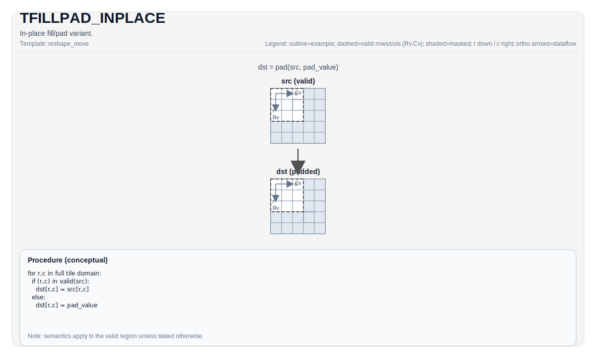

# TFILLPAD_INPLACE

## 指令示意图



## 简介

`TFILLPAD_INPLACE` 是 `TFILLPAD` 的原位变体。它的结果语义与普通 `TFILLPAD` 相同，都是“保留源 valid region，剩余区域写入 pad 值”；区别在于这条接口面向“把目标 Tile 当成被原地修补的对象”的使用方式。

如果你只看最终结果，可以把它理解成“同尺寸 `TFILLPAD`”；如果你关心实现路径，它表达的是“允许 backend 走原位修补式填充”。

## 数学语义

设：

- `VR = src.GetValidRow()`
- `VC = src.GetValidCol()`

对 `dst` 的每个元素 `(i, j)`：

$$
\mathrm{dst}_{i,j} =
\begin{cases}
\mathrm{src}_{i,j} & \text{当 } i < VR \text{ 且 } j < VC \\
\mathrm{pad} & \text{否则}
\end{cases}
$$

其中 `pad` 由 `TileDataDst::PadVal` 决定。

## 汇编语法

PTO-AS 形式：参见 [PTO-AS 规范](../../../../assembly/PTO-AS_zh.md)。

### AS Level 1（SSA）

```text
%dst = pto.tfillpad_inplace %src : !pto.tile<...> -> !pto.tile<...>
```

### AS Level 2（DPS）

```text
pto.tfillpad_inplace ins(%src : !pto.tile_buf<...>) outs(%dst : !pto.tile_buf<...>)
```

## C++ 内建接口

声明于 `include/pto/common/pto_instr.hpp`：

```cpp
template <typename DstTileData, typename SrcTileData, typename... WaitEvents>
PTO_INST RecordEvent TFILLPAD_INPLACE(DstTileData &dst, SrcTileData &src, WaitEvents &... events);
```

## 约束

### 通用约束

- `dst.Rows == src.Rows`
- `dst.Cols == src.Cols`
- `TileDataDst::PadVal != PadValue::Null`
- `src` 和 `dst` 的元素大小必须一致，并且当前实现只接受 `1`、`2` 或 `4` 字节元素
- 如果 `dst.GetValidRow() == 0` 或 `dst.GetValidCol() == 0`，backend 会直接返回

### Backend 说明

- A2/A3、A5 和 CPU 模拟器都把这条指令实现成与同尺寸 `TFILLPAD` 等价的结果语义。
- “原位”更多是接口和实现路径上的语义，而不是另一套数学定义。

## 示例

```cpp
#include <pto/pto-inst.hpp>

using namespace pto;

void example() {
  using TileT = Tile<TileType::Vec, float, 16, 16,
                     BLayout::RowMajor, 16, 16, SLayout::NoneBox,
                     TileConfig::fractalABSize, PadValue::Max>;

  TileT src;
  TileT dst;
  TFILLPAD_INPLACE(dst, src);
}
```

## 相关页面

- [TFILLPAD](./tfillpad_zh.md)
- [TFILLPAD_EXPAND](./tfillpad-expand_zh.md)
- [布局与重排指令集](../../layout-and-rearrangement_zh.md)
