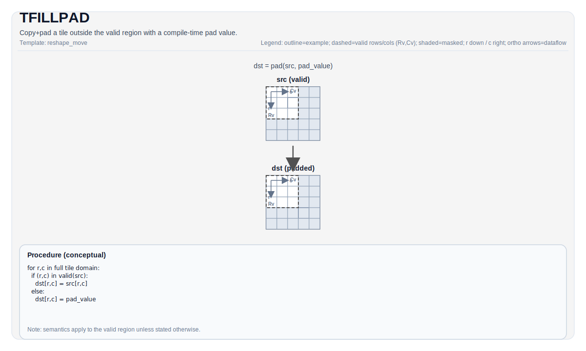

# TFILLPAD

## 指令示意图



## 简介

`TFILLPAD` 复制源 Tile，并把源 valid region 之外的部分用一个**编译期确定的 pad 值**补满。它最常见的用途，是把“运行时有效矩形”扩成“可安全继续参与后续计算的完整静态 Tile”。

如果后续操作不想显式处理边界，就需要有人把边界外的位置先变成确定值。`TFILLPAD` 做的正是这件事。

## 数学语义

设：

- `VR = src.GetValidRow()`
- `VC = src.GetValidCol()`

对 `dst` 的每个元素 `(i, j)`：

$$
\mathrm{dst}_{i,j} =
\begin{cases}
\mathrm{src}_{i,j} & \text{当 } i < VR \text{ 且 } j < VC \\
\mathrm{pad} & \text{否则}
\end{cases}
$$

其中 `pad` 来自 `TileDataDst::PadVal`。常见取值有：

- `PadValue::Zero`
- `PadValue::Min`
- `PadValue::Max`
- 通过 `PadValueCustom(...)` 指定的自定义常量

对浮点类型，`Min/Max` 往往会映射到 `-inf/+inf` 一类“适合做极值归约”的值；对整数类型则映射到对应类型的最小值 / 最大值。

## 汇编语法

PTO-AS 形式：参见 [PTO-AS 规范](../../../../assembly/PTO-AS_zh.md)。

同步形式：

```text
%dst = tfillpad %src : !pto.tile<...> -> !pto.tile<...>
```

### AS Level 1（SSA）

```text
%dst = pto.tfillpad %src : !pto.tile<...> -> !pto.tile<...>
```

### AS Level 2（DPS）

```text
pto.tfillpad ins(%src : !pto.tile_buf<...>) outs(%dst : !pto.tile_buf<...>)
```

## C++ 内建接口

声明于 `include/pto/common/pto_instr.hpp`：

```cpp
template <typename TileData, PadValue PadVal = PadValue::Zero, typename... WaitEvents>
PTO_INST RecordEvent TFILLPAD(TileData &dst, TileData &src, WaitEvents &... events);

template <typename DstTileData, typename SrcTileData, typename... WaitEvents>
PTO_INST RecordEvent TFILLPAD(DstTileData &dst, SrcTileData &src, WaitEvents &... events);
```

相关的同族接口还有：

- `TFILLPAD_INPLACE(dst, src)`：原位填充
- `TFILLPAD_EXPAND(dst, src)`：允许 `dst` 比 `src` 更大

## 约束

### 通用约束

- Vec Tile 版本要求 `TileDataDst::PadVal != PadValue::Null`。
- `src` 和 `dst` 的元素大小必须一致，并且当前实现只接受 `1`、`2` 或 `4` 字节元素。
- 如果 `dst.GetValidRow() == 0` 或 `dst.GetValidCol() == 0`，当前 backend 会直接返回，不执行填充。

### 形状约束

- `TFILLPAD(dst, src)`：`dst.Rows/Cols` 必须与 `src.Rows/Cols` 相同。
- `TFILLPAD_INPLACE(dst, src)`：`dst.Rows/Cols` 也必须与 `src.Rows/Cols` 相同。
- `TFILLPAD_EXPAND(dst, src)`：`dst.Rows >= src.Rows` 且 `dst.Cols >= src.Cols`。

### Mat Tile 特化

- 单类型重载 `TFILLPAD(TileData &dst, TileData &src)` 还支持一条 Mat Tile 特化路径。
- 这条路径当前只支持：
  - NZ 形态的 Mat Tile（非 row-major，`SLayout::RowMajor`）
  - `TileData::PadVal` 为 `PadValue::Zero` 或 `PadValue::Null`
- 这条 Mat 特化更像“把矩阵 Tile 的未覆盖区域置成可接受的默认值”，而不是通用的 Vec copy+pad。

## 示例

### Vec Tile

```cpp
#include <pto/pto-inst.hpp>

using namespace pto;

void example_vec() {
  using SrcT = Tile<TileType::Vec, float, 16, 16>;
  using DstT = Tile<TileType::Vec, float, 16, 16,
                    BLayout::RowMajor, 16, 16, SLayout::NoneBox,
                    TileConfig::fractalABSize, PadValue::Min>;

  SrcT src;
  DstT dst;
  TFILLPAD(dst, src);
}
```

### Mat Tile

```cpp
#include <pto/pto-inst.hpp>

using namespace pto;

void example_mat() {
  using TileMatData = Tile<TileType::Mat, float, 16, 256,
                           BLayout::ColMajor, 1, 224,
                           SLayout::RowMajor, 512>;

  TileMatData matTile;
  TFILLPAD(matTile, matTile);
}
```

## 相关页面

- [布局与重排指令集](../../layout-and-rearrangement_zh.md)
- [布局参考](../../../state-and-types/layout_zh.md)
- [Tiles 与有效区域](../../../programming-model/tiles-and-valid-regions_zh.md)
