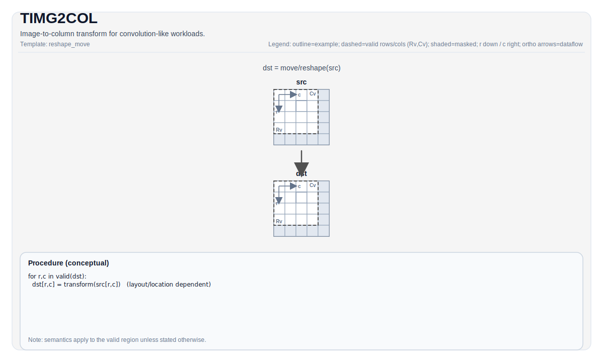

# TIMG2COL

## 指令示意图



## 简介

`TIMG2COL` 把输入特征图 Tile 重排成卷积友好的列矩阵形式，是 PTO 里连接卷积样式输入布局与矩阵乘法路径的关键桥梁。

这条指令不只是简单提取窗口。它同时综合了：

- 输入特征图几何信息
- kernel 大小
- stride / dilation
- padding
- channel 打包方式
- 当前在逻辑 im2col 矩阵中的起始位置 `posM / posK`

## 数学语义

把卷积输入展开成矩阵时，可以把输出矩阵看成按 `(m, k)` 编址：

- `m` 选择输出空间位置
- `k` 选择卷积核内的通道与空间偏移

`TIMG2COL` 会把源特征图中与 `(posM, posK)` 对应的卷积窗口元素，写到目标 Left Tile 中。若窗口越过输入边界，则写入 pad value。

CPU 模拟器里的显式计算逻辑是：

- 先根据 `stride / dilation / filter / pad` 推出输出位置 `(outRow, outCol)`
- 再根据 `kIndex` 推出 `(channelIndex, kernelH, kernelW)`
- 若映射回输入后的 `(inputH, inputW)` 越界，则写 `padValue`
- 否则读取源特征图相应元素

## 汇编语法

PTO-AS 形式：参见 [PTO-AS 规范](../../../../assembly/PTO-AS_zh.md)。

### AS Level 1（SSA）

```text
%dst = pto.timg2col %src : !pto.tile<...> -> !pto.tile<...>
```

### AS Level 2（DPS）

```text
pto.timg2col ins(%src : !pto.tile_buf<...>) outs(%dst : !pto.tile_buf<...>)
```

## C++ 内建接口

声明于 `include/pto/common/pto_instr.hpp`：

```cpp
template <typename TileData, typename ConvTileData, SetFmatrixMode FmatrixMode = SetFmatrixMode::FMATRIX_A_MANUAL,
          typename... WaitEvents>
PTO_INST RecordEvent TIMG2COL(TileData &dst, ConvTileData &src, uint16_t posM = 0, uint16_t posK = 0,
                              WaitEvents&... events);
```

## 约束

### 通用约束

- `src` 必须是卷积配置/特征图 Tile，位置类型为 `TileType::Mat`。
- 输入布局必须是 `NC1HWC0` 或 `NDC1HWC0`。
- `dst` 必须是 `TileType::Left`。
- `src` 与 `dst` 的元素类型必须一致。
- `posM / posK` 不是像素坐标，而是逻辑 im2col 矩阵中的起始偏移。

### A2/A3 实现

- 支持的数据类型是：
  `int8_t`、`half`、`bfloat16_t`、`float`。
- A2/A3 的 `Left` 目标约束是：
  - `dst.SFractal == SLayout::RowMajor`
  - `dst.isRowMajor == true`
- 当 `FmatrixMode` 为 `FMATRIX_A_AUTO` 或 `FMATRIX_B_AUTO` 时，A2/A3 会自动根据 `src` 的：
  - `fmapH / fmapW`
  - `padList`
  来设置 FMATRIX。
- A2/A3 的 `TIMG2COL` auto 路径**不会**顺手设置 repeat 和 padding 寄存器；如果后续路径依赖这些状态，应显式使用对应的 `TSET_*` 指令。

### A5 实现

- 支持的数据类型更宽，除 `int8_t/half/bfloat16_t/float` 外，还覆盖若干 `uint*` / `int*` 类型。
- A5 的 `Left` 目标约束是：
  - `dst.SFractal == SLayout::RowMajor`
  - `dst.isRowMajor == false`
- 当 `FmatrixMode` 为 `FMATRIX_A_AUTO` 或 `FMATRIX_B_AUTO` 时，A5 会自动根据 `src` 的：
  - `fmapH / fmapW`
  - `padList`
  - `repeatStride / repeatTime / repeatMode / dstStride / dstMposition`
  - `padValue`
  一并设置 FMATRIX、repeat 和 padding 状态。

### CPU 模拟器

- CPU 使用显式公式直接完成 im2col 展开。
- CPU 目前沿用与 A5 相同的 `Left` 目标布局约束：
  - `dst.SFractal == SLayout::RowMajor`
  - `dst.isRowMajor == false`

这意味着 `TIMG2COL` 的 Left Tile 细节并不是所有目标完全一致，文档里必须按目标区分。

## 示例

```cpp
#include <pto/pto-inst.hpp>

using namespace pto;

template <typename LeftTile, typename ConvTile>
void example(LeftTile& dst, ConvTile& src) {
  TIMG2COL(dst, src, /*posM=*/0, /*posK=*/0);
}
```

## 相关页面

- [TSETFMATRIX](../../../scalar/ops/control-and-configuration/tsetfmatrix_zh.md)
- [TSET_IMG2COL_RPT](../sync-and-config/tset-img2col-rpt_zh.md)
- [TSET_IMG2COL_PADDING](../sync-and-config/tset-img2col-padding_zh.md)
