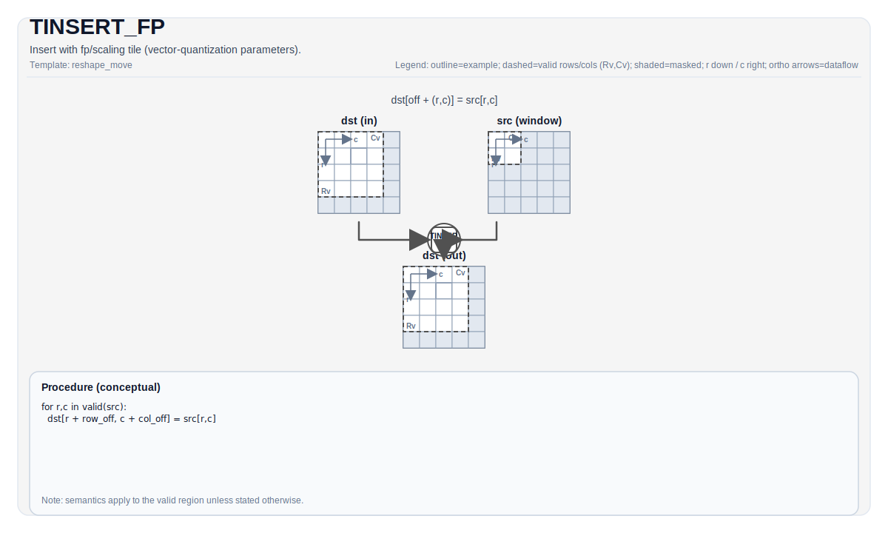

# TINSERT_FP

## 指令示意图



## 简介

`TINSERT_FP` 是 `TINSERT` 的向量量化版本：它把一个源 Tile 插入到目标 Tile 的某个子区域里，同时使用额外的 `fp` Tile 提供量化参数。

这条指令不是通用“任意 Tile 插入”。当前真实 backend 路径主要面向“把 `Acc` Tile 的一块结果，按向量量化规则插入到 `Mat` Tile 的指定位置”。

## 机制

对最直观的结果可以这样理解：

1. 从 `src` 读取一个有效子块。
2. 依据 `fp` 提供的量化参数，把这块数据做向量量化或相关转换。
3. 把结果写到 `dst` 的 `(indexRow, indexCol)` 起始位置。

若只看写入位置关系，它对应的是：

$$ \mathrm{dst}_{indexRow + i,\; indexCol + j} = \mathrm{Convert}\!\left(\mathrm{src}_{i,j};\ \mathrm{fp}\right) $$

其中 `Convert` 的具体形式由 backend 上的向量量化模式决定。

## 汇编语法

PTO-AS 形式：参见 [PTO-AS 规范](../../../../assembly/PTO-AS_zh.md)。

### AS Level 1（SSA）

```text
%dst = pto.tinsert_fp %src, %fp, %idxrow, %idxcol : (!pto.tile<...>, !pto.tile<...>, dtype, dtype) -> !pto.tile<...>
```

### AS Level 2（DPS）

```text
pto.tinsert_fp ins(%src, %fp, %idxrow, %idxcol : !pto.tile_buf<...>, !pto.tile_buf<...>, dtype, dtype) outs(%dst : !pto.tile_buf<...>)
```

## C++ 内建接口

声明于 `include/pto/common/pto_instr.hpp`：

```cpp
template <typename DstTileData, typename SrcTileData, typename FpTileData, ReluPreMode reluMode = ReluPreMode::NoRelu,
          typename... WaitEvents>
PTO_INST RecordEvent TINSERT_FP(DstTileData &dst, SrcTileData &src, FpTileData &fp, uint16_t indexRow,
                                uint16_t indexCol, WaitEvents &... events);
```

## 约束

### 通用约束

- `indexRow + src.Rows` 不能超过 `dst.Rows`。
- `indexCol + src.Cols` 不能超过 `dst.Cols`。
- `fp` 的设计意图是承载缩放/量化参数，可移植代码应把它建成 `TileType::Scaling`。

### A2/A3 实现

- 这条路径基于 `CheckTMovAccToMat(...)`，因此：
  - `src` 必须来自 `Acc`
  - `dst` 必须是 `Mat`
  - `dst` fractal size 必须是 `512`
  - `dst` 列宽字节数必须是 `32` 的倍数
- `TINSERT_FP` 走的是向量量化版本，因此使用 `GetVectorPreQuantMode(...)`。
- `FpTileData::Loc` 必须是 `TileType::Scaling`。

### A5 实现

- A5 也把这条指令实现为 `Acc -> Mat` 的量化插入。
- 额外要求：
  - `dst` 必须是 `TileType::Mat`
  - `dst` 必须使用 `BLayout::ColMajor + SLayout::RowMajor`
  - `src` 必须是 `float` 或 `int32_t` 的 `Acc`
- `FpTileData::Loc` 必须是 `TileType::Scaling`。

### CPU 模拟器

- CPU 模拟器当前接受 `TINSERT_FP` 接口，但会忽略 `fp` 参数，退化为普通 `TINSERT`。
- 因此，依赖 `fp` 数值的量化行为应以 NPU backend 为准。

## 示例

```cpp
#include <pto/pto-inst.hpp>

using namespace pto;

void example() {
  using SrcT = TileAcc<float, 16, 16>;
  using DstT = Tile<TileType::Mat, int8_t, 32, 32, BLayout::ColMajor, -1, -1, SLayout::RowMajor, 512>;
  using FpT = Tile<TileType::Scaling, uint64_t, 1, 16>;

  SrcT src;
  DstT dst;
  FpT fp;
  TINSERT_FP(dst, src, fp, 0, 0);
}
```

## 相关页面

- [TINSERT](./tinsert_zh.md)
- [TEXTRACT_FP](./textract-fp_zh.md)
- [TMOV_FP](./tmov-fp_zh.md)
