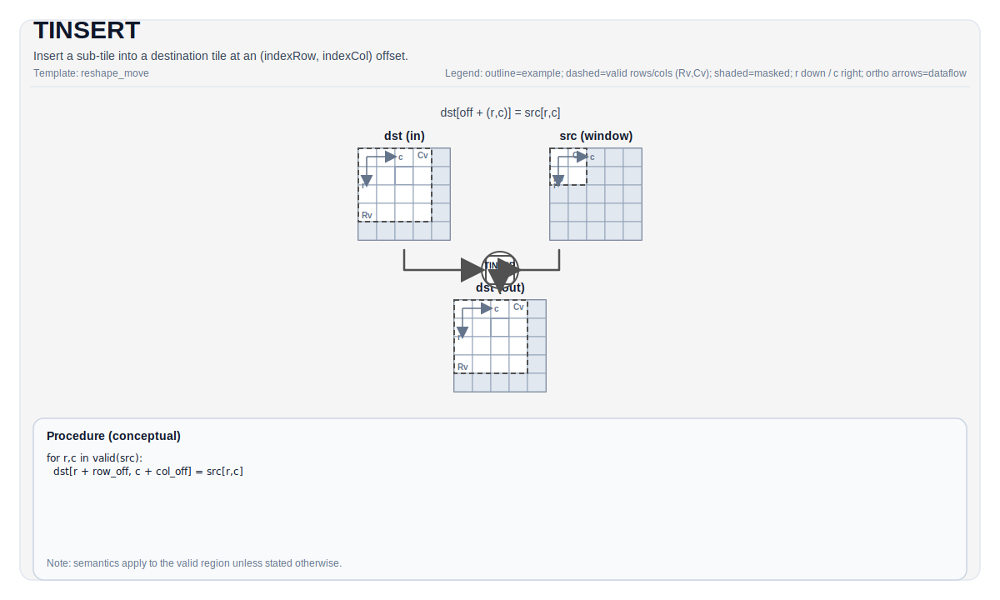

# TINSERT

## 指令示意图



## 简介

在 (indexRow, indexCol) 偏移处将子 Tile 插入到目标 Tile 中。

## 数学语义

设 `R = src.GetValidRow()` 和 `C = src.GetValidCol()`。概念上，对于 `0 <= i < R` 和 `0 <= j < C`：

$$
\mathrm{dst}_{\mathrm{indexRow}+i,\;\mathrm{indexCol}+j} = \mathrm{src}_{i,j}
$$

## 汇编语法

PTO-AS 形式：参见 [PTO-AS 规范](../../../../assembly/PTO-AS_zh.md)。

同步形式：

```text
%dst = tinsert %src[%r0, %r1] : !pto.tile<...> -> !pto.tile<...>
```

### AS Level 1（SSA）

```text
%dst = pto.tinsert %src[%r0, %r1] : !pto.tile<...> -> !pto.tile<...>
```

### AS Level 2（DPS）

```text
pto.tinsert ins(%src[%r0, %r1] : !pto.tile_buf<...>) outs(%dst : !pto.tile_buf<...>)
```

## C++ 内建接口

声明于 `include/pto/common/pto_instr.hpp`：

```cpp
template <typename DstTileData, typename SrcTileData, typename... WaitEvents>
PTO_INST RecordEvent TINSERT(DstTileData &dst, SrcTileData &src, uint16_t indexRow, uint16_t indexCol, WaitEvents &... events);

template <typename DstTileData, typename SrcTileData, ReluPreMode reluMode, typename... WaitEvents>
PTO_INST RecordEvent TINSERT(DstTileData &dst, SrcTileData &src, uint16_t indexRow, uint16_t indexCol, WaitEvents &... events);

template <typename DstTileData, typename SrcTileData, ReluPreMode reluMode = ReluPreMode::NoRelu,
          typename... WaitEvents>
PTO_INST RecordEvent TINSERT(DstTileData &dst, SrcTileData &src, uint64_t preQuantScalar, uint16_t indexRow, uint16_t indexCol, WaitEvents &... events);

template <typename DstTileData, typename SrcTileData, typename FpTileData, ReluPreMode reluMode = ReluPreMode::NoRelu,
          typename... WaitEvents>
PTO_INST RecordEvent TINSERT_FP(DstTileData &dst, SrcTileData &src, FpTileData &fp, uint16_t indexRow, uint16_t indexCol, WaitEvents &... events);

#ifdef PTO_NPU_ARCH_A5
template <TInsertMode mode, typename DstTileData, typename SrcTileData, typename... WaitEvents>
PTO_INST RecordEvent TINSERT(DstTileData &dst, SrcTileData &src, uint32_t indexRow = 0, uint32_t indexCol = 0, WaitEvents &... events);
#endif
```

## 约束

- **A2/A3**:
    - 文档中列出的这些重载对应 `Acc -> Mat` 插入路径，包括普通形式、`reluMode` 形式、标量预量化形式以及向量预量化（`TINSERT_FP`）形式。
    - 运行时边界必须满足 `indexRow + src.Rows <= dst.Rows` 且 `indexCol + src.Cols <= dst.Cols`。
- **A5**:
    - 除了上面的 `Acc -> Mat` 插入路径外，A5 还额外提供 `template <TInsertMode mode, ...> TINSERT(...)`，用于 `Vec -> Mat` 与 `Vec -> Vec` 插入变体。
    - `mode == TInsertMode::ND` 要求源向量 tile 为行优先，并以 ND 布局插入到矩阵 tile。
    - `mode == TInsertMode::ND_VEC` 要求源和目的都为行优先向量 tile。
    - NZ 系列模式（`NZ`、`NZ_PLUS_1`、`SPLIT2_NZ_PLUS_1`、`SPLIT4_NZ_PLUS_1`）要求源向量 tile 为 NZ 格式，目的为矩阵 tile。

## 示例

参见 `docs/isa/` 和 `docs/coding/tutorials/` 中的相关示例。

## 汇编示例（ASM）

### 自动模式

```text
# 自动模式：由编译器/运行时负责资源放置与调度。
%dst = pto.tinsert %src[%r0, %r1] : !pto.tile<...> -> !pto.tile<...>
```

### 手动模式

```text
# 手动模式：先显式绑定资源，再发射指令。
# 可选（当该指令包含 tile 操作数时）：
# pto.tassign %arg0, @tile(0x1000)
# pto.tassign %arg1, @tile(0x2000)
%dst = pto.tinsert %src[%r0, %r1] : !pto.tile<...> -> !pto.tile<...>
```

### PTO 汇编形式

```text
%dst = tinsert %src[%r0, %r1] : !pto.tile<...> -> !pto.tile<...>
# AS Level 2 (DPS)
pto.tinsert ins(%src[%r0, %r1] : !pto.tile_buf<...>) outs(%dst : !pto.tile_buf<...>)
```
