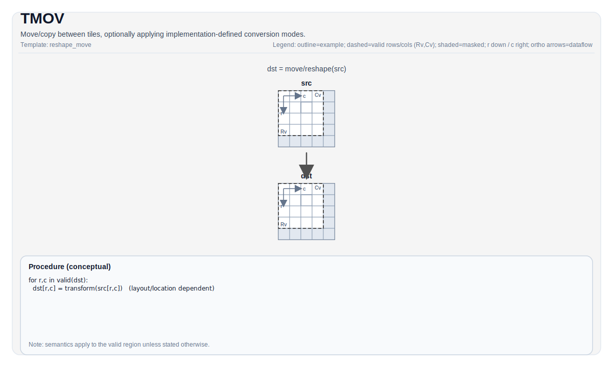

# TMOV

## 指令示意图



## 简介

`TMOV` 是 PTO tile 空间里的“位置变换与局部搬运”总入口。它不在 GM 和 Tile 之间传输数据，而是在不同 Tile 位置、不同布局或不同后端缓冲语义之间移动数据。

这条指令存在的理由很直接：`TLOAD` / `TSTORE` 负责进出 `GlobalTensor`，但很多后端计算单元还要求更具体的本地表示。例如 cube 路径要用 `Left` / `Right` / `Acc`，偏置和量化又要用 `Bias` / `Scaling` / `ScaleLeft` / `ScaleRight`。`TMOV` 正是这些本地表示之间的桥。

## 机制

`TMOV` 不是单一的数据通路，而是一组同名重载。实际语义由源 Tile、目标 Tile 以及所选重载共同决定。

最常见的几类路径是：

- `Vec -> Vec`：在两个向量 Tile 之间复制有效区域。
- `Mat -> Left/Right`：把一般矩阵 Tile 重排成 cube 乘法所需的 `Left` / `Right` 形态。
- `Mat -> Bias/Scaling`：把单行矩阵 Tile 送入偏置表或 fixpipe buffer。
- `Acc -> Vec/Mat`：把累加器内容取出到普通 Tile，并可选附带 ReLU、标量量化或向量量化。
- 某些 A5 特化路径还支持 `Vec -> Mat`、`Mat -> ScaleLeft/ScaleRight`，以及带 `tmp` 的 ND->ZZ 打包。

对最简单的纯复制场景，可以把它看成：

$$ \mathrm{dst}_{i,j} = \mathrm{src}_{i,j} $$

但一旦跨位置或跨 layout，真正发生的就不只是“复制”，还包括重排、格式转换和目标缓冲映射。

## 汇编语法

PTO-AS 形式：参见 [PTO-AS 规范](../../../../assembly/PTO-AS_zh.md)。

PTO-AS 设计上通常会把不同子路径拆成更明确的 spelling，例如：

```text
%left  = tmov.m2l %mat  : !pto.tile<...> -> !pto.tile<...>
%right = tmov.m2r %mat  : !pto.tile<...> -> !pto.tile<...>
%bias  = tmov.m2b %mat  : !pto.tile<...> -> !pto.tile<...>
%scale = tmov.m2s %mat  : !pto.tile<...> -> !pto.tile<...>
%vec   = tmov.a2v %acc  : !pto.tile<...> -> !pto.tile<...>
%v1    = tmov.v2v %v0   : !pto.tile<...> -> !pto.tile<...>
```

### AS Level 1（SSA）

```text
%dst = pto.tmov.s2d %src : !pto.tile<...> -> !pto.tile<...>
```

### AS Level 2（DPS）

```text
pto.tmov ins(%src : !pto.tile_buf<...>) outs(%dst : !pto.tile_buf<...>)
```

## C++ 内建接口

声明于 `include/pto/common/pto_instr.hpp`：

```cpp
template <typename DstTileData, typename SrcTileData, typename... WaitEvents>
PTO_INST RecordEvent TMOV(DstTileData &dst, SrcTileData &src, WaitEvents &... events);

template <typename DstTileData, typename SrcTileData, typename TmpTileData, typename... WaitEvents,
          std::enable_if_t<is_tile_data_v<TmpTileData>, int> = 0>
PTO_INST RecordEvent TMOV(DstTileData &dst, SrcTileData &src, TmpTileData &tmp, WaitEvents &... events);

template <typename DstTileData, typename SrcTileData, ReluPreMode reluMode, typename... WaitEvents>
PTO_INST RecordEvent TMOV(DstTileData &dst, SrcTileData &src, WaitEvents &... events);

template <typename DstTileData, typename SrcTileData, AccToVecMode mode, ReluPreMode reluMode = ReluPreMode::NoRelu,
          typename... WaitEvents>
PTO_INST RecordEvent TMOV(DstTileData &dst, SrcTileData &src, WaitEvents &... events);

template <typename DstTileData, typename SrcTileData, typename FpTileData, ReluPreMode reluMode = ReluPreMode::NoRelu,
          typename... WaitEvents>
PTO_INST RecordEvent TMOV_FP(DstTileData &dst, SrcTileData &src, FpTileData &fp, WaitEvents &... events);

template <typename DstTileData, typename SrcTileData, typename FpTileData, AccToVecMode mode,
          ReluPreMode reluMode = ReluPreMode::NoRelu, typename... WaitEvents>
PTO_INST RecordEvent TMOV(DstTileData &dst, SrcTileData &src, FpTileData &fp, WaitEvents &... events);

template <typename DstTileData, typename SrcTileData, ReluPreMode reluMode = ReluPreMode::NoRelu,
          typename... WaitEvents>
PTO_INST RecordEvent TMOV(DstTileData &dst, SrcTileData &src, uint64_t preQuantScalar, WaitEvents &... events);

template <typename DstTileData, typename SrcTileData, AccToVecMode mode, ReluPreMode reluMode = ReluPreMode::NoRelu,
          typename... WaitEvents>
PTO_INST RecordEvent TMOV(DstTileData &dst, SrcTileData &src, uint64_t preQuantScalar, WaitEvents &... events);
```

## 约束

### 通用约束

- 这是一组重载，不同路径的合法性差异很大。阅读 `TMOV` 时，先看“源位置 -> 目标位置”是哪一种。
- `reluMode` 取值为 `ReluPreMode::{NoRelu, NormalRelu}`。
- `mode` 取值为 `AccToVecMode::{SingleModeVec0, SingleModeVec1, DualModeSplitM, DualModeSplitN}`。
- 对纯 `Vec -> Vec` 复制，backend 复制的是双方 valid region 的交集，而不是强制把物理 Tile 全部搬满。

### A2/A3 实现检查

- A2/A3 支持的主要路径是：
  - `Mat -> Left/Right/Bias/Scaling`
  - `Vec -> Vec`
  - `Acc -> Mat`
- 这些路径都要求源和目标的静态 `Rows/Cols` 相同。
- `Mat -> Bias`：
  - 仅支持 `int32_t -> int32_t`、`float -> float`、`half -> float`
  - 源行数必须为 `1`
  - `Cols * sizeof(srcType)` 必须按 `64` 字节对齐
- `Mat -> Scaling`：
  - 目标类型必须与源类型一致，且必须是 `uint64_t`
  - 源行数必须为 `1`
  - `Cols * sizeof(srcType)` 必须按 `128` 字节对齐
- `Acc -> Mat` 普通 / ReLU 形式并不是通用 cast：
  - 源必须是 `Acc`
  - 目标必须是 `Mat`
  - 目标 fractal size 固定为 `512`
  - 目标列宽字节数必须是 `32` 的倍数
  - 普通 / ReLU 形式只覆盖 `float Acc -> half/bfloat16 Mat`
- `Acc -> Mat` 标量量化 / 向量量化路径的支持集更窄：
  - `float Acc -> int8_t Mat`
  - `int32_t Acc -> int8_t / uint8_t / half / int16_t Mat`
- A2/A3 没有 `Acc -> Vec` 的 `TMOV` 路径；这点和 A5 不同。

### A5 实现检查

- A5 支持的路径更宽，主要包括：
  - `Mat -> Left/Right/Bias/Scaling/ScaleLeft/ScaleRight`
  - `Vec -> Vec/Mat`
  - `Acc -> Vec/Mat`
- 对普通 `Mat` / `Vec` 路径，源和目标通常要求同 dtype。支持的常见元素类型包括：
  `int8_t`、`hifloat8_t`、`float8_e5m2_t`、`float8_e4m3_t`、`half`、`bfloat16_t`、`float`、
  `float4_e2m1x2_t`、`float4_e1m2x2_t`。
- MX scale 路径额外覆盖 `float8_e8m0_t`。
- `Mat -> Bias`：
  - 支持 `int32_t -> int32_t`、`float -> float`、`half -> float`、`bfloat16_t -> float`
  - 源行数必须为 `1`
  - 目标字节数必须按 `64` 字节对齐，且总占用不超过 `4096` 字节
- `Mat -> Scaling`：
  - 源行数必须为 `1`
  - 目标字节数必须按 `128` 字节对齐，且总占用不超过 `4096` 字节
- `Acc -> Vec/Mat`：
  - 源必须是 `float` 或 `int32_t` 的 `Acc`
  - 目标布局只允许 `nz2nz`、`nz2nd`、`nz2dn`
  - 目标 stride 必须非零，且对应字节数必须是 `32` 的倍数
- A5 的非量化 `Acc -> Vec/Mat` 支持：
  - `float -> half / bfloat16 / float`
  - `int32_t -> int32_t`
- A5 的量化路径支持：
  - `float -> int8_t / uint8_t / hifloat8_t / half / bfloat16_t / float8_e4m3_t / float`
  - `int32_t -> int8_t / uint8_t / half / bfloat16_t`
- `DualModeSplitM` / `DualModeSplitN` 仅适用于 `Acc -> Vec`，并且：
  - 不能与量化同时使用
  - 不支持 `nz2dn` 输出路径
- A5 还提供一个带 `tmp` 的特化重载，用于 `uint8_t` 数据的 ND->ZZ 打包路径；它不是通用三操作数 `TMOV`，而是一个窄 backend 特化。

## 示例

### 自动（Auto）

```cpp
#include <pto/pto-inst.hpp>

using namespace pto;

void example_auto() {
  using TileT = Tile<TileType::Vec, float, 16, 16>;
  TileT src, dst;
  TMOV(dst, src);
}
```

### 手动（Manual）

```cpp
#include <pto/pto-inst.hpp>

using namespace pto;

void example_manual() {
  using SrcT = Tile<TileType::Mat, float, 16, 16, BLayout::RowMajor, 16, 16, SLayout::ColMajor>;
  using DstT = TileLeft<float, 16, 16>;
  SrcT mat;
  DstT left;
  TASSIGN(mat, 0x1000);
  TASSIGN(left, 0x2000);
  TMOV(left, mat);
}
```

## 相关页面

- [布局与重排指令集](../../layout-and-rearrangement_zh.md)
- [TMATMUL](../matrix-and-matrix-vector/tmatmul_zh.md)
- [布局参考](../../../state-and-types/layout_zh.md)
