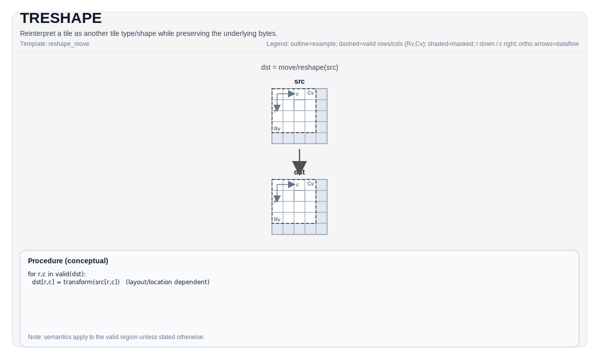

# TRESHAPE

## 指令示意图



## 简介

`TRESHAPE` 重新解释一个 Tile 的字节视图，而不改变底层字节内容。它不是数值转换，也不是数据搬运；它做的是“同一块数据，用另一种 Tile 形状/类型规则来看”。

如果你需要真的改变值，应该找 `TCVT`、`TMOV` 或量化类指令；如果你只是想换一种兼容的 Tile 视图，才使用 `TRESHAPE`。

## 机制

从结果上看，可以把 `TRESHAPE` 理解成：

- `src` 的字节序列保持不变
- `dst` 只是用另一套 Tile 元数据去解释同一批字节

因此它的核心前提不是“形状能不能算”，而是“总字节数和布局类别能不能兼容”。

## 汇编语法

PTO-AS 形式：参见 [PTO-AS 规范](../../../../assembly/PTO-AS_zh.md)。

```text
%dst = treshape %src : !pto.tile<...>
```

### AS Level 1（SSA）

```text
%dst = pto.treshape %src : !pto.tile<...> -> !pto.tile<...>
```

### AS Level 2（DPS）

```text
pto.treshape ins(%src : !pto.tile_buf<...>) outs(%dst : !pto.tile_buf<...>)
```

## C++ 内建接口

声明于 `include/pto/common/pto_instr.hpp`：

```cpp
template <typename TileDataOut, typename TileDataIn, typename... WaitEvents>
PTO_INST RecordEvent TRESHAPE(TileDataOut &dst, TileDataIn &src, WaitEvents &... events);
```

## 约束

### 所有 backend 都共享的硬约束

- `TileDataIn::Loc == TileDataOut::Loc`
- `sizeof(InElem) * InNumel == sizeof(OutElem) * OutNumel`
- 不能在 boxed layout 和 non-boxed layout 之间重解释

### CPU 模拟器

- CPU 还会额外检查元素类型兼容性：
  - 同类型，或
  - 都是浮点，或
  - 都是整数

### A2/A3 / A5 / Kirin9030

- NPU 路径没有 CPU 那么强的“元素类别兼容”检查。
- A2/A3 在非自动路径下会把 `dst` 直接别名到 `src` 的地址；自动路径用 `__cce_alias`。
- A5 和 Kirin9030 复用 A2/A3 的 `TRESHAPE` 实现。

这意味着 `TRESHAPE` 在 NPU 上更接近“受约束的别名/重解释”，而不是一次真实复制。

## 示例

```cpp
#include <pto/pto-inst.hpp>

using namespace pto;

void example() {
  using Src = Tile<TileType::Vec, float, 16, 16>;
  using Dst = Tile<TileType::Vec, float, 8, 32>;
  static_assert(sizeof(typename Src::DType) * Src::Numel == sizeof(typename Dst::DType) * Dst::Numel);

  Src src;
  Dst dst;
  TRESHAPE(dst, src);
}
```

## 相关页面

- [TALIAS](../../../TALIAS_zh.md)
- [TMOV](./tmov_zh.md)
- [布局与重排指令集](../../layout-and-rearrangement_zh.md)
