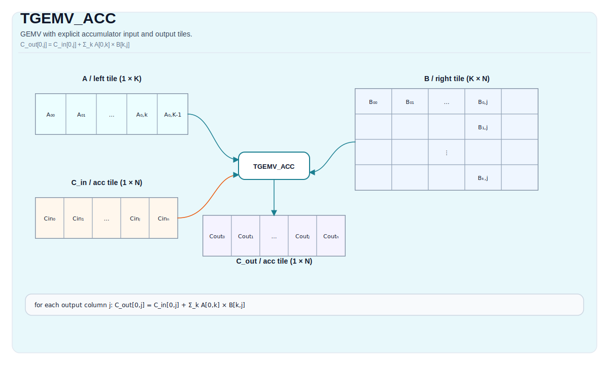

# TGEMV_ACC

## 指令示意图



## 简介

`TGEMV_ACC` 表示“在已有累加器上继续做一轮 GEMV 叠加”。它是 GEMV 的累加形式，对应 `TMATMUL_ACC` 在 `m = 1` 条件下的专门版本。

## 数学语义

设：

- `K = bMatrix.GetValidRow()`
- `N = bMatrix.GetValidCol()`

对 `0 <= j < N`：

$$ \mathrm{C}_{\text{out}, 0,j} = \mathrm{C}_{\text{in}, 0,j} + \sum_{k=0}^{K-1} \mathrm{A}_{0,k} \cdot \mathrm{B}_{k,j} $$

## 机制

这条指令仍然是 cube 路径合同，只是运行时固定 `m = 1`。和 `TMATMUL_ACC` 一样，需要把接口语义和当前实现现状区分开看：

- CPU 模拟器会把 `cInMatrix` 作为显式输入累加器；
- 当前 A2A3 / A5 实现会直接在 `cOutMatrix` 上继续累加，不会先把 `cInMatrix` 拷入 `cOutMatrix`。

因此，若你显式传入不同的输入 / 输出累加器，不应默认所有后端都严格等价。最稳妥的写法，是让输入和输出共享同一块累加器 tile。

## 汇编语法

PTO-AS 形式：参见 [PTO-AS 规范](../../../../assembly/PTO-AS_zh.md)。

同步形式：

```text
%acc1 = tgemv.acc %acc0, %a, %b : (!pto.tile<...>, !pto.tile<...>, !pto.tile<...>) -> !pto.tile<...>
```

### AS Level 1（SSA）

```text
%c_out = pto.tgemv.acc %c_in, %a, %b : (!pto.tile<...>, !pto.tile<...>, !pto.tile<...>) -> !pto.tile<...>
```

### AS Level 2（DPS）

```text
pto.tgemv.acc ins(%c_in, %a, %b : !pto.tile_buf<...>, !pto.tile_buf<...>, !pto.tile_buf<...>) outs(%c_out : !pto.tile_buf<...>)
```

## C++ 内建接口

声明于 `include/pto/common/pto_instr.hpp`：

```cpp
template <typename TileRes, typename TileLeft, typename TileRight, typename... WaitEvents>
PTO_INST RecordEvent TGEMV_ACC(TileRes &cOutMatrix, TileRes &cInMatrix, TileLeft &aMatrix, TileRight &bMatrix,
                               WaitEvents &... events);

template <AccPhase Phase, typename TileRes, typename TileLeft, typename TileRight, typename... WaitEvents>
PTO_INST RecordEvent TGEMV_ACC(TileRes &cOutMatrix, TileRes &cInMatrix, TileLeft &aMatrix, TileRight &bMatrix,
                               WaitEvents &... events);
```

## 输入与输出

- `cInMatrix`：输入累加器。
- `aMatrix`：左操作数 tile，必须是 `Left`。
- `bMatrix`：右操作数 tile，必须是 `Right`。
- `cOutMatrix`：输出累加器，必须是 `Acc`。

## 约束

### 通用约束

- `TGEMV` 的角色、shape、dtype 和 target-profile 约束在这里全部成立；
- 运行时固定 `m = 1`；
- 对于跨后端的稳妥可移植写法，优先使用共享累加器。

### A2A3 与 A5 说明

- A2A3 与 A5 的 dtype、布局和角色限制，与 `TGEMV` 相同；
- 当前 A2A3 / A5 实现不会先把 `cInMatrix` 搬到 `cOutMatrix`，而是直接对 `cOutMatrix` 所指向的累加器继续叠加。

## 不允许的情形

- 违反 `TGEMV` 的任一合法性约束；
- 依赖“不同 `cInMatrix` / `cOutMatrix` 在所有后端上都严格等价”的假设。

## 性能与吞吐

当前仓内 A2A3 costmodel 对 `TGEMV_ACC` 与 `TGEMV` 使用同一条公式：

```text
cycles = 14 + ceil(N/16) * ceil(K / baskK) * repeat_cost
```

其中：

- `baskK = 32 / sizeof(left_element_type)`；
- int8、fp16 bucket 的 `repeat_cost = 1`；
- fp32 bucket 的 `repeat_cost = 2`。

当前仓库没有公开单列的 A5 latency / throughput 表。

## 示例

### 自动（Auto）

```cpp
#include <pto/pto-inst.hpp>

using namespace pto;

void example_auto() {
  using A = TileLeft<half, 1, 16>;
  using B = TileRight<half, 16, 16>;
  using C = TileAcc<float, 1, 16>;
  A a;
  B b;
  C c0, c1;
  TGEMV_ACC(c1, c0, a, b);
}
```

### 共享累加器写法

```cpp
#include <pto/pto-inst.hpp>

using namespace pto;

void example_accumulate() {
  using A = TileLeft<half, 1, 16>;
  using B = TileRight<half, 16, 16>;
  using C = TileAcc<float, 1, 16>;
  A a;
  B b;
  C acc;
  TGEMV_ACC(acc, acc, a, b);
}
```

## 相关页面

- [TGEMV](./tgemv_zh.md)
- [TGEMV_BIAS](./tgemv-bias_zh.md)
- [矩阵与矩阵-向量指令集](../../matrix-and-matrix-vector_zh.md)
