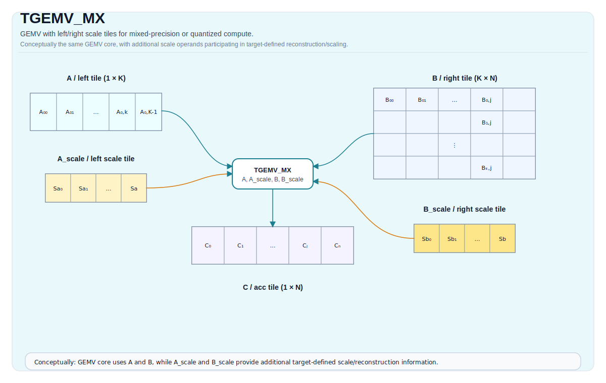

# TGEMV_MX

## 指令示意图



## 简介

`TGEMV_MX` 是 MX 路径下的矩阵向量乘版本。它和 `TMATMUL_MX` 共享同一套 scale Tile 思路，只是把乘法域收窄到 GEMV 形态。

从接口上看，这条指令同样支持普通、累加和 bias 三种变体。

## 数学语义

GEMV 基础乘法域可以写成：

$$ \mathrm{C}_{0,j} = \sum_{k=0}^{K-1} \mathrm{A}_{0,k} \cdot \mathrm{B}_{k,j} $$

和 `TMATMUL_MX` 一样，`aScaleMatrix` / `bScaleMatrix` 会参与 MX 路径下的重建 / 缩放；它们的精确作用由目标定义，而不是由这页单独给出一套独立数值规则。

## 汇编语法

PTO-AS 形式：参见 [PTO-AS 规范](../../../../assembly/PTO-AS_zh.md)。

示意形式：

```text
%acc = tgemv.mx %a, %a_scale, %b, %b_scale : (!pto.tile<...>, !pto.tile<...>, !pto.tile<...>, !pto.tile<...>) -> !pto.tile<...>
```

### AS Level 1（SSA）

```text
%acc = pto.tgemv.mx %a, %a_scale, %b, %b_scale : (!pto.tile<...>, !pto.tile<...>, !pto.tile<...>, !pto.tile<...>) -> !pto.tile<...>
```

### AS Level 2（DPS）

```text
pto.tgemv.mx ins(%a, %a_scale, %b, %b_scale : !pto.tile_buf<...>, !pto.tile_buf<...>, !pto.tile_buf<...>, !pto.tile_buf<...>) outs(%acc : !pto.tile_buf<...>)
```

## C++ 内建接口

声明于 `include/pto/common/pto_instr.hpp`：

```cpp
template <typename TileRes, typename TileLeft, typename TileLeftScale, typename TileRight, typename TileRightScale,
          typename... WaitEvents>
PTO_INST RecordEvent TGEMV_MX(TileRes &cMatrix, TileLeft &aMatrix, TileLeftScale &aScaleMatrix, TileRight &bMatrix,
                              TileRightScale &bScaleMatrix, WaitEvents &... events);

template <typename TileRes, typename TileLeft, typename TileLeftScale, typename TileRight, typename TileRightScale,
          typename... WaitEvents>
PTO_INST RecordEvent TGEMV_MX(TileRes &cOutMatrix, TileRes &cInMatrix, TileLeft &aMatrix, TileLeftScale &aScaleMatrix,
                              TileRight &bMatrix, TileRightScale &bScaleMatrix, WaitEvents &... events);

template <typename TileRes, typename TileLeft, typename TileLeftScale, typename TileRight, typename TileRightScale,
          typename TileBias, typename... WaitEvents>
PTO_INST RecordEvent TGEMV_MX(TileRes &cMatrix, TileLeft &aMatrix, TileLeftScale &aScaleMatrix, TileRight &bMatrix,
                              TileRightScale &bScaleMatrix, TileBias &biasData, WaitEvents &... events);
```

## 约束

### A5 真正支持的 MX 语义

- `TGEMV_MX` 复用与 `TMATMUL_MX` 相同的 `CheckMadMxValid(...)` 约束，因此：
  - 结果累加器必须是 `float`
  - 输入必须是受支持的 fp4 或 fp8 组合
  - Left / Right / Acc 的位置与 fractal 方向必须合法
- 运行时这里不再取 `m = aMatrix.GetValidRow()`，而是固定 GEMV 语义使用单行输出：
  - `k = aMatrix.GetValidCol()`
  - `n = bMatrix.GetValidCol()`
  - `k/n` 均必须落在 `[1, 4095]`
- Bias 变体要求：
  - `biasData` 元素类型为 `float`
  - `biasData` 是单行 `TileType::Bias`

### 其他目标的现状

- CPU 模拟器当前会忽略 `aScaleMatrix` / `bScaleMatrix`，退化为普通 `TGEMV` / `TGEMV_ACC` / `TGEMV_BIAS`。
- Kirin9030 当前没有 MX 实现路径。

因此，这条指令的真实 MX 数值语义目前仍以 A5 backend 为准。

## 示例

```cpp
#include <pto/pto-inst.hpp>

using namespace pto;

void example() {
  using A = TileLeft<float8_e5m2_t, 1, 64>;
  using B = TileRight<float8_e5m2_t, 64, 32>;
  using ScaleA = TileLeftScale<float8_e8m0_t, 1, 2>;
  using ScaleB = TileRightScale<float8_e8m0_t, 2, 32>;
  using C = TileAcc<float, 1, 32>;

  A a;
  B b;
  ScaleA scaleA;
  ScaleB scaleB;
  C c;
  TGEMV_MX(c, a, scaleA, b, scaleB);
}
```

## 相关页面

- [TMATMUL_MX](./tmatmul-mx_zh.md)
- [TGEMV](./tgemv_zh.md)
- [矩阵与矩阵向量指令集](../../matrix-and-matrix-vector_zh.md)
