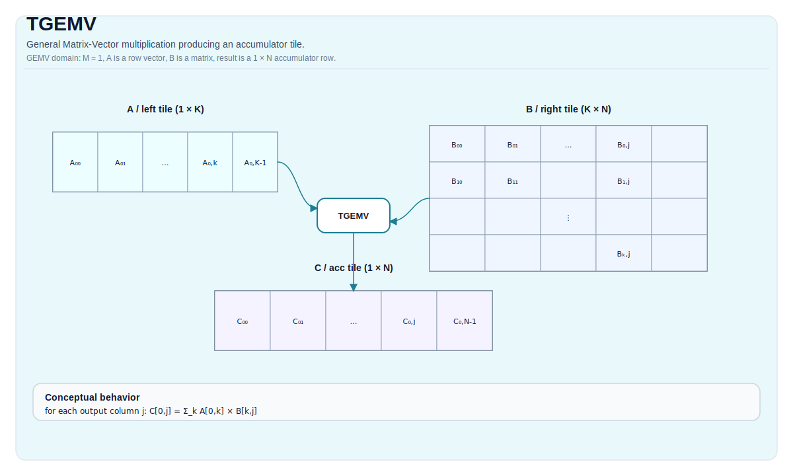

# TGEMV

## 指令示意图



## 简介

`TGEMV` 是 cube 路径上的矩阵-向量乘指令。它不是 vector 指令，而是矩阵乘合同在 `m = 1` 条件下的专门形式：左输入仍走 `Left`，右输入仍走 `Right`，结果仍写入 `Acc`。

把 GEMV 单独列成一条指令，是为了让接口、用法和调度语义更直接，不必让读者总是从“一般 matmul 的退化情况”去倒推。

## 数学语义

设：

- `K = bMatrix.GetValidRow()`
- `N = bMatrix.GetValidCol()`

对 `0 <= j < N`：

$$ \mathrm{C}_{0,j} = \sum_{k=0}^{K-1} \mathrm{A}_{0,k} \cdot \mathrm{B}_{k,j} $$

这里输出只有一行，因此 `TGEMV` 可以理解为矩阵乘一条向量，但它仍然遵守 cube 路径的角色和布局约束。

## 机制

`TGEMV` 仍然使用：

- `Left` 作为左操作数，对应 L0A 路径；
- `Right` 作为右操作数，对应 L0B 路径；
- `Acc` 作为输出累加器。

和 `TMATMUL` 的主要区别，不在“是不是 cube 指令”，而在运行时合同里固定了 `m = 1`。因此它的 costmodel、角色限制和 target 边界都更接近 matmul，而不是向量算术。

## 汇编语法

PTO-AS 形式：参见 [PTO-AS 规范](../../../../assembly/PTO-AS_zh.md)。

同步形式：

```text
%acc = tgemv %a, %b : (!pto.tile<...>, !pto.tile<...>) -> !pto.tile<...>
```

### AS Level 1（SSA）

```text
%c = pto.tgemv %a, %b : (!pto.tile<...>, !pto.tile<...>) -> !pto.tile<...>
```

### AS Level 2（DPS）

```text
pto.tgemv ins(%a, %b : !pto.tile_buf<...>, !pto.tile_buf<...>) outs(%c : !pto.tile_buf<...>)
```

## C++ 内建接口

声明于 `include/pto/common/pto_instr.hpp`：

```cpp
template <typename TileRes, typename TileLeft, typename TileRight, typename... WaitEvents>
PTO_INST RecordEvent TGEMV(TileRes &cMatrix, TileLeft &aMatrix, TileRight &bMatrix, WaitEvents &... events);
```

## 输入与输出

- `aMatrix`：左操作数 tile，必须是 `Left`。
- `bMatrix`：右操作数 tile，必须是 `Right`。
- `cMatrix`：结果累加器 tile，必须是 `Acc`。

输出合同是：生成一行结果 `C[0, j]`。这条指令不会把普通 vector buffer 直接提升成 cube 合同。

## 约束

### 通用约束

- 静态 shape 必须满足：
  - `TileLeft::Rows == TileRes::Rows`
  - `TileLeft::Cols == TileRight::Rows`
  - `TileRight::Cols == TileRes::Cols`
- tile 角色必须满足：
  - `TileLeft::Loc == Left`
  - `TileRight::Loc == Right`
  - `TileRes::Loc == Acc`
- 运行时要求：
  - `m = 1`
  - `k`、`n` 位于 `[1, 4095]`

### A2A3 约束

`A2A3` 指 Ascend 910B 与 Ascend 910C。当前仓内实现公开支持的 `(CType, AType, BType)` 组合包括：

- `(int32_t, int8_t, int8_t)`
- `(float, half, half)`
- `(float, float, float)`
- `(float, bfloat16_t, bfloat16_t)`

### A5 约束

`A5` 指 Ascend 950 PR 与 Ascend 950 DT。当前实现要求：

- 累加器类型必须是 `int32_t` 或 `float`；
- 若累加器为 `int32_t`，左右输入都必须是 `int8_t`；
- 若累加器为 `float`，当前实现支持 `half`、`bfloat16_t`、`float` 和部分 fp8 输入对；
- A5 的 `Right` 角色有独立布局 / fractal 约束，不能拿 A2A3 的右操作数布局直接套用。

## 不允许的情形

- `m != 1`；
- 角色不是 `Left` / `Right` / `Acc`；
- 形状不满足 GEMV 兼容关系；
- 在不支持的 target 上使用不支持的 dtype 组合。

## 性能与吞吐

仓内 A2A3 costmodel 对 `TGEMV` 与 `TMATMUL` 共用 `mad/mmad` 模型，只是 GEMV 固定 `m = 1`，因此公式可直接写成：

```text
cycles = 14 + ceil(N/16) * ceil(K / baskK) * repeat_cost
```

其中：

- `baskK = 32 / sizeof(left_element_type)`；
- int8、fp16 bucket 的 `repeat_cost = 1`；
- fp32 bucket 的 `repeat_cost = 2`。

当前仓库没有公开单列的 A5 latency / throughput 表。

## 示例

### 自动（Auto）

```cpp
#include <pto/pto-inst.hpp>

using namespace pto;

void example_auto() {
  using A = TileLeft<half, 1, 16>;
  using B = TileRight<half, 16, 16>;
  using C = TileAcc<float, 1, 16>;
  A a;
  B b;
  C c;
  TGEMV(c, a, b);
}
```

### 手动（Manual）

```cpp
#include <pto/pto-inst.hpp>

using namespace pto;

void example_manual() {
  using A = TileLeft<half, 1, 16>;
  using B = TileRight<half, 16, 16>;
  using C = TileAcc<float, 1, 16>;
  A a;
  B b;
  C c;
  TASSIGN(a, 0x1000);
  TASSIGN(b, 0x2000);
  TASSIGN(c, 0x3000);
  TGEMV(c, a, b);
}
```

## 相关页面

- [TGEMV_ACC](./tgemv-acc_zh.md)
- [TGEMV_BIAS](./tgemv-bias_zh.md)
- [TGEMV_MX](./tgemv-mx_zh.md)
- [矩阵与矩阵-向量指令集](../../matrix-and-matrix-vector_zh.md)
