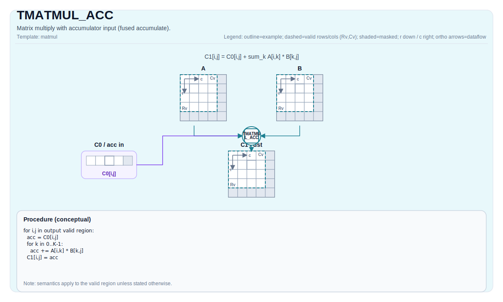

# TMATMUL_ACC

## 指令示意图



## 简介

`TMATMUL_ACC` 表示“在已有累加器上继续做一次矩阵乘叠加”。它不是 `TMATMUL` 的语法别名，而是 K 维分块 GEMM 中真正需要的累加形式。

如果 `TMATMUL` 负责生成一个新块，那么 `TMATMUL_ACC` 负责把后续块继续叠到这个累加器上。这就是两条指令必须并列存在的原因。

## 数学语义

设：

- `M = aMatrix.GetValidRow()`
- `K = aMatrix.GetValidCol()`
- `N = bMatrix.GetValidCol()`

则：

$$ \mathrm{C}_{\text{out}, i,j} = \mathrm{C}_{\text{in}, i,j} + \sum_{k=0}^{K-1} \mathrm{A}_{i,k} \cdot \mathrm{B}_{k,j} $$

## 机制

这条指令仍然使用 `Left` / `Right` / `Acc` 的 cube 路径合同。和 `TMATMUL` 相比，唯一核心差别是它把累加器视为已有值，而不是从零开始的新结果。

需要特别说明的是：接口把 `cInMatrix` 和 `cOutMatrix` 分开，是为了表达“显式输入累加器”和“显式输出累加器”这层语义。但当前仓内实现并不完全一致：

- CPU 模拟器会按接口字面语义使用 `cInMatrix` 作为输入累加器；
- 当前 A2A3 / A5 后端实现会直接在 `cOutMatrix` 上继续累加，不会先把 `cInMatrix` 拷入 `cOutMatrix`。

因此，如果你显式传入两个不同的 tile，对 CPU 与 NPU 的当前行为不应想当然地当作完全一致。最稳妥的可移植写法，是使用共享累加器重载，让输入和输出指向同一块 `Acc` tile。

## 汇编语法

PTO-AS 形式：参见 [PTO-AS 规范](../../../../assembly/PTO-AS_zh.md)。

同步形式：

```text
%acc1 = tmatmul.acc %acc0, %a, %b : (!pto.tile<...>, !pto.tile<...>, !pto.tile<...>) -> !pto.tile<...>
```

### AS Level 1（SSA）

```text
%c_out = pto.tmatmul.acc %c_in, %a, %b : (!pto.tile<...>, !pto.tile<...>, !pto.tile<...>) -> !pto.tile<...>
```

### AS Level 2（DPS）

```text
pto.tmatmul.acc ins(%c_in, %a, %b : !pto.tile_buf<...>, !pto.tile_buf<...>, !pto.tile_buf<...>) outs(%c_out : !pto.tile_buf<...>)
```

## C++ 内建接口

声明于 `include/pto/common/pto_instr.hpp`：

```cpp
template <typename TileRes, typename TileLeft, typename TileRight, typename... WaitEvents>
PTO_INST RecordEvent TMATMUL_ACC(TileRes &cOutMatrix, TileRes &cInMatrix, TileLeft &aMatrix, TileRight &bMatrix,
                                 WaitEvents &... events);

template <AccPhase Phase, typename TileRes, typename TileLeft, typename TileRight, typename... WaitEvents>
PTO_INST RecordEvent TMATMUL_ACC(TileRes &cOutMatrix, TileRes &cInMatrix, TileLeft &aMatrix, TileRight &bMatrix,
                                 WaitEvents &... events);

template <AccPhase Phase = AccPhase::Unspecified, typename TileRes, typename TileLeft, typename TileRight,
          typename... WaitEvents>
PTO_INST RecordEvent TMATMUL_ACC(TileRes &cMatrix, TileLeft &aMatrix, TileRight &bMatrix, WaitEvents &... events);
```

最后一个重载是最稳妥的共享累加器写法。

## 输入与输出

- `cInMatrix`：输入累加器。
- `aMatrix`：左操作数 tile，必须是 `Left`。
- `bMatrix`：右操作数 tile，必须是 `Right`。
- `cOutMatrix`：输出累加器，必须是 `Acc`。

若使用共享累加器重载，则同一块 `Acc` tile 同时承担输入和输出。

## 约束

### 通用约束

- `TMATMUL` 的 shape、角色、dtype 和 target-profile 约束在这里全部成立；
- `m`、`k`、`n` 仍取自 `aMatrix.GetValidRow()`、`aMatrix.GetValidCol()` 和 `bMatrix.GetValidCol()`；
- 若追求跨 CPU / NPU 的稳妥可移植性，应优先使用共享累加器重载。

### A2A3 与 A5 说明

- A2A3 与 A5 的 dtype、布局和角色限制，与 `TMATMUL` 相同；
- 当前 A2A3 / A5 后端的实现路径不会先把 `cInMatrix` 复制到 `cOutMatrix`，而是直接把 `cOutMatrix` 交给底层累加路径。

## 不允许的情形

- 违反 `TMATMUL` 的任一合法性约束；
- 依赖“不同 `cInMatrix` / `cOutMatrix` 在所有后端上都严格等价”的假设；
- 把实现现状误写成更强的架构合同。

## 性能与吞吐

当前仓内 A2A3 costmodel 对 `TMATMUL_ACC` 与 `TMATMUL` 使用同一条 `mad/mmad` 公式：

```text
cycles = 14 + ceil(M/16) * ceil(N/16) * ceil(K / baskK) * repeat_cost
```

其中：

- `baskK = 32 / sizeof(left_element_type)`；
- int8、fp16 bucket 的 `repeat_cost = 1`；
- fp32 bucket 的 `repeat_cost = 2`。

当前仓库没有单列的 A5 latency / throughput 表；A5 仍只公开合法性和 dtype / layout 边界。

## 示例

### 自动（Auto）

```cpp
#include <pto/pto-inst.hpp>

using namespace pto;

void example_auto() {
  using A = TileLeft<half, 16, 16>;
  using B = TileRight<half, 16, 16>;
  using C = TileAcc<float, 16, 16>;
  A a;
  B b;
  C c0, c1;
  TMATMUL_ACC(c1, c0, a, b);
}
```

### 共享累加器写法

```cpp
#include <pto/pto-inst.hpp>

using namespace pto;

void example_accumulate() {
  using A = TileLeft<half, 16, 16>;
  using B = TileRight<half, 16, 16>;
  using C = TileAcc<float, 16, 16>;
  A a;
  B b;
  C acc;
  TMATMUL_ACC(acc, a, b);
}
```

## 相关页面

- [TMATMUL](./tmatmul_zh.md)
- [TMATMUL_BIAS](./tmatmul-bias_zh.md)
- [矩阵与矩阵-向量指令集](../../matrix-and-matrix-vector_zh.md)
