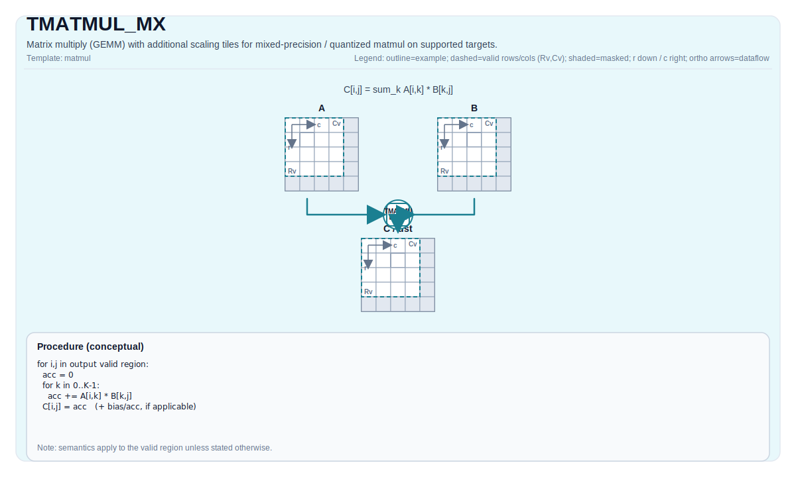

# TMATMUL_MX

## 指令示意图



## 简介

`TMATMUL_MX` 是带双 scale Tile 的矩阵乘法扩展，用来表达 MX 路径下的混合精度 / 量化 GEMM。它和普通 `TMATMUL` 共享 Left / Right / Acc 的整体结构，但额外携带 `aScaleMatrix` 和 `bScaleMatrix`。

这条指令存在的意义，是把“矩阵乘法本体”和“MX 重建/缩放参数”同时放进一条架构可见指令里，而不是靠外部约定隐式拼接。

## 数学语义

设：

- `M = aMatrix.GetValidRow()`
- `K = aMatrix.GetValidCol()`
- `N = bMatrix.GetValidCol()`

基础乘法域仍然是：

$$ \mathrm{C}_{i,j} = \sum_{k=0}^{K-1} \mathrm{A}_{i,k} \cdot \mathrm{B}_{k,j} $$

区别在于，`aScaleMatrix` 和 `bScaleMatrix` 会参与 MX 路径下的重建 / 缩放。它们如何参与，不是通用 PTO 规则，而是目标定义的 MX 语义。

## 汇编语法

PTO-AS 形式：参见 [PTO-AS 规范](../../../../assembly/PTO-AS_zh.md)。

示意形式：

```text
%c = tmatmul.mx %a, %a_scale, %b, %b_scale : (!pto.tile<...>, !pto.tile<...>, !pto.tile<...>, !pto.tile<...>) -> !pto.tile<...>
%c_out = tmatmul.mx.acc %c_in, %a, %a_scale, %b, %b_scale : (!pto.tile<...>, !pto.tile<...>, !pto.tile<...>, !pto.tile<...>, !pto.tile<...>) -> !pto.tile<...>
%c = tmatmul.mx.bias %a, %a_scale, %b, %b_scale, %bias : (!pto.tile<...>, !pto.tile<...>, !pto.tile<...>, !pto.tile<...>, !pto.tile<...>) -> !pto.tile<...>
```

### AS Level 1（SSA）

```text
%c = pto.tmatmul.mx %a, %a_scale, %b, %b_scale : (!pto.tile<...>, !pto.tile<...>, !pto.tile<...>, !pto.tile<...>) -> !pto.tile<...>
%c_out = pto.tmatmul.mx.acc %c_in, %a, %a_scale, %b, %b_scale : (!pto.tile<...>, !pto.tile<...>, !pto.tile<...>, !pto.tile<...>, !pto.tile<...>) -> !pto.tile<...>
%c = pto.tmatmul.mx.bias %a, %a_scale, %b, %b_scale, %bias : (!pto.tile<...>, !pto.tile<...>, !pto.tile<...>, !pto.tile<...>, !pto.tile<...>) -> !pto.tile<...>
```

### AS Level 2（DPS）

```text
pto.tmatmul.mx ins(%a, %a_scale, %b, %b_scale : !pto.tile_buf<...>, !pto.tile_buf<...>, !pto.tile_buf<...>, !pto.tile_buf<...>) outs(%c : !pto.tile_buf<...>)
pto.tmatmul.mx.acc ins(%c_in, %a, %a_scale, %b, %b_scale : !pto.tile_buf<...>, !pto.tile_buf<...>, !pto.tile_buf<...>, !pto.tile_buf<...>, !pto.tile_buf<...>) outs(%c_out : !pto.tile_buf<...>)
pto.tmatmul.mx.bias ins(%a, %a_scale, %b, %b_scale, %bias : !pto.tile_buf<...>, !pto.tile_buf<...>, !pto.tile_buf<...>, !pto.tile_buf<...>, !pto.tile_buf<...>) outs(%c : !pto.tile_buf<...>)
```

## C++ 内建接口

声明于 `include/pto/common/pto_instr.hpp`：

```cpp
template <typename TileRes, typename TileLeft, typename TileLeftScale, typename TileRight, typename TileRightScale,
          typename... WaitEvents>
PTO_INST RecordEvent TMATMUL_MX(TileRes &cMatrix, TileLeft &aMatrix, TileLeftScale &aScaleMatrix, TileRight &bMatrix,
                                TileRightScale &bScaleMatrix, WaitEvents &... events);

template <typename TileRes, typename TileLeft, typename TileLeftScale, typename TileRight, typename TileRightScale,
          typename... WaitEvents>
PTO_INST RecordEvent TMATMUL_MX(TileRes &cOutMatrix, TileRes &cInMatrix, TileLeft &aMatrix, TileLeftScale &aScaleMatrix,
                                TileRight &bMatrix, TileRightScale &bScaleMatrix, WaitEvents &... events);

template <typename TileRes, typename TileLeft, typename TileLeftScale, typename TileRight, typename TileRightScale,
          typename TileBias, typename... WaitEvents>
PTO_INST RecordEvent TMATMUL_MX(TileRes &cMatrix, TileLeft &aMatrix, TileLeftScale &aScaleMatrix, TileRight &bMatrix,
                                TileRightScale &bScaleMatrix, TileBias &biasData, WaitEvents &... events);
```

`AccPhase` 的模板重载与普通 `TMATMUL` 一样，主要用于目标实现侧的 unit-flag 选择。

## 约束

### A5 真正支持的 MX 语义

- 当前仓库里，只有 A5 backend 真正实现了 MX 语义。
- A5 的 `CheckMadMxValid(...)` 要求：
  - 结果累加器类型必须是 `float`
  - 输入必须是受支持的 fp4 或 fp8 组合
  - `TileLeft::Cols` 必须是 `64` 的倍数
  - 若走 fp4 路径，`TileLeft::Cols` 还必须是偶数
  - Left / Right / Acc 的位置与 fractal 方向必须符合 cube 路径要求

支持的输入组合包括：

- fp4：
  - `float4_e1m2x2_t` / `float4_e1m2x2_t`
  - `float4_e1m2x2_t` / `float4_e2m1x2_t`
  - `float4_e2m1x2_t` / `float4_e2m1x2_t`
  - `float4_e2m1x2_t` / `float4_e1m2x2_t`
- fp8：
  - `float8_e4m3_t` / `float8_e4m3_t`
  - `float8_e4m3_t` / `float8_e5m2_t`
  - `float8_e5m2_t` / `float8_e4m3_t`
  - `float8_e5m2_t` / `float8_e5m2_t`

Bias 变体还要求：

- `biasData` 的元素类型必须是 `float`
- `biasData` 必须是单行 `TileType::Bias`

### 运行时范围

- A5 的 `m/k/n` 均必须落在 `[1, 4095]`。

### 其他目标的现状

- CPU 模拟器会接受 `TMATMUL_MX` 接口，但当前实现会忽略 `aScaleMatrix` / `bScaleMatrix`，直接退化为普通 `TMATMUL` / `TMATMUL_ACC` / `TMATMUL_BIAS`。
- Kirin9030 当前明确不支持 `TMATMUL_MX`，对应实现直接 `static_assert` 失败。

这意味着：

- 如果你要验证真正的 MX 语义，应以 A5 为准。
- CPU 只能用来跑接口形态或近似流程，不适合作为 MX 数值语义的最终依据。

## 示例

### 自动（Auto）

```cpp
#include <pto/pto-inst.hpp>

using namespace pto;

void example_auto() {
  using A = TileLeft<float8_e5m2_t, 16, 64>;
  using B = TileRight<float8_e5m2_t, 64, 32>;
  using ScaleA = TileLeftScale<float8_e8m0_t, 16, 2>;
  using ScaleB = TileRightScale<float8_e8m0_t, 2, 32>;
  using Bias = Tile<TileType::Bias, float, 1, 32>;
  using C = TileAcc<float, 16, 32>;
  A a;
  B b;
  ScaleA scaleA;
  ScaleB scaleB;
  Bias bias;
  C c;
  TMATMUL_MX(c, a, scaleA, b, scaleB, bias);
}
```

### 手动（Manual）

```cpp
#include <pto/pto-inst.hpp>

using namespace pto;

void example_manual() {
  using A = TileLeft<float8_e5m2_t, 16, 64>;
  using B = TileRight<float8_e5m2_t, 64, 32>;
  using ScaleA = TileLeftScale<float8_e8m0_t, 16, 2>;
  using ScaleB = TileRightScale<float8_e8m0_t, 2, 32>;
  using Bias = Tile<TileType::Bias, float, 1, 32>;
  using C = TileAcc<float, 16, 32>;
  A a;
  B b;
  ScaleA scaleA;
  ScaleB scaleB;
  Bias bias;
  C c;
  TASSIGN(a, 0x1000);
  TASSIGN(b, 0x2000);
  TASSIGN(scaleA, GetScaleAddr(a.data()));
  TASSIGN(scaleB, GetScaleAddr(b.data()));
  TASSIGN(bias, 0x3000);
  TASSIGN(c, 0x4000);
  TMATMUL_MX(c, a, scaleA, b, scaleB, bias);
}
```

## 相关页面

- [TGEMV_MX](./tgemv-mx_zh.md)
- [TMATMUL](./tmatmul_zh.md)
- [矩阵与矩阵向量指令集](../../matrix-and-matrix-vector_zh.md)
