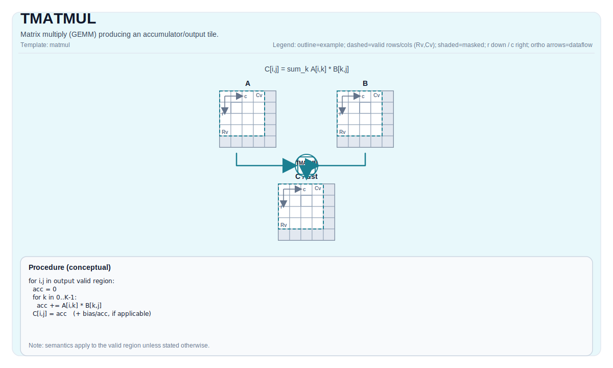

# TMATMUL

## 指令示意图



## 简介

`TMATMUL` 是 tile 路径里生成新累加器结果的基础矩阵乘指令。它从 `Left` 读取左操作数，从 `Right` 读取右操作数，把结果写入 `Acc`。

这条指令和 `TMATMUL_ACC` 分开的原因很直接：`TMATMUL` 代表“这次计算生成一个新的输出块”，而 `TMATMUL_ACC` 代表“在已有累加器上继续叠加”。把两者混在一起，会让 K 维分块循环里的资源和调度语义变得不清楚。

## 数学语义

设：

- `M = aMatrix.GetValidRow()`
- `K = aMatrix.GetValidCol()`
- `N = bMatrix.GetValidCol()`

对 `0 <= i < M`、`0 <= j < N`：

$$ \mathrm{C}_{i,j} = \sum_{k=0}^{K-1} \mathrm{A}_{i,k} \cdot \mathrm{B}_{k,j} $$

有效计算域由输入 tile 的 valid region 决定，而不是单纯由静态 tile 尺寸决定。指令不会隐式做广播、reshape，或把不合法的输入域“修复”为某种可移植结果。

## 机制

`TMATMUL` 属于 cube 路径，不是普通逐元素 tile 运算：

- 左操作数必须是 `Left` tile，对应 L0A 路径；
- 右操作数必须是 `Right` tile，对应 L0B 路径；
- 输出必须是 `Acc` tile；
- 结果域由 `(M, K) x (K, N) -> (M, N)` 的合法矩阵乘域决定。

`Right` 虽然在 A2A3 与 A5 上都叫同一个架构角色，但它们的具体布局要求并不完全相同，不能把某一侧的物理布局理解成“全 target 通用”。

## 汇编语法

PTO-AS 形式：参见 [PTO-AS 规范](../../../../assembly/PTO-AS_zh.md)。

同步形式：

```text
%acc = tmatmul %a, %b : (!pto.tile<...>, !pto.tile<...>) -> !pto.tile<...>
```

### AS Level 1（SSA）

```text
%c = pto.tmatmul %a, %b : (!pto.tile<...>, !pto.tile<...>) -> !pto.tile<...>
```

### AS Level 2（DPS）

```text
pto.tmatmul ins(%a, %b : !pto.tile_buf<...>, !pto.tile_buf<...>) outs(%c : !pto.tile_buf<...>)
```

## C++ 内建接口

声明于 `include/pto/common/pto_instr.hpp`：

```cpp
template <typename TileRes, typename TileLeft, typename TileRight, typename... WaitEvents>
PTO_INST RecordEvent TMATMUL(TileRes &cMatrix, TileLeft &aMatrix, TileRight &bMatrix, WaitEvents &... events);

template <AccPhase Phase, typename TileRes, typename TileLeft, typename TileRight, typename... WaitEvents>
PTO_INST RecordEvent TMATMUL(TileRes &cMatrix, TileLeft &aMatrix, TileRight &bMatrix, WaitEvents &... events);
```

带 `AccPhase` 的模板重载不改变矩阵乘法的算术语义；它只是让具体后端在 unit-flag 或实现细节上做选择。

## 输入与输出

- `aMatrix`：左操作数 tile，必须是 `Left`。
- `bMatrix`：右操作数 tile，必须是 `Right`。
- `cMatrix`：结果累加器 tile，必须是 `Acc`。

结果写入 `cMatrix`。对读者可见的合同是：输出块由本次 `A * B` 生成，而不是在旧累加器上继续叠加。

## 约束

### 通用约束

- 静态 shape 必须满足：
  - `TileLeft::Rows == TileRes::Rows`
  - `TileLeft::Cols == TileRight::Rows`
  - `TileRight::Cols == TileRes::Cols`
- tile 角色必须满足：
  - `TileLeft::Loc == Left`
  - `TileRight::Loc == Right`
  - `TileRes::Loc == Acc`
- 运行时 `m`、`k`、`n` 必须位于 `[1, 4095]`。

### A2A3 约束

`A2A3` 指 Ascend 910B 与 Ascend 910C。当前仓内实现公开支持的 `(CType, AType, BType)` 组合包括：

- `(int32_t, int8_t, int8_t)`
- `(float, half, half)`
- `(float, float, float)`
- `(float, bfloat16_t, bfloat16_t)`

### A5 约束

`A5` 指 Ascend 950 PR 与 Ascend 950 DT。当前仓内实现要求：

- 累加器类型必须是 `int32_t` 或 `float`；
- 若累加器为 `int32_t`，左右输入都必须是 `int8_t`；
- 若累加器为 `float`，当前实现支持 `half`、`bfloat16_t`、`float` 和部分 fp8 输入对；
- A5 还要求固定的角色布局组合：
  - Left：`Loc == Left`，非 row-major，`SFractal == RowMajor`
  - Right：`Loc == Right`，row-major，`SFractal == ColMajor`
  - Acc：`Loc == Acc`，非 row-major，`SFractal == RowMajor`

## 不允许的情形

- 使用不是 `Left` / `Right` / `Acc` 的角色组合；
- 形状不满足 `(M, K) x (K, N) -> (M, N)`；
- 在不支持的 target 上使用不支持的 dtype 组合；
- 把某个 target 上偶然可运行的布局当成可移植合同。

## 性能与吞吐

仓内当前公开的性能数据主要来自 A2A3 costmodel。`TMATMUL`、`TMATMUL_ACC` 与 `TMATMUL_BIAS` 使用同一条 `mad/mmad` cube 模型：

- 启动开销：`14` cycles；
- repeat 次数：`ceil(M/16) * ceil(N/16) * ceil(K / baskK)`；
- `baskK = 32 / sizeof(left_element_type)`；
- 单个 repeat 的稳态代价：
  - int8、fp16 bucket 为 `1` cycle；
  - fp32 bucket 为 `2` cycles。

因此 A2A3 的公开公式是：

```text
cycles = 14 + ceil(M/16) * ceil(N/16) * ceil(K / baskK) * repeat_cost
```

仓内 costmodel 测试样例包括：

- half `40x50 * 50x60`：`62` cycles；
- int8 `6x7 * 7x8`：`15` cycles；
- float `120x110 * 110x50`：`910` cycles。

当前仓库没有公开单列的 A5 latency / throughput 表，因此 A5 这里只能精确写合法性和 dtype 边界，不能编造周期数字。

## 示例

### 自动（Auto）

```cpp
#include <pto/pto-inst.hpp>

using namespace pto;

void example_auto() {
  using A = TileLeft<half, 16, 16>;
  using B = TileRight<half, 16, 16>;
  using C = TileAcc<float, 16, 16>;
  A a;
  B b;
  C c;
  TMATMUL(c, a, b);
}
```

### 手动（Manual）

```cpp
#include <pto/pto-inst.hpp>

using namespace pto;

void example_manual() {
  using A = TileLeft<half, 16, 16>;
  using B = TileRight<half, 16, 16>;
  using C = TileAcc<float, 16, 16>;
  A a;
  B b;
  C c;
  TASSIGN(a, 0x1000);
  TASSIGN(b, 0x2000);
  TASSIGN(c, 0x3000);
  TMATMUL(c, a, b);
}
```

## 相关页面

- [矩阵与矩阵-向量指令集](../../matrix-and-matrix-vector_zh.md)
- [TMATMUL_ACC](./tmatmul-acc_zh.md)
- [TMATMUL_BIAS](./tmatmul-bias_zh.md)
- [TMATMUL_MX](./tmatmul-mx_zh.md)
