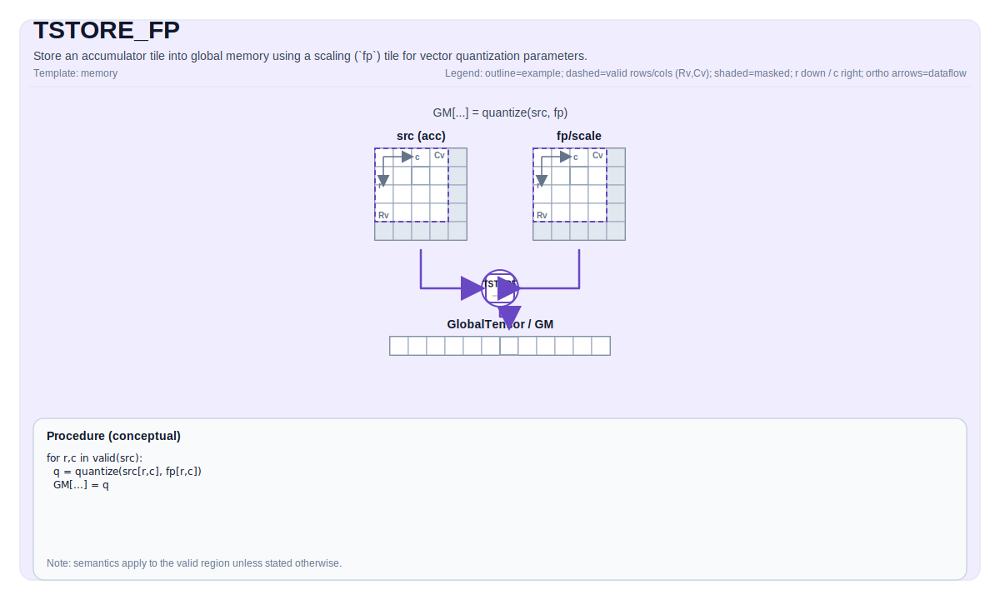

# TSTORE_FP

## 指令示意图



## 简介

`TSTORE_FP` 是带向量量化参数的累加器写回指令。它把 `Acc` Tile 写回 `GlobalTensor`，同时使用额外的 `fp` Tile 提供向量量化或反量化所需的参数。

如果普通 `TSTORE` 足够表达你的写回，就不需要这条指令；只有当写回过程本身依赖一组外部缩放参数时，才使用 `TSTORE_FP`。

## 数学语义

设：

- `R = src.GetValidRow()`
- `C = src.GetValidCol()`

从二维视角写回时，可概念化为：

$$ \mathrm{dst}_{r_0 + i,\; c_0 + j} = \mathrm{Convert}\!\left(\mathrm{src}_{i,j};\ \mathrm{fp}\right) $$

其中 `Convert` 表示“结合 `fp` 参数完成的向量量化 / 反量化写回”。地址计算规则与普通 `TSTORE` 一致，仍由 `GlobalTensor` 的 shape / stride 决定。

## 汇编语法

PTO-AS 形式：参见 [PTO-AS 规范](../../../../assembly/PTO-AS_zh.md)。

同步形式：

```text
tstore.fp %src, %fp, %sv_out[%c0, %c0]
```

### AS Level 1（SSA）

```text
pto.tstore.fp %src, %fp, %mem : (!pto.tile<...>, !pto.tile<...>, !pto.partition_tensor_view<MxNxdtype>) -> ()
```

### AS Level 2（DPS）

```text
pto.tstore.fp ins(%src, %fp : !pto.tile_buf<...>, !pto.tile_buf<...>) outs(%mem : !pto.partition_tensor_view<MxNxdtype>)
```

## C++ 内建接口

声明于 `include/pto/common/pto_instr.hpp`：

```cpp
template <typename TileData, typename GlobalData, typename FpTileData, AtomicType atomicType = AtomicType::AtomicNone,
          ReluPreMode reluPreMode = ReluPreMode::NoRelu, typename... WaitEvents>
PTO_INST RecordEvent TSTORE_FP(GlobalData &dst, TileData &src, FpTileData &fp, WaitEvents &... events);
```

## 约束

### 通用约束

- `src` 必须是 `Acc` Tile。
- `TSTORE_FP` 复用累加器到 GM 的量化写回检查，因此目标布局、行列范围和 dtype 合法域都沿用对应 backend 的 quantized `Acc -> GM` 路径。
- 当前实现不会对 `FpTileData::Loc` 做直接 `static_assert`，但可移植代码应将 `fp` 建成 `TileType::Scaling`。

### A2/A3 实现检查

- 目标 `GlobalTensor` 布局必须是 `ND`、`NZ` 或 `NC1HWC0`。
- 源累加器类型必须是 `float` 或 `int32_t`。
- 静态范围：
  - `1 <= TileData::Cols <= 4095`
  - 若目标为 `ND`，则 `1 <= TileData::Rows <= 8192`
  - 若目标为 `NZ` 或 `NC1HWC0`，则 `1 <= TileData::Rows <= 65535` 且 `TileData::Cols % 16 == 0`
- 运行时要求：
  - `1 <= src.GetValidCol() <= 4095`
  - 目标 shape 各维与源 valid region 都必须大于 `0`
- 量化支持集为：
  - `float Acc -> __gm__ int8_t / __gm__ uint8_t`
  - `int32_t Acc -> __gm__ int8_t / __gm__ uint8_t / __gm__ half`

### A5 实现检查

- 目标 `GlobalTensor` 布局必须是 `ND`、`NZ`、`NHWC`、`NCHW` 或 `NCDHW`。
- 源累加器类型必须是 `float` 或 `int32_t`。
- 静态范围：
  - `1 <= TileData::Cols <= 4095`
  - 若目标为 `ND`，则 `1 <= TileData::Rows <= 8192`
  - 若目标为 `NZ/NHWC/NCHW/NCDHW`，则 `1 <= TileData::Rows <= 65535` 且 `TileData::Cols % 16 == 0`
- 量化支持集为：
  - `float Acc -> __gm__ int8_t / __gm__ uint8_t / __gm__ bfloat16_t / __gm__ half / __gm__ hifloat8_t / __gm__ float8_e4m3_t / __gm__ float`
  - `int32_t Acc -> __gm__ int8_t / __gm__ uint8_t / __gm__ bfloat16_t / __gm__ half`
- 若启用 `AtomicAdd`，目标 dtype 还必须属于 backend 允许的原子类型集合。

### CPU 模拟器说明

- 当前 CPU 模拟器会接受 `TSTORE_FP` 接口，但不会真正消费 `fp` 参数，而是退化为普通 `TSTORE`。
- 因而依赖 `fp` 具体数值的量化效果，应以 NPU backend 为准。

## 示例

### 自动（Auto）

```cpp
#include <pto/pto-inst.hpp>

using namespace pto;

void example_auto(__gm__ int8_t* out) {
  using AccT = TileAcc<float, 16, 16>;
  using FpT = Tile<TileType::Scaling, uint64_t, 1, 16, BLayout::RowMajor, 1, DYNAMIC, SLayout::NoneBox>;
  using GShape = Shape<1, 1, 1, 16, 16>;
  using GStride = BaseShape2D<int8_t, 16, 16, Layout::ND>;
  using GT = GlobalTensor<int8_t, GShape, GStride, Layout::ND>;

  GT gout(out);
  AccT acc;
  FpT fp(16);
  TSTORE_FP(gout, acc, fp);
}
```

### 手动（Manual）

```cpp
#include <pto/pto-inst.hpp>

using namespace pto;

void example_manual(__gm__ int8_t* out) {
  using AccT = TileAcc<float, 16, 16>;
  using FpT = Tile<TileType::Scaling, uint64_t, 1, 16, BLayout::RowMajor, 1, DYNAMIC, SLayout::NoneBox>;
  using GShape = Shape<1, 1, 1, 16, 16>;
  using GStride = BaseShape2D<int8_t, 16, 16, Layout::ND>;
  using GT = GlobalTensor<int8_t, GShape, GStride, Layout::ND>;

  GT gout(out);
  AccT acc;
  FpT fp(16);
  TASSIGN(acc, 0x1000);
  TASSIGN(fp, 0x2000);
  TSTORE_FP(gout, acc, fp);
}
```

## 相关页面

- [TSTORE](./tstore_zh.md)
- [TMOV_FP](../layout-and-rearrangement/tmov-fp_zh.md)
- [内存与数据搬运指令集](../../memory-and-data-movement_zh.md)
