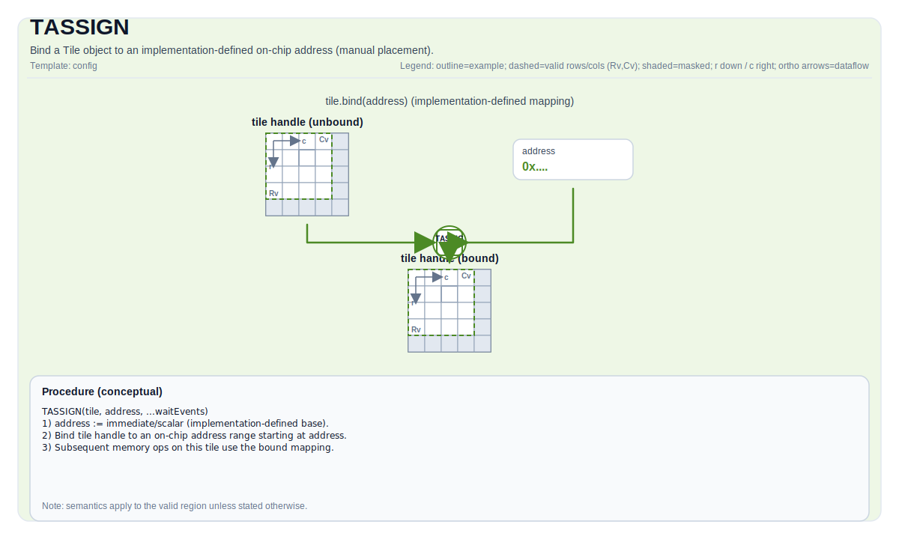

# TASSIGN

## 指令示意图



## 简介

`TASSIGN` 把一个 Tile 或 `GlobalTensor` 对象绑定到具体存储地址。它不做算术，也不搬运数据；它做的是“把抽象对象落到某个物理或模拟地址上”。

这条指令主要服务于手动放置和手动调度场景。很多自动流程也会在 lowering 过程中显式插入它，用来把 SSA 层的 tile 名称映射到真实缓冲。

## 机制

对 Tile 来说，`TASSIGN` 的作用是把内部数据指针指向某个片上地址；对 `GlobalTensor` 来说，则是把对象绑定到一段外部指针地址。

它本身没有独立的数学语义。真正重要的是：

- 绑定的是哪类对象
- 地址是在运行时给出，还是在编译期给出
- 当前目标是否允许这种地址落点

## 汇编语法

PTO-AS 形式：参见 [PTO-AS 规范](../../../../assembly/PTO-AS_zh.md)。

同步形式：

```text
tassign %tile, %addr : !pto.tile<...>, index
```

### AS Level 1（SSA）

```text
pto.tassign %tile, %addr : !pto.tile<...>, dtype
```

### AS Level 2（DPS）

```text
pto.tassign ins(%tile, %addr : !pto.tile_buf<...>, dtype)
```

## C++ 内建接口

声明于 `include/pto/common/pto_instr.hpp`。

### 运行时地址形式

```cpp
template <typename T, typename AddrType>
PTO_INST void TASSIGN(T& obj, AddrType addr);
```

### 编译期地址形式

```cpp
template <std::size_t Addr, typename T>
PTO_INST std::enable_if_t<is_tile_data_v<T> || is_conv_tile_v<T>> TASSIGN(T& obj);
```

第二种写法会在编译期执行静态边界与对齐检查，因此更适合固定地址的手动布局。

## 约束

### Tile / ConvTile

- 运行时地址形式要求 `addr` 是整型地址。
- 在 NPU manual 模式下，这个地址会被直接解释成 tile 存储地址。
- 在 `__PTO_AUTO__` 打开的自动模式下，NPU backend 中的 `TASSIGN(tile, addr)` 当前是 no-op。
- CPU 模拟器不会直接把整型当裸地址使用，而是通过 `NPUMemoryModel` 把它解析到对应架构的模拟缓冲区。

### GlobalTensor

- `addr` 必须是指针类型。
- 指针指向的元素类型必须和 `GlobalTensor::DType` 一致。

### 编译期地址检查

`TASSIGN<Addr>(tile)` 会根据 Tile 的 `Loc` 自动推导对应内存空间，并检查：

- 该内存空间在当前架构上是否存在
- Tile 是否能放得下
- `Addr + tile_size` 是否越界
- 地址是否满足对齐要求

## 示例

### 运行时地址

```cpp
#include <pto/pto-inst.hpp>

using namespace pto;

void example_runtime() {
  using TileT = Tile<TileType::Vec, float, 16, 16>;
  TileT a, b, c;
  TASSIGN(a, 0x1000);
  TASSIGN(b, 0x2000);
  TASSIGN(c, 0x3000);
  TADD(c, a, b);
}
```

### 编译期地址

```cpp
#include <pto/pto-inst.hpp>

using namespace pto;

void example_checked() {
  using TileT = Tile<TileType::Vec, float, 16, 16>;
  TileT a, b, c;

  TASSIGN<0x0000>(a);
  TASSIGN<0x0400>(b);
  TASSIGN<0x0800>(c);
  TADD(c, a, b);
}
```

## 相关页面

- [TSUBVIEW](./tsubview_zh.md)
- [TALIAS](../../../TALIAS_zh.md)
- [同步与配置指令集](../../sync-and-config_zh.md)
