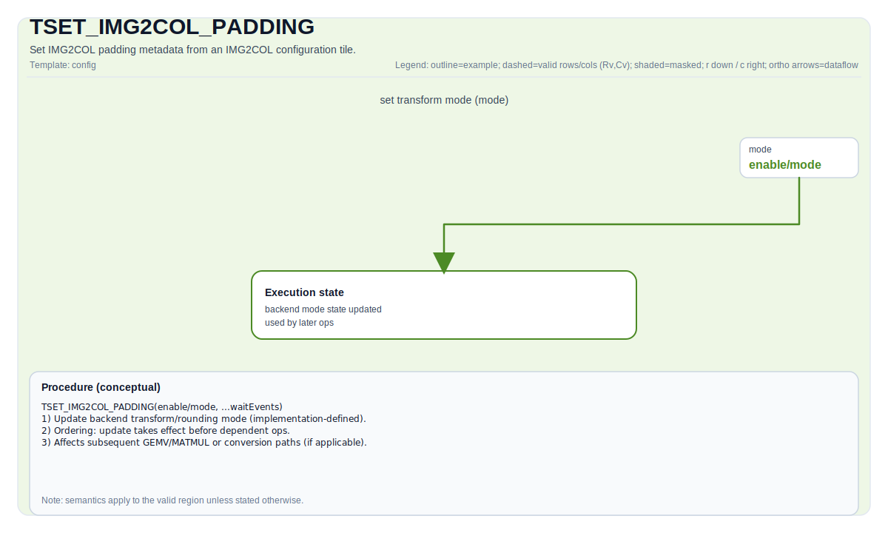

# TSET_IMG2COL_PADDING

## 指令示意图



## 简介

`TSET_IMG2COL_PADDING` 把 `Img2colTileConfig` 里的 pad value 写入 IMG2COL 相关 padding 配置寄存器，供后续 `TIMG2COL` 一类操作在边界补值时使用。

它解决的问题不是“pad 多大”，而是“边界外应该补什么值”。

## 机制

这条指令从配置 Tile 读取 `src.GetPadValue()`，然后把这个值编码成硬件需要的 padding 字段。

当前 backend 的编码规则是：

- 若元素宽度为 1 字节：把同一个字节复制两次后写入 padding 字段
- 若元素宽度为 2 字节：按 16 位值写入
- 若元素宽度为 4 字节：按 32 位值写入

在 A5 上，这条配置同样支持 A 侧和 B 侧两组寄存器。

## 汇编语法

PTO-AS 形式：参见 [PTO-AS 规范](../../../../assembly/PTO-AS_zh.md)。

示意形式：

```text
tset_img2col_padding %cfg
```

### AS Level 1（SSA）

```text
pto.tset_img2col_padding %cfg : !pto.fmatrix_config -> ()
```

### AS Level 2（DPS）

```text
pto.tset_img2col_padding ins(%cfg : !pto.fmatrix_config) outs()
```

## C++ 内建接口

声明于 `include/pto/common/pto_instr.hpp`：

```cpp
template <typename ConvTileData, typename... WaitEvents>
PTO_INST RecordEvent TSET_IMG2COL_PADDING(ConvTileData &src, WaitEvents &... events);

template <typename ConvTileData, SetFmatrixMode FmatrixMode = SetFmatrixMode::FMATRIX_A_MANUAL, typename... WaitEvents>
PTO_INST RecordEvent TSET_IMG2COL_PADDING(ConvTileData &src, WaitEvents &... events);
```

## 约束

### 通用约束

- `src` 应是有效的 IMG2COL 配置 Tile。
- 这条指令只更新控制状态，不直接产生新的 tile 数据。
- 通常应在同一执行流中先配置 padding，再发出依赖它的 `TIMG2COL`。

### CPU 模拟器

- CPU 当前把这条指令实现为 no-op，不额外写入寄存器状态。

### A2/A3 实现

- A2/A3 直接把 `padValue` 编码后写入 padding 寄存器。
- 这条路径没有区分 A/B 两组配置寄存器。

### A5 实现

- A5 仅在 `FMATRIX_A_MANUAL` 或 `FMATRIX_B_MANUAL` 时真正写寄存器。
- `FMATRIX_A_MANUAL` 写 A 侧 padding 配置。
- `FMATRIX_B_MANUAL` 写 B 侧 padding 配置。

## 示例

```cpp
#include <pto/pto-inst.hpp>

using namespace pto;

void example_set_img2col_padding(Img2colTileConfig<uint16_t>& cfg) {
  TSET_IMG2COL_PADDING(cfg);
}
```

## 相关页面

- [TSETFMATRIX](../../../scalar/ops/control-and-configuration/tsetfmatrix_zh.md)
- [TSET_IMG2COL_RPT](./tset-img2col-rpt_zh.md)
- [TIMG2COL](../layout-and-rearrangement/timg2col_zh.md)
