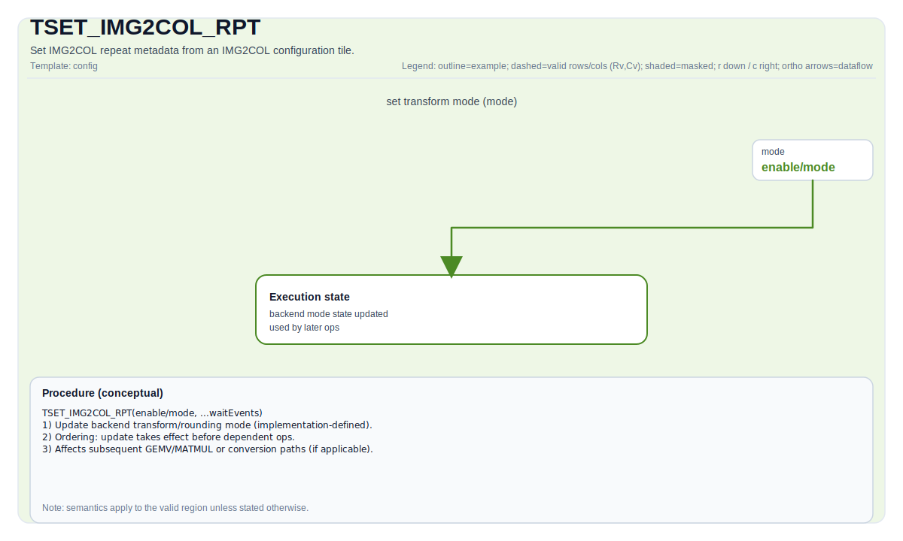

# TSET_IMG2COL_RPT

## 指令示意图



## 简介

`TSET_IMG2COL_RPT` 把 `Img2colTileConfig` 里的重复控制字段写入 IMG2COL 相关寄存器，供后续 `TIMG2COL` 一类操作使用。

如果 `TSETFMATRIX` 负责写“输入特征图几何信息”，那么这条指令负责写“IMG2COL 应该按什么重复方式工作”。

## 机制

A2/A3 与 A5 都会从配置 Tile 中读取 `repeat` 相关字段，但两代硬件暴露的字段不完全一样。

### A2/A3

会把以下字段打包到一份 repeat 配置里：

- `repeatStride`
- `repeatTime`
- `repeatMode`

### A5

除了上面三项，还会额外写入：

- `dstStride`
- `dstMposition`

并且支持写到 A 侧或 B 侧的对应寄存器。

## 汇编语法

PTO-AS 形式：参见 [PTO-AS 规范](../../../../assembly/PTO-AS_zh.md)。

示意形式：

```text
tset_img2col_rpt %cfg
```

### AS Level 1（SSA）

```text
pto.tset_img2col_rpt %cfg : !pto.fmatrix_config -> ()
```

### AS Level 2（DPS）

```text
pto.tset_img2col_rpt ins(%cfg : !pto.fmatrix_config) outs()
```

## C++ 内建接口

声明于 `include/pto/common/pto_instr.hpp`：

```cpp
template <typename ConvTileData, typename... WaitEvents>
PTO_INST RecordEvent TSET_IMG2COL_RPT(ConvTileData &src, WaitEvents &... events);

template <typename ConvTileData, SetFmatrixMode FmatrixMode = SetFmatrixMode::FMATRIX_A_MANUAL, typename... WaitEvents>
PTO_INST RecordEvent TSET_IMG2COL_RPT(ConvTileData &src, WaitEvents &... events);
```

## 约束

### 通用约束

- `src` 应是有效的 IMG2COL 配置 Tile。
- 这条指令只更新控制状态，不直接产生新的 tile 数据。
- 通常应在同一执行流中先配置 repeat，再发出依赖它的 `TIMG2COL`。

### CPU 模拟器

- CPU 只检查 `repeatTime` 已被初始化（`GetRepeatTime() >= 0`）。

### A2/A3 实现

- A2/A3 的无 `SetFmatrixMode` 重载会直接写 repeat 配置。
- 当前仓库里的 A2/A3 实现字段是：
  - `repeatStride`
  - `repeatTime`
  - `repeatMode`

### A5 实现

- A5 仅在 `FMATRIX_A_MANUAL` 或 `FMATRIX_B_MANUAL` 时真正写寄存器。
- A5 比 A2/A3 多写两项：
  - `dstStride`
  - `dstMposition`
- `FMATRIX_A_MANUAL` 写 A 侧 repeat 配置。
- `FMATRIX_B_MANUAL` 写 B 侧 repeat 配置。

## 示例

```cpp
#include <pto/pto-inst.hpp>

using namespace pto;

void example_set_img2col_rpt(Img2colTileConfig<uint16_t>& cfg) {
  TSET_IMG2COL_RPT(cfg);
}
```

## 相关页面

- [TSETFMATRIX](../../../scalar/ops/control-and-configuration/tsetfmatrix_zh.md)
- [TSET_IMG2COL_PADDING](./tset-img2col-padding_zh.md)
- [TIMG2COL](../layout-and-rearrangement/timg2col_zh.md)
