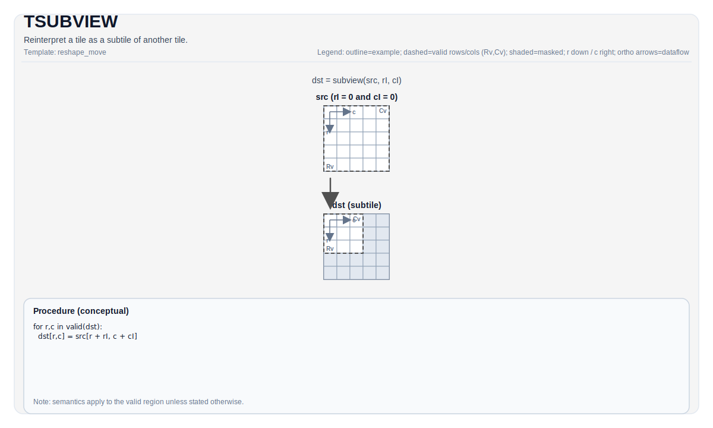

# TSUBVIEW

## Tile操作图例



## 简介

表达一个Tile是另一个Tile的subview。

## 数学表达

- `rowIdx`: 在`src`的有效区域内的起始行的索引。
- `colIdx`: 在`src`的有效区域内的起始列的索引。

对于`dst`中有效区域内的每一个元素`(i, j)`：

$$ \mathrm{dst}_{i,j} = \mathrm{src}_{\mathrm{rowIdx} + i,\mathrm{colIdx} + j} $$

## 汇编语法

PTO-AS form: 详见 [PTO-AS Specification](../../../../assembly/PTO-AS_zh.md).

### IR Level 1（SSA）

TODO

### IR Level 2（DPS）

TODO

## C++ Intrinsic

定义在 `include/pto/common/pto_instr.hpp`:

```cpp
template <typename TileDataDst, typename TileDataSrc, typename... WaitEvents>
PTO_INST RecordEvent TSUBVIEW(TileDataDst &dst, TileDataSrc &src, uint16_t rowIdx, uint16_t colIdx, WaitEvents&... events);
```

## 限制

规定在`TSUBVIEW_IMPL`中:

- **Tile类型必须相同**: `TileDataSrc::Loc == TileDataDst::Loc`.
- **输入和输出Tile的静态shape必须相同**: `TileDataSrc::Rows == TileDataDst::Rows` and `TileDataSrc::Cols == TileDataDst::Cols`.
- **输入和输出Tile的BLayout必须相同**: `TileDataSrc::BFractal == TileDataDst::BFractal`.
- **src的validRow和validCol必须大于等于dst的validRow和validCol**

## 示例

```cpp
#include <pto/pto-inst.hpp>

using namespace pto;

void example() {
  using Src = Tile<TileType::Vec, float, 4, 64, BLayout::RowMajor, 4, 64>;
  using Dst = Tile<TileType::Vec, float, 4, 64, BLayout::RowMajor, 2, 32>;

  Src src;
  Dst dst0;
  Dst dst1;
  Dst dst2;
  Dst dst3;

  // e.g. split into four 2x32 subtiles
  TSUBVIEW(dst0, src, 0, 0);
  TSUBVIEW(dst1, src, 0, 32);
  TSUBVIEW(dst2, src, 2, 0);
  TSUBVIEW(dst3, src, 2, 32);
}
```

## ASM示例

### Auto模式

TODO

### Manual模式

TODO

### PTO汇编格式

TODO
