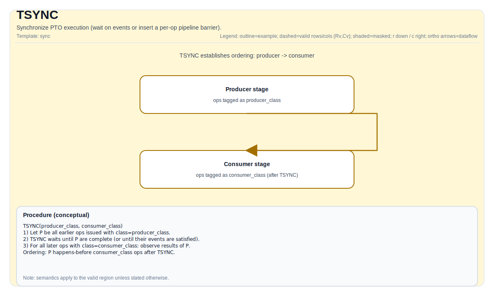

# TSYNC

## 指令示意图



## 简介

同步 PTO 执行（等待事件或插入每操作流水线屏障）。

- `TSYNC(events...)` 等待一组显式事件令牌。
- `TSYNC<Op>()` 为单个向量操作类插入流水线屏障。

`include/pto/common/pto_instr.hpp` 中的许多内建函数在发射指令前会在内部调用 `TSYNC(events...)`。

## 数学语义

不适用。

## 汇编语法

PTO-AS 形式：参见 [PTO-AS 规范](../../../../assembly/PTO-AS_zh.md)。

Event operand form:

```text
tsync %e0, %e1 : !pto.event<...>, !pto.event<...>
```

Single-op barrier form:

```text
tsync.op #pto.op<TADD>
```

### AS Level 1（SSA）

```text
// Level 1 (SSA) does not support explicit synchronization primitives.
```

### AS Level 2（DPS）

```text
pto.record_event[src_op, dst_op, eventID]
// 支持的op：TLOAD， TSTORE_ACC，TSTORE_VEC，TMOV_M2L，TMOV_M2S，TMOV_M2B，TMOV_M2V，TMOV_V2M，TMATMUL，TVEC
pto.wait_event[src_op, dst_op, eventID]
// 支持的op：TLOAD， TSTORE_ACC，TSTORE_VEC，TMOV_M2L，TMOV_M2S，TMOV_M2B，TMOV_M2V，TMOV_V2M，TMATMUL，TVEC
pto.barrier(op)
// 支持的op：TVEC,TMATMUL
```

在当前 PTO-DSL 前端流程中，`record_event` 和 `wait_event` 应视为 TSYNC 的低层形式。
前端 kernel 通常不应手工编写事件连线，而应依赖 `ptoas --enable-insert-sync`
自动插入同步。

## C++ 内建接口

声明于 `include/pto/common/pto_instr.hpp`：

```cpp
template <Op OpCode>
PTO_INST void TSYNC();

template <typename... WaitEvents>
PTO_INST void TSYNC(WaitEvents &... events);
```

## 约束

- **实现检查（`TSYNC<Op>()`）**:
  - `TSYNC_IMPL<Op>()` 仅支持向量流水线操作（`include/pto/common/event.hpp` 中通过 `static_assert(pipe == PIPE_V)` 强制执行）。
- **`TSYNC(events...)` 语义**:
  - `TSYNC(events...)` 调用 `WaitAllEvents(events...)`，后者对每个事件令牌调用 `events.Wait()`。在auto模式下是no-op。

## 示例

### 自动（Auto）

```cpp
#include <pto/pto-inst.hpp>

using namespace pto;

void example_auto(__gm__ float* in) {
  using TileT = Tile<TileType::Vec, float, 16, 16>;
  using GShape = Shape<1, 1, 1, 16, 16>;
  using GStride = BaseShape2D<float, 16, 16, Layout::ND>;
  using GT = GlobalTensor<float, GShape, GStride, Layout::ND>;

  GT gin(in);
  TileT t;
  Event<Op::TLOAD, Op::TADD> e;
  e = TLOAD(t, gin);
  TSYNC(e);
}
```

### 手动（Manual）

```cpp
#include <pto/pto-inst.hpp>

using namespace pto;

void example_manual() {
  using TileT = Tile<TileType::Vec, float, 16, 16>;
  TileT a, b, c;
  Event<Op::TADD, Op::TSTORE_VEC> e;
  e = TADD(c, a, b);
  TSYNC<Op::TADD>();
  TSYNC(e);
}
```

## 汇编示例（ASM）

### 自动模式

```text
# 自动模式：由编译器/运行时负责资源放置与调度。
%result = pto.tsync ...
```

### 手动模式

```text
# 手动模式：先显式绑定资源，再发射指令。
# 可选（当该指令包含 tile 操作数时）：
# pto.tassign %arg0, @tile(0x1000)
# pto.tassign %arg1, @tile(0x2000)
%result = pto.tsync ...
```

### PTO 汇编形式

```text
tsync %e0, %e1 : !pto.event<...>, !pto.event<...>
# AS Level 2 (DPS)
pto.record_event[src_op, dst_op, eventID]
```
